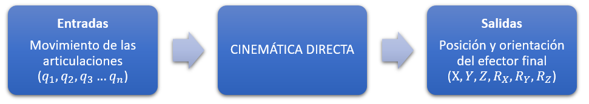
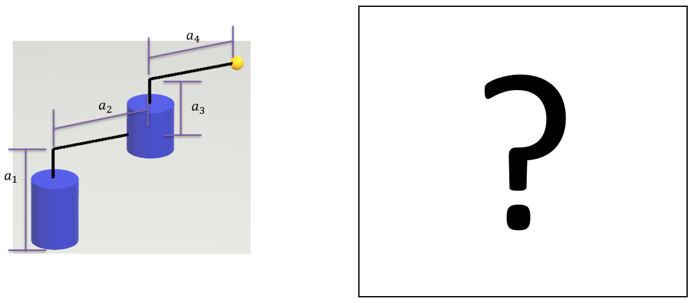
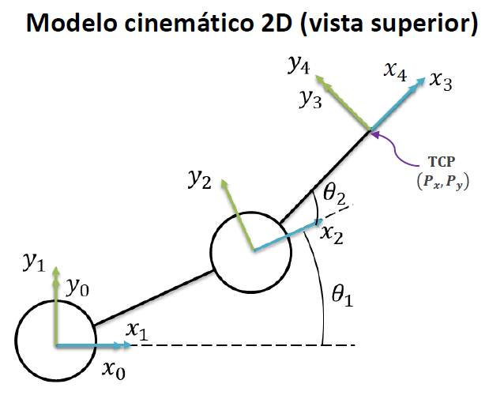
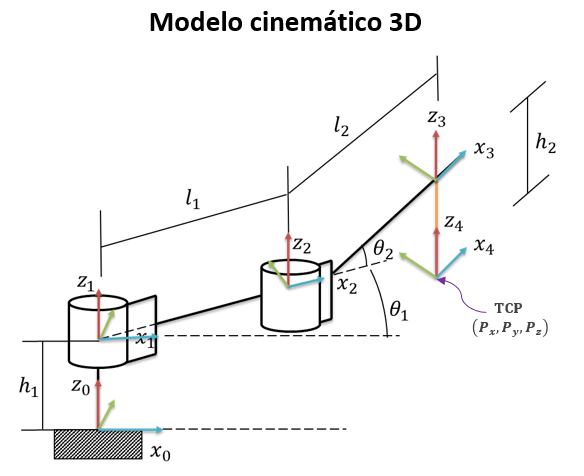

<h1>Aula 13</h1>

Esta clase consiste en realizar una introducción a la cinemática directa.

<h2>Introducción a la cinemática directa</h2>

Consiste en determinar la posición (traslación) y orientación (rotación) del efector final (TCP) con respecto al sistema coordenado de referencia (SC{0}), teniendo en cuenta los movimientos angulares y/o lineales de las articulaciones rotacionales y/o prismáticas, respectivamente.

El problema cinemático directo se reduce a una matriz homogénea de transformación (MTH) donde se relacione la posición y orientación del TCP

$$𝑇_6^0 = 𝑇_1^0 \cdot 𝑇_2^1 \cdot 𝑇_3^2 \cdot 𝑇_4^3 \cdot 𝑇_5^4 \cdot 𝑇_6^5$$





<h3>Método geométrico</h3>

1. Conocimientos de geometría espacial y trigonometría

2. Los sistemas coordenados son arbitrarios (no tienen requisitos), pero se debe cumplir con la regla de la mano derecha

3. No es un método sistemático, es decir, para cada robot hay que realizar el análisis.

<h3>Método DH</h3>

1. Utilizado para robots manipuladores seriales

2. Los sistemas coordenados deben ubicarse de acuerdo al movimiento de las articulaciones que están en medio de dos eslabones

3. Es un método sistemático, es decir, el análisis funciona para cualquier robot de configuración serial


<h3>Método geométrico</h3>



Traslación (posición)

$$𝑥=𝑙_1cos⁡(𝜃_1)+𝑙_2cos⁡(𝜃_1+𝜃_2)$$

$$𝑦=𝑙_1sen⁡(𝜃_1)+𝑙_2sen⁡(𝜃_1+𝜃_2)$$

$$𝑧=ℎ_1−ℎ_2$$

Rotación (orientación)

$$𝑅_𝑧(𝜃_1)\cdot 𝑅_𝑧(𝜃_2)=𝑅_𝑧(𝜃_2) \cdot 𝑅_𝑧(𝜃_1)=𝑅_𝑧(𝜃_1+𝜃_2)$$

$$𝑅_𝑧(𝜃_1+𝜃_2)=\begin{bmatrix}
cos⁡(𝜃_1+𝜃_2) & -sen⁡(𝜃_1+𝜃_2) & 0\\ 
sen⁡(𝜃_1+𝜃_2) & cos⁡(𝜃_1+𝜃_2) & 0 \\ 
0 & 0 & 1 
\end{bmatrix}$$

```matlab
syms theta1 theta2
RZ1 = simplify(RotarZ(theta1)*RotarZ(theta2))
RZ2 = simplify(RotarZ(theta2)*RotarZ(theta1))
RZ3 = simplify(RotarZ(theta1+theta2))
```

Resultado final de la cinemática directa

$$𝑇_4^0 = \begin{bmatrix}
cos⁡(𝜃_1+𝜃_2) & -sen⁡(𝜃_1+𝜃_2) & 0 & 𝑙_1cos⁡(𝜃_1)+𝑙_2cos⁡(𝜃_1+𝜃_2)\\ 
sen⁡(𝜃_1+𝜃_2) & cos⁡(𝜃_1+𝜃_2) & 0 & 𝑙_1sen⁡(𝜃_1)+𝑙_2sen⁡(𝜃_1+𝜃_2)\\ 
0 & 0 & 1 & ℎ_1−ℎ_2\\ 
0 & 0 & 0 & 1
\end{bmatrix}$$

<h3>Transformaciones</h3>



$$𝑇_6^0 = 𝑇_1^0 \cdot 𝑇_2^1 \cdot 𝑇_3^2 \cdot 𝑇_4^3$$

$$𝑇_1^0 = \begin{bmatrix}
1 & 0 & 0 & 0 \\ 
0 & 1 & 0 & 0 \\ 
0 & 0 & 1 & ℎ_1 \\ 
0 & 0 & 0 & 1
\end{bmatrix}$$

$$𝑇_2^1 = \begin{bmatrix}
cos⁡(𝜃_1) & -sen⁡(𝜃_1) & 0 & 𝑙_1cos⁡(𝜃_1)\\ 
sen⁡(𝜃_1) & cos⁡(𝜃_1) & 0 & 𝑙_1sen⁡(𝜃_1)\\ 
0 & 0 & 1 & 0\\ 
0 & 0 & 0 & 1
\end{bmatrix}$$

$$𝑇_3^2 = \begin{bmatrix}
cos⁡(𝜃_2) & -sen⁡(𝜃_2) & 0 & 𝑙_2cos⁡(𝜃_2)\\ 
sen⁡(𝜃_2) & cos⁡(𝜃_2) & 0 & 𝑙_2sen⁡(𝜃_2)\\ 
0 & 0 & 1 & 0\\ 
0 & 0 & 0 & 1
\end{bmatrix}$$

$$𝑇_4^3 = \begin{bmatrix}
1 & 0 & 0 & 0 \\ 
0 & 1 & 0 & 0 \\ 
0 & 0 & 1 & -ℎ_2 \\ 
0 & 0 & 0 & 1
\end{bmatrix}$$

```matlab
%Transformaciones (MTH)

syms h1 h2 theta1 theta2 l1 l2
% theta1 = pi/2
% theta2 = pi/2
% l1 = 5;
% l2 = 5;
% h1 = 3;
% h2 = 2;

T01 = [1 0 0 0;
       0 1 0 0;
       0 0 1 h1;
       0 0 0 1]

T12 = [cos(theta1) -sin(theta1) 0 l1*cos(theta1);
       sin(theta1) cos(theta1)  0 l1*sin(theta1);
       0           0            1 0;
       0           0            0 1]
   
T23 = [cos(theta2) -sin(theta2) 0 l2*cos(theta2);
       sin(theta2) cos(theta2)  0 l2*sin(theta2);
       0           0            1 0;
       0           0            0 1]
   
T34 = [1 0 0 0;
       0 1 0 0;
       0 0 1 -h2;
       0 0 0 1]

T04 = simplify(T01*T12*T23*T34)
% T04 = T01*T12*T23*T34

% r = T04(1:3,1:3)
% m = rad2deg(tr2rpy(r,'zyx'))
```

Resultado final de la cinemática directa

$$𝑇_4^0 = \begin{bmatrix}
cos⁡(𝜃_1+𝜃_2) & -sen⁡(𝜃_1+𝜃_2) & 0 & 𝑙_1cos⁡(𝜃_1)+𝑙_2cos⁡(𝜃_1+𝜃_2)\\ 
sen⁡(𝜃_1+𝜃_2) & cos⁡(𝜃_1+𝜃_2) & 0 & 𝑙_1sen⁡(𝜃_1)+𝑙_2sen⁡(𝜃_1+𝜃_2)\\ 
0 & 0 & 1 & ℎ_1−ℎ_2\\ 
0 & 0 & 0 & 1
\end{bmatrix}$$

<h3>Ejercicios</h3>

Calcular en Matlab el valor de la matriz de transformación homogénea para el robot planar, con los siguientes valores:

$$1. 𝜃_1=0, 𝜃_2=0, 𝑙_1=6, 𝑙_2=7, ℎ_1=2, ℎ_2=2$$

$$2. 𝜃_1=𝜋/2, 𝜃_2=𝜋/2, 𝑙_1=4, 𝑙_2=5, ℎ_1=3, ℎ_2=5$$

$$3. 𝜃_1=𝜋/2, 𝜃_2=𝜋/9, 𝑙_1=5, 𝑙_2=8, ℎ_1=7, ℎ_2=4$$

$$4. 𝜃_1=𝜋/6, 𝜃_2=𝜋/3, 𝑙_1=3, 𝑙_2=2, ℎ_1=4, ℎ_2=1$$


