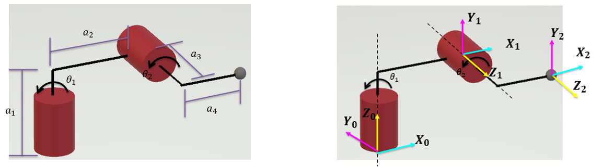
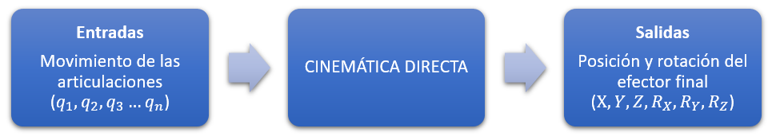
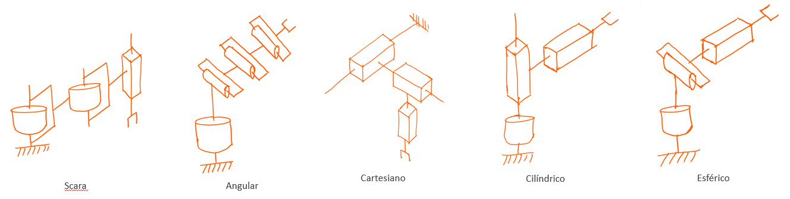

<h1>Aula 14</h1>

Esta clase consiste en comprender y aplicar el primer paso del método DH (Denavit-Hartengerg), el cual es una solución de la cinemática directa de robots manipuladores seriales.

<h2>Método DH</h2>

El método Denavit Hartenberg (DH) fue propuesto en 1955 por Jacques Denavit y Richard S. Hartenberg, el cual consiste en un método matricial que permite establecer de manera sistemática un sistema coordenado final con respecto al sistema coordenado de referencia. Para aplicar el método DH se deben tener en cuenta los siguientes pasos:

1. Asignar el sistema coordenado para cada articulación del robot
2. Determinar los parámetros DH (𝜃,𝑑,𝛼,𝑎), los cuales se utilizarán en el Toolbox Peter Corke de Matlab 
3. Obtener la siguiente matriz :

$$𝑇_𝑛^{𝑛−1}=𝑇𝑟𝑎𝑛𝑠_{𝑧_{𝑛−1}}(𝑑_𝑛) \cdot 𝑅𝑜𝑡_{𝑧_{𝑛−1}}(𝜃_𝑛) \cdot 𝑇𝑟𝑎𝑛𝑠_{𝑥_𝑛}(𝑎_𝑛) \cdot 𝑅𝑜𝑡_{𝑥_𝑛}(𝛼_𝑛)$$

$$𝑇_𝑛^{𝑛−1}= 𝑅𝑜𝑡_{𝑧_{𝑛−1}}(𝜃_𝑛) \cdot 𝑇𝑟𝑎𝑛𝑠_{𝑧_{𝑛−1}}(𝑑_𝑛) \cdot 𝑅𝑜𝑡_{𝑥_𝑛}(𝛼_𝑛) \cdot 𝑇𝑟𝑎𝑛𝑠_{𝑥_𝑛}(𝑎_𝑛)$$

<h3>Paso 1 - Asignación de sistemas coordenados</h3>

Regla 1: El eje Z se debe ubicar de manera positiva en el eje de rotación si la articulación es rotacional o en la misma dirección de movimiento si es prismática.

Regla 2: El eje X debe ser perpendicular al eje Z de su mismo SC y al eje Z del anterior SC.

Regla 3: Todos los sistemas deben respetar la regla de la mano derecha (eje Y).

Regla 4: Cada eje X debe intersecar el eje Z del SC inmediatamente anterior.

<h4>Ejemplo 1</h4>

<h4>Ejemplo 2</h4>

<h4>Ejercicio 1</h4>

<h4>Ejercicio 2</h4>

<h3>Ejercicios</h3>

Realizar la asignación de sistemas coordenados de los siguientes cinco tipos de robots: 1. Cartesiano, 2. Cilíndrico, 3. Esférico, 4. Scara y 5. Angular.

