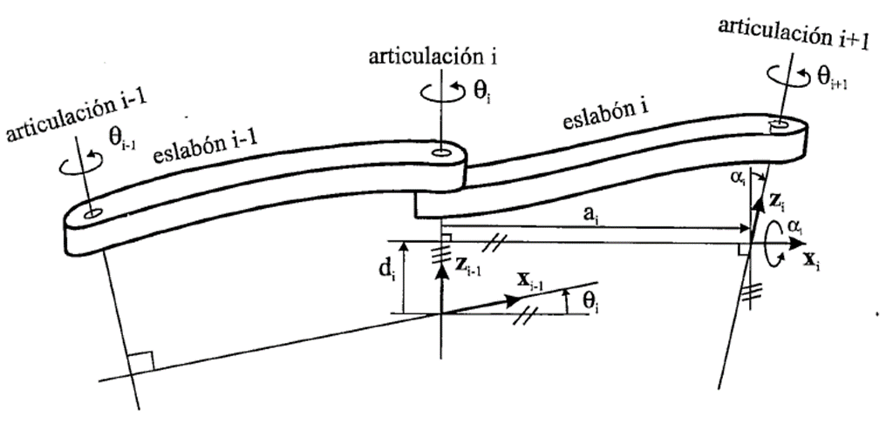
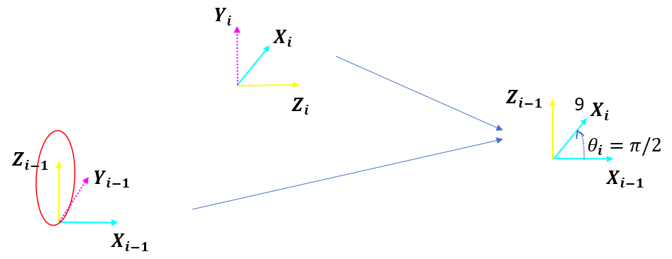
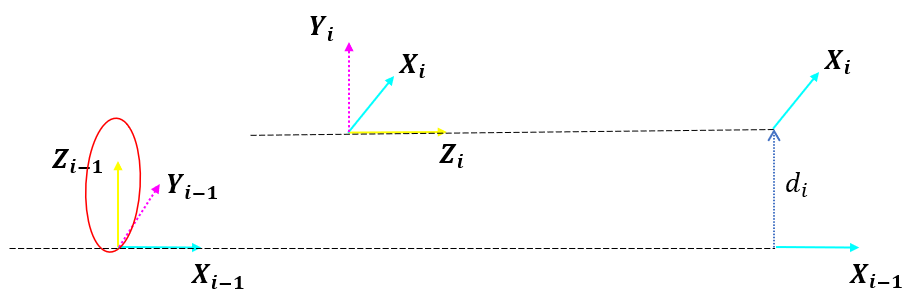
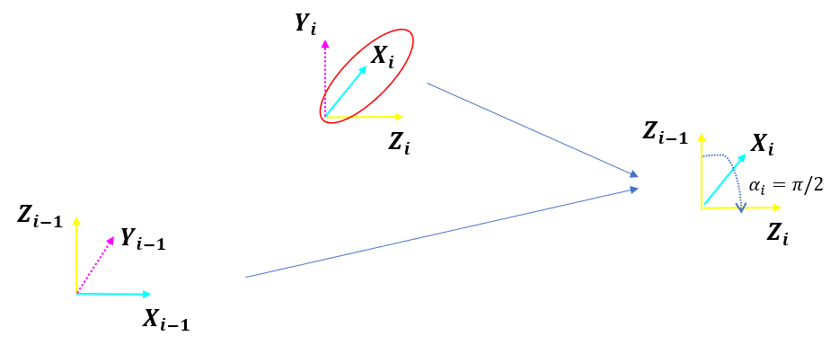
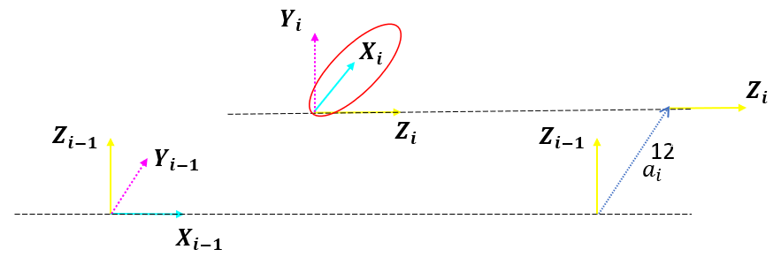
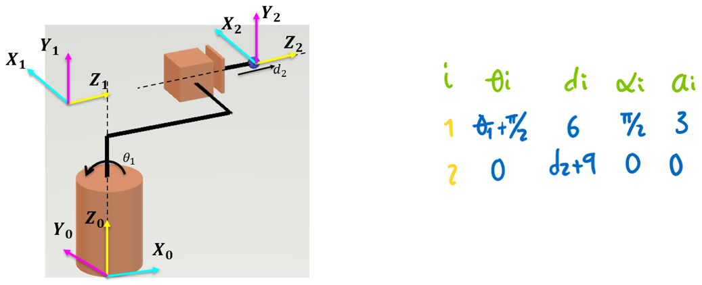
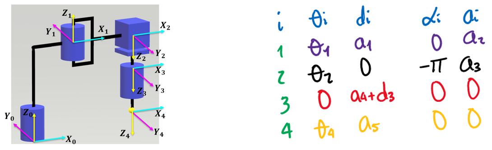

<h1>Aula 15</h1>

Esta clase consiste en comprender y aplicar el segundo paso del método DH (Denavit-Hartengerg).

<h3>Paso 2 - Parámetros DH</h3>

Los parámetros DH (𝑑,𝜃,𝑎,𝛼) son definidos por las articulaciones y los eslabones del robot. 



Fuente: Barrientos, A., Peñín, L.F., Balaguer, C., y Aracil, R., 2007, Fundamentos de Robótica, 2nd edition, McGraw-Hill.

<h4>Párametro $𝜃_𝒊$</h4>

Es el ángulo que forman los ejes de $x_{𝑖−1}$ a $x_𝑖$ perpendicular al eje $z_{𝑖−1}$



<h4>Párametro $𝒅_𝒊$</h4>

Es la distancia de $𝑋_{𝑖−1}$ a $𝑋_𝑖$ a lo largo del eje $𝑍_{𝑖−1}$



<h4>Párametro $𝜶_𝒊$</h4>

Es el ángulo que forman los ejes de $𝑍_{𝑖−1}$ a $𝑍_𝑖$ perpendicular al eje $𝑋_𝑖$



<h4>Párametro $𝒂_𝒊$</h4>

Es la distancia de $𝑍_{𝑖−1}$ a $𝑍_𝑖$ a lo largo del eje $𝑋_𝑖$



<h4>Ejemplo 1</h4>


```matlab
clear all
close all
clc

%Peter corke
a1 = 12;
a2 = 14;
a3 = 6;
a4 = 4;

q1 = 0;%Theta1
q2 = 0;%Theta2

R(1) = Link('revolute','d',a1,'alpha',pi/2,'a',a2,'offset',0);
R(2) = Link('revolute','d',a3,'alpha',0,'a',a4,'offset',0);

Robot = SerialLink(R,'name','Bender')

Robot.plot([q1,q2],'scale',1.0,'workspace',[-30 30 -30 30 -30 30]);
zlim([-15,30]);
Robot.teach([q1,q2],'rpy/zyx');
MTH = Robot.fkine([q1,q2])
```

<h4>Ejemplo 2</h4>



```matlab
clear all
close all
clc

l1 = 6;
l2 = 7;
l3 = 3;
l4 = 2;

q1 = 0;
q2 = 0;

R(1) = Link('revolute','d',l1,'alpha',pi/2,'a',l3,'offset',pi/2);
R(2) = Link('prismatic','theta',0,'alpha',0,'a',0,'offset',l2+l4);
R(2).qlim = [0,10];

Robot = SerialLink(R,'name','Bender')

Robot.plot([q1,q2],'scale',1.0,'workspace',[-30 30 -30 30 -30 30]);
zlim([-15,30]);
Robot.teach([q1,q2],'rpy/zyx');
MTH = Robot.fkine([q1,q2])
```

<h4>Ejercicio 1</h4>


```matlab
clear all
close all
clc

a1 = 10;
a2 = 11;
a3 = 5;
a4 = 12;

q1 = 0;
q2 = 0;

R(1) = Link('revolute','d',a1,'alpha',0,'a',a2,'offset',0);
R(2) = Link('revolute','d',a3,'alpha',0,'a',a4,'offset',0);

Robot = SerialLink(R,'name','Bender')

Robot.plot([q1,q2],'scale',1.0,'workspace',[-30 30 -30 30 -30 30]);
zlim([-15,30]);
Robot.teach([q1,q2],'rpy/zyx');
MTH = Robot.fkine([q1,q2])
```

<h4>Ejercicio 2</h4>



```matlab
clear all
close all
clc

a1 = 15;
a2 = 5;
a3 = 8;
a4 = 5;
a5 = 6;

q1 = 0;
q2 = 0;
q3 = 0;
q4 = 0;

R(1) = Link('revolute','d',a1,'alpha',0,'a',a2,'offset',0);
R(2) = Link('revolute','d',0,'alpha',pi,'a',a3,'offset',0);
R(3) = Link('prismatic','theta',0,'alpha',0,'a',0,'offset',a4);
R(3).qlim = [0,10];
R(4) = Link('revolute','d',a5,'alpha',0,'a',0,'offset',0);

Robot = SerialLink(R,'name','Bender')

Robot.plot([q1,q2,q3,q4],'scale',0.5,'workspace',[-30 30 -30 30 -30 30]);
zlim([-15,30]);
Robot.teach([q1,q2,q3,q4],'rpy/zyx');
MTH = Robot.fkine([q1,q2,q3,q4])
```

<h3>Ejercicios</h3>

Obtener los parámetros DH de los siguientes cinco tipos de robots: 1. Cartesiano, 2. Cilíndrico, 3. Esférico, 4. Scara y 5. Angular.


