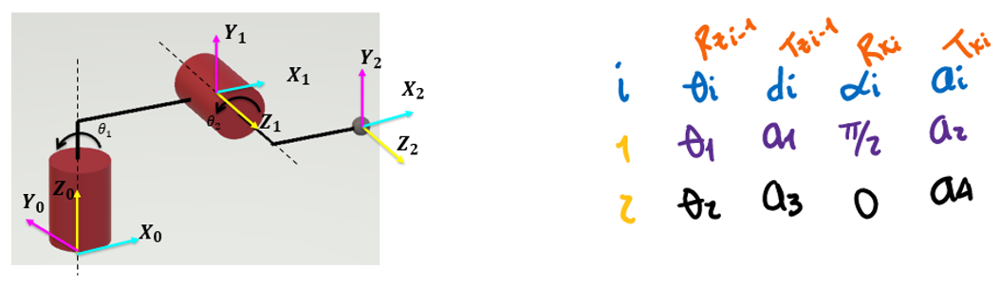
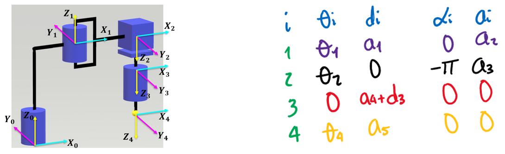
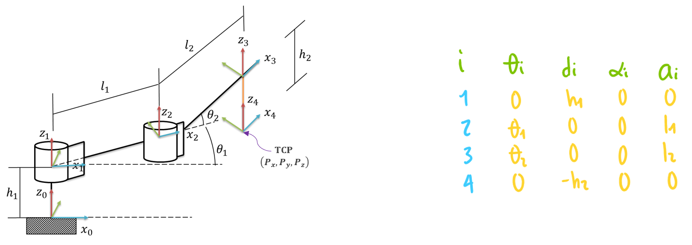
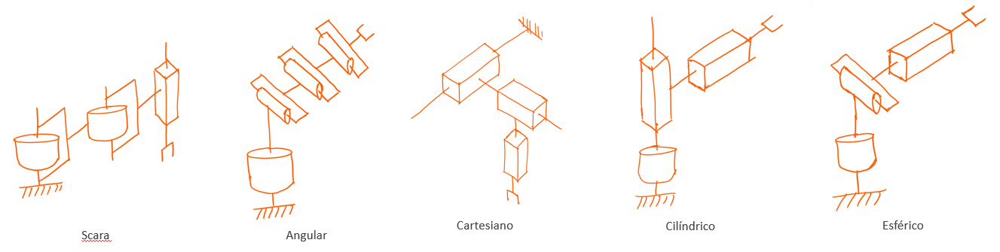

<h1>Aula 16</h1>

Esta clase consiste en comprender y aplicar el tercer paso del método DH (Denavit-Hartengerg).

<h2>Paso 3 - Matriz DH</h2>

$$𝑇_𝑛^{𝑛−1}=𝑇𝑟𝑎𝑛𝑠_{𝑧_{𝑛−1}}(𝑑_𝑛) \cdot 𝑅𝑜𝑡_{𝑧_{𝑛−1}}(𝜃_𝑛) \cdot 𝑇𝑟𝑎𝑛𝑠_{𝑥_𝑛}(𝑎_𝑛) \cdot 𝑅𝑜𝑡_{𝑥_𝑛}(𝛼_𝑛)$$

$$𝑇_𝑛^{𝑛−1}= 𝑅𝑜𝑡_{𝑧_{𝑛−1}}(𝜃_𝑛) \cdot 𝑇𝑟𝑎𝑛𝑠_{𝑧_{𝑛−1}}(𝑑_𝑛) \cdot 𝑅𝑜𝑡_{𝑥_𝑛}(𝛼_𝑛) \cdot 𝑇𝑟𝑎𝑛𝑠_{𝑥_𝑛}(𝑎_𝑛)$$

<h3>Ejemplo 1</h3>



$$𝑇_1^0 = \begin{bmatrix}
1 & 0 & 0 & 0\\ 
0 & 1 & 0 & 0\\ 
0 & 0 & 1 & 𝑎_1\\ 
0 & 0 & 0 & 1
\end{bmatrix}
\begin{bmatrix}
cos⁡(𝜃_1) & -sen⁡(𝜃_1) & 0 & 0\\ 
sen⁡(𝜃_1) & cos⁡(𝜃_1) & 0 & 0\\ 
0 & 0 & 1 & 0\\ 
0 & 0 & 0 & 1
\end{bmatrix}
\begin{bmatrix}
1 & 0 & 0 & 𝑎_2\\ 
0 & 1 & 0 & 0\\ 
0 & 0 & 1 & 0\\ 
0 & 0 & 0 & 1
\end{bmatrix}
\begin{bmatrix}
1 & 0 & 0 & 0\\ 
0 & cos⁡(𝜋/2) & -sen⁡(𝜋/2) & 0\\ 
0 & sen⁡(𝜋/2) & cos⁡(𝜋/2) & 0\\ 
0 & 0 & 0 & 1
\end{bmatrix}$$

$$𝑇_2^1 = \begin{bmatrix}
1 & 0 & 0 & 0\\ 
0 & 1 & 0 & 0\\ 
0 & 0 & 1 & 𝑎_3\\ 
0 & 0 & 0 & 1
\end{bmatrix}
\begin{bmatrix}
cos⁡(𝜃_2) & -sen⁡(𝜃_2) & 0 & 0\\ 
sen⁡(𝜃_2) & cos⁡(𝜃_2) & 0 & 0\\ 
0 & 0 & 1 & 0\\ 
0 & 0 & 0 & 1
\end{bmatrix}
\begin{bmatrix}
1 & 0 & 0 & 𝑎_4\\ 
0 & 1 & 0 & 0\\ 
0 & 0 & 1 & 0\\ 
0 & 0 & 0 & 1
\end{bmatrix}
\begin{bmatrix}
1 & 0 & 0 & 0\\ 
0 & cos⁡(0) & -sen⁡(0) & 0\\ 
0 & sen⁡(0) & cos⁡(0) & 0\\ 
0 & 0 & 0 & 1
\end{bmatrix}$$

$$𝑇_2^0 = 𝑇_1^0 \cdot 𝑇_2^1 = \begin{bmatrix}
1 & 0 & 0 & 18\\ 
0 & 0 & -1 & -6\\ 
0 & 1 & 0 & 12\\ 
0 & 0 & 0 & 1
\end{bmatrix}$$

```matlab
clear all
close all
clc

%Peter corke
a1 = 12;
a2 = 14;
a3 = 6;
a4 = 4;

q1 = 0;%Theta1
q2 = 0;%Theta2

R(1) = Link('revolute','d',a1,'alpha',pi/2,'a',a2,'offset',0);
R(2) = Link('revolute','d',a3,'alpha',0,'a',a4,'offset',0);

Robot = SerialLink(R,'name','Bender')

Robot.plot([q1,q2],'scale',1.0,'workspace',[-30 30 -30 30 -30 30]);
zlim([-15,30]);
Robot.teach([q1,q2],'rpy/zyx');
MTH = Robot.fkine([q1,q2])

%Matriz (DH)
TZ0 = [1 0 0 0; 0 1 0 0; 0 0 1 a1; 0 0 0 1]
RZ0 = [cos(q1) -sin(q1) 0 0; sin(q1) cos(q1) 0 0; 0 0 1 0; 0 0 0 1]
TX1 = [1 0 0 a2; 0 1 0 0; 0 0 1 0; 0 0 0 1]
RZ1 = [1 0 0 0; 0 cos(pi/2) -sin(pi/2) 0; 0 sin(pi/2) cos(pi/2) 0; 0 0 0 1]
T01 =  TZ0*RZ0*TX1*RZ1
T01 =  RZ0*TZ0*TX1*RZ1

TZ1 = [1 0 0 0; 0 1 0 0; 0 0 1 a3; 0 0 0 1]
RZ1 = [cos(q2) -sin(q2) 0 0; sin(q2) cos(q2) 0 0; 0 0 1 0; 0 0 0 1]
TX2 = [1 0 0 a4; 0 1 0 0; 0 0 1 0; 0 0 0 1]
RZ2 = [1 0 0 0; 0 cos(0) -sin(0) 0; 0 sin(0) cos(0) 0; 0 0 0 1]
% T12 =  TZ1*RZ1*TX2*RZ2
T12 =  RZ1*TZ1*TX2*RZ2

T02 = T01*T12

%Confirmar la rotación en ángulos de Euler
m = T02(1:3,1:3)
r = rad2deg(tr2rpy(m,'zyx'))
```

<h3>Ejemplo 2</h3>


$$𝑇_1^0 = \begin{bmatrix}
1 & 0 & 0 & 0\\ 
0 & 1 & 0 & 0\\ 
0 & 0 & 1 & 6\\ 
0 & 0 & 0 & 1
\end{bmatrix}
\begin{bmatrix}
cos⁡(𝜃_1+𝜋/2) & -sen⁡(𝜃_1+𝜋/2) & 0 & 0\\ 
sen⁡(𝜃_1+𝜋/2) & cos⁡(𝜃_1+𝜋/2) & 0 & 0\\ 
0 & 0 & 1 & 0\\ 
0 & 0 & 0 & 1
\end{bmatrix}
\begin{bmatrix}
1 & 0 & 0 & 3\\ 
0 & 1 & 0 & 0\\ 
0 & 0 & 1 & 0\\ 
0 & 0 & 0 & 1
\end{bmatrix}
\begin{bmatrix}
1 & 0 & 0 & 0\\ 
0 & cos⁡(𝜋/2) & -sen⁡(𝜋/2) & 0\\ 
0 & sen⁡(𝜋/2) & cos⁡(𝜋/2) & 0\\ 
0 & 0 & 0 & 1
\end{bmatrix}$$

$$𝑇_2^1 = \begin{bmatrix}
1 & 0 & 0 & 0\\ 
0 & 1 & 0 & 0\\ 
0 & 0 & 1 & 𝑑_2+9\\ 
0 & 0 & 0 & 1
\end{bmatrix}
\begin{bmatrix}
cos⁡(0) & -sen⁡(0) & 0 & 0\\ 
sen⁡(0) & cos⁡(0) & 0 & 0\\ 
0 & 0 & 1 & 0\\ 
0 & 0 & 0 & 1
\end{bmatrix}
\begin{bmatrix}
1 & 0 & 0 & 0\\ 
0 & 1 & 0 & 0\\ 
0 & 0 & 1 & 0\\ 
0 & 0 & 0 & 1
\end{bmatrix}
\begin{bmatrix}
1 & 0 & 0 & 0\\ 
0 & cos⁡(0) & -sen⁡(0) & 0\\ 
0 & sen⁡(0) & cos⁡(0) & 0\\ 
0 & 0 & 0 & 1
\end{bmatrix}$$

$$𝑇_2^0 = 𝑇_1^0 \cdot 𝑇_2^1 = \begin{bmatrix}
0 & 0 & 1 & 9\\ 
1 & 0 & 0 & 3\\ 
0 & 1 & 0 & 6\\ 
0 & 0 & 0 & 1
\end{bmatrix}$$

```matlab
clear all
close all
clc

l1 = 6;
l2 = 7;
l3 = 3;
l4 = 2;

q1 = 0;
q2 = 0;

R(1) = Link('revolute','d',l1,'alpha',pi/2,'a',l3,'offset',pi/2);
R(2) = Link('prismatic','theta',0,'alpha',0,'a',0,'offset',l2+l4);
R(2).qlim = [0,10];

Robot = SerialLink(R,'name','Bender')

Robot.plot([q1,q2],'scale',1.0,'workspace',[-30 30 -30 30 -30 30]);
zlim([-15,30]);
Robot.teach([q1,q2],'rpy/zyx');
MTH = Robot.fkine([q1,q2])

%Matriz (DH)
TZ0 = [1 0 0 0; 0 1 0 0; 0 0 1 l1; 0 0 0 1]
RZ0 = [cos(q1+pi/2) -sin(q1+pi/2) 0 0; sin(q1+pi/2) cos(q1+pi/2) 0 0; 0 0 1 0; 0 0 0 1]
TX1 = [1 0 0 l3; 0 1 0 0; 0 0 1 0; 0 0 0 1]
RZ1 = [1 0 0 0; 0 cos(pi/2) -sin(pi/2) 0; 0 sin(pi/2) cos(+pi/2) 0; 0 0 0 1]
% T01 =  TZ0*RZ0*TX1*RZ1
T01 =  RZ0*TZ0*TX1*RZ1

TZ1 = [1 0 0 0; 0 1 0 0; 0 0 1 q2+l2+l4; 0 0 0 1]
RZ1 = [cos(0) -sin(0) 0 0; sin(0) cos(0) 0 0; 0 0 1 0; 0 0 0 1]
TX2 = [1 0 0 0; 0 1 0 0; 0 0 1 0; 0 0 0 1]
RZ2 = [1 0 0 0; 0 cos(0) -sin(0) 0; 0 sin(0) cos(0) 0; 0 0 0 1]
% T12 =  TZ1*RZ1*TX2*RZ2
T12 =  RZ1*TZ1*TX2*RZ2

T02 = T01*T12

%Confirmar la rotación en ángulos de Euler
m = T02(1:3,1:3)
r = rad2deg(tr2rpy(m,'zyx'))
```

<h3>Ejercicio 1</h3>


$$𝑇_1^0 = \begin{bmatrix}
1 & 0 & 0 & 0\\ 
0 & 1 & 0 & 0\\ 
0 & 0 & 1 & 𝑎_1\\ 
0 & 0 & 0 & 1
\end{bmatrix}
\begin{bmatrix}
cos⁡(𝜃_1) & -sen⁡(𝜃_1) & 0 & 0\\ 
sen⁡(𝜃_1) & cos⁡(𝜃_1) & 0 & 0\\ 
0 & 0 & 1 & 0\\ 
0 & 0 & 0 & 1
\end{bmatrix}
\begin{bmatrix}
1 & 0 & 0 & 𝑎_2\\ 
0 & 1 & 0 & 0\\ 
0 & 0 & 1 & 0\\ 
0 & 0 & 0 & 1
\end{bmatrix}
\begin{bmatrix}
1 & 0 & 0 & 0\\ 
0 & cos⁡(0) & -sen⁡(0) & 0\\ 
0 & sen⁡(0) & cos⁡(0) & 0\\ 
0 & 0 & 0 & 1
\end{bmatrix}$$

$$𝑇_2^1 = \begin{bmatrix}
1 & 0 & 0 & 0\\ 
0 & 1 & 0 & 0\\ 
0 & 0 & 1 & 𝑎_3\\ 
0 & 0 & 0 & 1
\end{bmatrix}
\begin{bmatrix}
cos⁡(𝜃_2) & -sen⁡(𝜃_2) & 0 & 0\\ 
sen⁡(𝜃_2) & cos⁡(𝜃_2) & 0 & 0\\ 
0 & 0 & 1 & 0\\ 
0 & 0 & 0 & 1
\end{bmatrix}
\begin{bmatrix}
1 & 0 & 0 & 𝑎_4\\ 
0 & 1 & 0 & 0\\ 
0 & 0 & 1 & 0\\ 
0 & 0 & 0 & 1
\end{bmatrix}
\begin{bmatrix}
1 & 0 & 0 & 0\\ 
0 & cos⁡(0) & -sen⁡(0) & 0\\ 
0 & sen⁡(0) & cos⁡(0) & 0\\ 
0 & 0 & 0 & 1
\end{bmatrix}$$

$$𝑇_2^0 = 𝑇_1^0 \cdot 𝑇_2^1 = \begin{bmatrix}
1 & 0 & 0 & 23\\ 
0 & 1 & 0 & 0\\ 
0 & 0 & 1 & 15\\ 
0 & 0 & 0 & 1
\end{bmatrix}$$

```matlab
clear all
close all
clc

a1 = 10;
a2 = 11;
a3 = 5;
a4 = 12;

q1 = 0;
q2 = 0;

R(1) = Link('revolute','d',a1,'alpha',0,'a',a2,'offset',0);
R(2) = Link('revolute','d',a3,'alpha',0,'a',a4,'offset',0);

Robot = SerialLink(R,'name','Bender')

Robot.plot([q1,q2],'scale',1.0,'workspace',[-30 30 -30 30 -30 30]);
zlim([-15,30]);
Robot.teach([q1,q2],'rpy/zyx');
MTH = Robot.fkine([q1,q2])

%Matriz (DH)
TZ0 = [1 0 0 0; 0 1 0 0; 0 0 1 a1; 0 0 0 1]
RZ0 = [cos(q1) -sin(q1) 0 0; sin(q1) cos(q1) 0 0; 0 0 1 0; 0 0 0 1]
TX1 = [1 0 0 a2; 0 1 0 0; 0 0 1 0; 0 0 0 1]
RZ1 = [1 0 0 0; 0 cos(0) -sin(0) 0; 0 sin(0) cos(0) 0; 0 0 0 1]
% T01 =  TZ0*RZ0*TX1*RZ1
T01 =  RZ0*TZ0*TX1*RZ1

TZ1 = [1 0 0 0; 0 1 0 0; 0 0 1 a3; 0 0 0 1]
RZ1 = [cos(q2) -sin(q2) 0 0; sin(q2) cos(q2) 0 0; 0 0 1 0; 0 0 0 1]
TX2 = [1 0 0 a4; 0 1 0 0; 0 0 1 0; 0 0 0 1]
RZ2 = [1 0 0 0; 0 cos(0) -sin(0) 0; 0 sin(0) cos(0) 0; 0 0 0 1]
% T12 =  TZ1*RZ1*TX2*RZ2
T12 =  RZ1*TZ1*TX2*RZ2

T02 = T01*T12

%Confirmar la rotación en ángulos de Euler
m = T02(1:3,1:3)
r = rad2deg(tr2rpy(m,'zyx'))
```

<h3>Ejercicio 2</h3>



$$𝑇_1^0 = \begin{bmatrix}
1 & 0 & 0 & 0\\ 
0 & 1 & 0 & 0\\ 
0 & 0 & 1 & 𝑎_1\\ 
0 & 0 & 0 & 1
\end{bmatrix}
\begin{bmatrix}
cos⁡(𝜃_1) & -sen⁡(𝜃_1) & 0 & 0\\ 
sen⁡(𝜃_1) & cos⁡(𝜃_1) & 0 & 0\\ 
0 & 0 & 1 & 0\\ 
0 & 0 & 0 & 1
\end{bmatrix}
\begin{bmatrix}
1 & 0 & 0 & 𝑎_2\\ 
0 & 1 & 0 & 0\\ 
0 & 0 & 1 & 0\\ 
0 & 0 & 0 & 1
\end{bmatrix}
\begin{bmatrix}
1 & 0 & 0 & 0\\ 
0 & cos⁡(0) & -sen⁡(0) & 0\\ 
0 & sen⁡(0) & cos⁡(0) & 0\\ 
0 & 0 & 0 & 1
\end{bmatrix}$$

$$𝑇_2^1 = \begin{bmatrix}
1 & 0 & 0 & 0\\ 
0 & 1 & 0 & 0\\ 
0 & 0 & 1 & 0\\ 
0 & 0 & 0 & 1
\end{bmatrix}
\begin{bmatrix}
cos⁡(𝜃_2) & -sen⁡(𝜃_2) & 0 & 0\\ 
sen⁡(𝜃_2) & cos⁡(𝜃_2) & 0 & 0\\ 
0 & 0 & 1 & 0\\ 
0 & 0 & 0 & 1
\end{bmatrix}
\begin{bmatrix}
1 & 0 & 0 & 𝑎_3\\ 
0 & 1 & 0 & 0\\ 
0 & 0 & 1 & 0\\ 
0 & 0 & 0 & 1
\end{bmatrix}
\begin{bmatrix}
1 & 0 & 0 & 0\\ 
0 & cos⁡(-𝜋) & -sen⁡(-𝜋) & 0\\ 
0 & sen⁡(-𝜋) & cos⁡(-𝜋) & 0\\ 
0 & 0 & 0 & 1
\end{bmatrix}$$

$$𝑇_3^2 = \begin{bmatrix}
1 & 0 & 0 & 0\\ 
0 & 1 & 0 & 0\\ 
0 & 0 & 1 & 𝑎_4+𝑑_3\\ 
0 & 0 & 0 & 1
\end{bmatrix}
\begin{bmatrix}
cos⁡(0) & -sen⁡(0) & 0 & 0\\ 
sen⁡(0) & cos⁡(0) & 0 & 0\\ 
0 & 0 & 1 & 0\\ 
0 & 0 & 0 & 1
\end{bmatrix}
\begin{bmatrix}
1 & 0 & 0 & 0\\ 
0 & 1 & 0 & 0\\ 
0 & 0 & 1 & 0\\ 
0 & 0 & 0 & 1
\end{bmatrix}
\begin{bmatrix}
1 & 0 & 0 & 0\\ 
0 & cos⁡(0) & -sen⁡(0) & 0\\ 
0 & sen⁡(0) & cos⁡(0) & 0\\ 
0 & 0 & 0 & 1
\end{bmatrix}$$

$$𝑇_4^3 = \begin{bmatrix}
1 & 0 & 0 & 0\\ 
0 & 1 & 0 & 0\\ 
0 & 0 & 1 & 𝑎_5\\ 
0 & 0 & 0 & 1
\end{bmatrix}
\begin{bmatrix}
cos⁡(𝜃_4) & -sen⁡(𝜃_4) & 0 & 0\\ 
sen⁡(𝜃_4) & cos⁡(𝜃_4) & 0 & 0\\ 
0 & 0 & 1 & 0\\ 
0 & 0 & 0 & 1
\end{bmatrix}
\begin{bmatrix}
1 & 0 & 0 & 0\\ 
0 & 1 & 0 & 0\\ 
0 & 0 & 1 & 0\\ 
0 & 0 & 0 & 1
\end{bmatrix}
\begin{bmatrix}
1 & 0 & 0 & 0\\ 
0 & cos⁡(0) & -sen⁡(0) & 0\\ 
0 & sen⁡(0) & cos⁡(0) & 0\\ 
0 & 0 & 0 & 1
\end{bmatrix}$$

$$𝑇_4^0 = 𝑇_1^0 \cdot 𝑇_2^1 \cdot 𝑇_3^2 \cdot 𝑇_4^3 = \begin{bmatrix}
1 & 0 & 0 & 13\\ 
0 & -1 & 0 & 0\\ 
0 & 0 & -1 & 4\\ 
0 & 0 & 0 & 1
\end{bmatrix}$$

```matlab
clear all
close all
clc

a1 = 15;
a2 = 5;
a3 = 8;
a4 = 5;
a5 = 6;

q1 = 0;
q2 = 0;
q3 = 0;
q4 = 0;

R(1) = Link('revolute','d',a1,'alpha',0,'a',a2,'offset',0);
R(2) = Link('revolute','d',0,'alpha',pi,'a',a3,'offset',0);
R(3) = Link('prismatic','theta',0,'alpha',0,'a',0,'offset',a4);
R(3).qlim = [0,10];
R(4) = Link('revolute','d',a5,'alpha',0,'a',0,'offset',0);

Robot = SerialLink(R,'name','Bender')

Robot.plot([q1,q2,q3,q4],'scale',0.5,'workspace',[-30 30 -30 30 -30 30]);
zlim([-15,30]);
Robot.teach([q1,q2,q3,q4],'rpy/zyx');
MTH = Robot.fkine([q1,q2,q3,q4])

%Matriz (DH)
TZ0 = [1 0 0 0; 0 1 0 0; 0 0 1 a1; 0 0 0 1]
RZ0 = [cos(q1) -sin(q1) 0 0; sin(q1) cos(q1) 0 0; 0 0 1 0; 0 0 0 1]
TX1 = [1 0 0 a2; 0 1 0 0; 0 0 1 0; 0 0 0 1]
RZ1 = [1 0 0 0; 0 cos(0) -sin(0) 0; 0 sin(0) cos(0) 0; 0 0 0 1]
% T01 =  TZ0*RZ0*TX1*RZ1
T01 =  RZ0*TZ0*TX1*RZ1

TZ1 = [1 0 0 0; 0 1 0 0; 0 0 1 0; 0 0 0 1]
RZ1 = [cos(q2) -sin(q2) 0 0; sin(q2) cos(q2) 0 0; 0 0 1 0; 0 0 0 1]
TX2 = [1 0 0 a3; 0 1 0 0; 0 0 1 0; 0 0 0 1]
RZ2 = [1 0 0 0; 0 cos(-pi) -sin(-pi) 0; 0 sin(-pi) cos(-pi) 0; 0 0 0 1]
% T12 =  TZ1*RZ1*TX2*RZ2
T12 =  RZ1*TZ1*TX2*RZ2

TZ2 = [1 0 0 0; 0 1 0 0; 0 0 1 a4+q3; 0 0 0 1]
RZ2 = [cos(0) -sin(0) 0 0; sin(0) cos(0) 0 0; 0 0 1 0; 0 0 0 1]
TX3 = [1 0 0 0; 0 1 0 0; 0 0 1 0; 0 0 0 1]
RZ3 = [1 0 0 0; 0 cos(0) -sin(0) 0; 0 sin(0) cos(0) 0; 0 0 0 1]
% T01 =  TZ0*RZ0*TX1*RZ1
T23 =  RZ2*TZ2*TX3*RZ3

TZ3 = [1 0 0 0; 0 1 0 0; 0 0 1 a5; 0 0 0 1]
RZ3 = [cos(q4) -sin(q4) 0 0; sin(q4) cos(q4) 0 0; 0 0 1 0; 0 0 0 1]
TX4 = [1 0 0 0; 0 1 0 0; 0 0 1 0; 0 0 0 1]
RZ4 = [1 0 0 0; 0 cos(0) -sin(0) 0; 0 sin(0) cos(0) 0; 0 0 0 1]
% T12 =  TZ1*RZ1*TX2*RZ2
T34 =  RZ3*TZ3*TX4*RZ4

T04 = T01*T12*T23*T34

%Confirmar la rotación en ángulos de Euler
m = T04(1:3,1:3)
r = rad2deg(tr2rpy(m,'zyx'))
```

<h3>2R</h3>



$$𝑇_1^0 = \begin{bmatrix}
1 & 0 & 0 & 0\\ 
0 & 1 & 0 & 0\\ 
0 & 0 & 1 & ℎ_1\\ 
0 & 0 & 0 & 1
\end{bmatrix}
\begin{bmatrix}
cos⁡(0) & -sen⁡(0) & 0 & 0\\ 
sen⁡(0) & cos⁡(0) & 0 & 0\\ 
0 & 0 & 1 & 0\\ 
0 & 0 & 0 & 1
\end{bmatrix}
\begin{bmatrix}
1 & 0 & 0 & 0\\ 
0 & 1 & 0 & 0\\ 
0 & 0 & 1 & 0\\ 
0 & 0 & 0 & 1
\end{bmatrix}
\begin{bmatrix}
1 & 0 & 0 & 0\\ 
0 & cos⁡(0) & -sen⁡(0) & 0\\ 
0 & sen⁡(0) & cos⁡(0) & 0\\ 
0 & 0 & 0 & 1
\end{bmatrix}$$

$$𝑇_2^1 = \begin{bmatrix}
1 & 0 & 0 & 0\\ 
0 & 1 & 0 & 0\\ 
0 & 0 & 1 & 0\\ 
0 & 0 & 0 & 1
\end{bmatrix}
\begin{bmatrix}
cos⁡(𝜃_1) & -sen⁡(𝜃_1) & 0 & 0\\ 
sen⁡(𝜃_1) & cos⁡(𝜃_1) & 0 & 0\\ 
0 & 0 & 1 & 0\\ 
0 & 0 & 0 & 1
\end{bmatrix}
\begin{bmatrix}
1 & 0 & 0 & 𝑙_1\\ 
0 & 1 & 0 & 0\\ 
0 & 0 & 1 & 0\\ 
0 & 0 & 0 & 1
\end{bmatrix}
\begin{bmatrix}
1 & 0 & 0 & 0\\ 
0 & cos⁡(0) & -sen⁡(0) & 0\\ 
0 & sen⁡(0) & cos⁡(0) & 0\\ 
0 & 0 & 0 & 1
\end{bmatrix}$$

$$𝑇_3^2 = \begin{bmatrix}
1 & 0 & 0 & 0\\ 
0 & 1 & 0 & 0\\ 
0 & 0 & 1 & 0\\ 
0 & 0 & 0 & 1
\end{bmatrix}
\begin{bmatrix}
cos⁡(𝜃_2) & -sen⁡(𝜃_2) & 0 & 0\\ 
sen⁡(𝜃_2) & cos⁡(𝜃_2) & 0 & 0\\ 
0 & 0 & 1 & 0\\ 
0 & 0 & 0 & 1
\end{bmatrix}
\begin{bmatrix}
1 & 0 & 0 & 𝑙_2\\ 
0 & 1 & 0 & 0\\ 
0 & 0 & 1 & 0\\ 
0 & 0 & 0 & 1
\end{bmatrix}
\begin{bmatrix}
1 & 0 & 0 & 0\\ 
0 & cos⁡(0) & -sen⁡(0) & 0\\ 
0 & sen⁡(0) & cos⁡(0) & 0\\ 
0 & 0 & 0 & 1
\end{bmatrix}$$

$$𝑇_4^3 = \begin{bmatrix}
1 & 0 & 0 & 0\\ 
0 & 1 & 0 & 0\\ 
0 & 0 & 1 & -ℎ_2\\ 
0 & 0 & 0 & 1
\end{bmatrix}
\begin{bmatrix}
cos⁡(0) & -sen⁡(0) & 0 & 0\\ 
sen⁡(0) & cos⁡(0) & 0 & 0\\ 
0 & 0 & 1 & 0\\ 
0 & 0 & 0 & 1
\end{bmatrix}
\begin{bmatrix}
1 & 0 & 0 & 0\\ 
0 & 1 & 0 & 0\\ 
0 & 0 & 1 & 0\\ 
0 & 0 & 0 & 1
\end{bmatrix}
\begin{bmatrix}
1 & 0 & 0 & 0\\ 
0 & cos⁡(0) & -sen⁡(0) & 0\\ 
0 & sen⁡(0) & cos⁡(0) & 0\\ 
0 & 0 & 0 & 1
\end{bmatrix}$$

$$𝑇_4^0 = 𝑇_1^0 \cdot 𝑇_2^1 \cdot 𝑇_3^2 \cdot 𝑇_4^3 = \begin{bmatrix}
cos⁡(𝜃_1+𝜃_2) & -sen⁡(𝜃_1+𝜃_2) & 0 & 𝑙_1cos⁡(𝜃_1)+𝑙_2cos⁡(𝜃_1+𝜃_2)\\ 
sen⁡(𝜃_1+𝜃_2) & cos⁡(𝜃_1+𝜃_2) & 0 & 𝑙_1sen⁡(𝜃_1)+𝑙_2sen⁡(𝜃_1+𝜃_2)\\ 
0 & 0 & 1 & ℎ_1−ℎ_2\\ 
0 & 0 & 0 & 1
\end{bmatrix}$$

```matlab
clear all
close all
clc

h1 = 0;
h2 = 0;
l1 = 4;
l2 = 4;

q1 = 0;
q2 = 0;

R(1) = Link('revolute','d',0,'alpha',0,'a',l1,'offset',0);
R(2) = Link('revolute','d',0,'alpha',0,'a',l2,'offset',0);

Robot = SerialLink(R,'name','Bender')

Robot.plot([q1,q2],'scale',1,'workspace',[-30 30 -30 30 -30 30]);
zlim([-15,30]);
Robot.teach([q1,q2],'rpy/zyx');
MTH = Robot.fkine([q1,q2])

% syms q1 q2 l1 l2 h1 h2

%Matriz (DH)
TZ0 = [1 0 0 0; 0 1 0 0; 0 0 1 h1; 0 0 0 1]
RZ0 = [cos(0) -sin(0) 0 0; sin(0) cos(0) 0 0; 0 0 1 0; 0 0 0 1]
TX1 = [1 0 0 0; 0 1 0 0; 0 0 1 0; 0 0 0 1]
RZ1 = [1 0 0 0; 0 cos(0) -sin(0) 0; 0 sin(0) cos(0) 0; 0 0 0 1]
% T01 =  TZ0*RZ0*TX1*RZ1
T01 =  RZ0*TZ0*RZ1*TX1

TZ1 = [1 0 0 0; 0 1 0 0; 0 0 1 0; 0 0 0 1]
RZ1 = [cos(q1) -sin(q1) 0 0; sin(q1) cos(q1) 0 0; 0 0 1 0; 0 0 0 1]
TX2 = [1 0 0 l1; 0 1 0 0; 0 0 1 0; 0 0 0 1]
RZ2 = [1 0 0 0; 0 cos(0) -sin(0) 0; 0 sin(0) cos(0) 0; 0 0 0 1]
% T12 =  TZ1*RZ1*TX2*RZ2
T12 =  RZ1*TZ1*RZ2*TX2

TZ2 = [1 0 0 0; 0 1 0 0; 0 0 1 0; 0 0 0 1]
RZ2 = [cos(q2) -sin(q2) 0 0; sin(q2) cos(q2) 0 0; 0 0 1 0; 0 0 0 1]
TX3 = [1 0 0 l2; 0 1 0 0; 0 0 1 0; 0 0 0 1]
RZ3 = [1 0 0 0; 0 cos(0) -sin(0) 0; 0 sin(0) cos(0) 0; 0 0 0 1]
% T23 =  TZ2*RZ2*TX3*RZ3
T23 =  RZ2*TZ2*RZ3*TX3

TZ3 = [1 0 0 0; 0 1 0 0; 0 0 1 -h2; 0 0 0 1]
RZ3 = [cos(0) -sin(0) 0 0; sin(0) cos(0) 0 0; 0 0 1 0; 0 0 0 1]
TX4 = [1 0 0 0; 0 1 0 0; 0 0 1 0; 0 0 0 1]
RZ4 = [1 0 0 0; 0 cos(0) -sin(0) 0; 0 sin(0) cos(0) 0; 0 0 0 1]
% T34 =  TZ3*RZ3*RZ4*TX4
T34 =  RZ3*TZ3*TX4*RZ4

% T04 = simplify(T01*T12*T23*T34)
T04 = T01*T12*T23*T34

%Confirmar la rotación en ángulos de Euler
m = T04(1:3,1:3)
r = rad2deg(tr2rpy(m,'zyx'))
```

<h3>Ejercicios</h3>

Calcular la MTH final de los siguientes cinco tipos de robots: 1. Cartesiano, 2. Cilíndrico, 3. Esférico, 4. Scara y 5. Angular.

