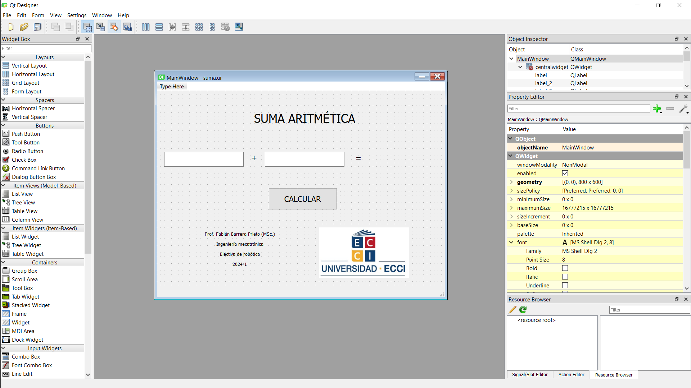

<h1>Aula 2</h1>

En esta clase se enseña a utilizar repositorio git, `Python` con el Toolbox de Peter Corke e interfaces gráficas (GUIs).

<h2>Introducción a Raspberry</h2>

La Raspberry es un 

<h2>Introducción a Python :atom:</h2>

`Python` es un lenguaje de programación interpretado, entre sus principales ventajas están: facilidad de sintaxis, no necesita declarar variables, indispensable indentar las líneas de código, fácil manejo de arreglos (vectores y matrices)

<h3>1. Instalar Python</h3><br>
En Windows, descargar el instalador del siguiente link: https://www.python.org y al momento de instalarlo, seleccionar la opción Add path.<br>
En Raspbian, por defecto ya está instalado `Python` versión 3.1X

Para conocer la versión de `Python` sobre la cual se está trabajando, en el terminal ejecutar el siguiente comando: 

```
python --version
```

<h3>2. Instalar Visual Studio Code</h3><br>
En Windows, descargar el instalador del siguiente link: https://code.visualstudio.com<br>
En Raspbian, ejecutar en el terminal la siguiente línea de comando: 

```
sudo apt install code
```

<h3>3. Ejemplos de programación en Python</h3>

Los ejemplos de esta clase están orientados a un repaso básico de programación, teniendo en cuenta la impresión de datos en consola, variables, ingreso de datos por consola, arreglos, condicionales, bucles, funciones y clases.

<h4>Impresión de datos en consola</h4>

Para imprimir informacion se utiliza la funcion `print`, en la cual es posible inicializar un <em>string</em> en comillas simples o dobles.

```python
print("Hola mundo '2024'")
print('Hola mundo "2024"')
```

<h4>Variables</h4>

No hay necesidad de declarar variables, sin embargo, pueden ser inicializadas y específicamente a las variables numéricas se les puede modificar el tipo de variable.

```python
a = 'Hola'
b = "Mundo"
c = 2024.0

print("Texto: %s %s %.2f" %(a,b,c))
print("Texto:",a,b,c)  
print("Texto: "+str(a)+' '+str(b)+' '+str(c))
print(f"Texto: {a} {b} {c:.2f}")
print("Texto: {0} {1} {2:.2f}".format(a,b,c))
```

Este tipo de operaciones se ejecutan de izquierda a derecha teniendo en cuenta la prioridad:

1. Paréntesis `()`
2. Exponente `**`
3. Negación `-x`
4. Multiplicación, División, Cociente, Módulo `*` `/` `//` `%`
5. Suma, Resta `+` `-`

```python
#Variables int y float
a = 7
b = c = 5.2
print(a,b,c)
print(type(a),type(int(b)),type(c)) #up o down casting
text = 'Los valores de a, b y c, respectivamente son:'
print(text+str(a)+' '+str(b)+" "+str(c)+"\n")

#Operaciones aritméticas
temp = a
a += b
print('a += b es: %f'%a)
a = temp
a -= b
print('a -= b es: %f'%a)
a = temp
a *= b
print('a *= b es: %f'%a)
a = temp
a /= b
print('a /= b es: %f'%a)
a = temp
a **= b
print('a **= b es: %f'%a)
a = temp
d = a/2 #cociente float
e = a//2 #cociente int
f = a%2 #residuo float
print('Los valores de d, e y f, respectivamente son: %f, %f y %f'%(d,e,f))

```

Ademas, es posible realizar operaciones logicas con las variables numericas

``` python
num1 = 7
num2 = 2
equal = num1 == num2
different = num1 != num2
greater = num1 >= num2
less = num1 <= num2
print(equal, different, greater, less)
```

En el caso de variables tipo <em>string</em>, tambien se pueden hacer comparaciones, teniendo en cuenta los valores de codificacion Unicode (similar a ASCII)

``` python
word1 = "Hola"
word2 = "hola"
equal = word1 == word2
different = word1 != word2
greater = word1 >= word2
less = word1 <= word2
print(equal, different, greater, less)
```

Es posible acceder a un caracter determinado de un <em>string</em> a traves de una posición específica tanto de izquierda a derecha (incrementando) como de derecha a izquierda (decrementando).

```python
n = "Fabián"
i1 = n[4]
i2 = n[-2]
print(i1,i2)

```
Asi mismo, en `Python` se pueden obtener y concatenar diferentes caracteres de un <em>string</em> 

```python
n = "Fabián" #string
s = "Barrera Prieto"
o = 'PROFESOR'
a = '2024'

print('Primera letra del nombre: %s' %n[0])
print("Primer apellido: %s" %s[:7])
print("Segundo apellido: %s" %s[8:])

c = n.upper()+' '+s+" es "+o.lower()+' en el semestre '+a+"\"2\""
print(c)
print(c[:int(len(c)/2)])
```

Las listas, al igual que los strings se acceden a las posiciones de igual manera, sin embargo, las listas pueden ser heterogeneas

```python
a = ['Fabián', "Barrera Prieto", "PROFESOR", 2024]
print(type(a))

print('Primera letra del nombre: %s' %a[0][0])
print("Primer apellido: %s" %a[1][:7])
print("Segundo apellido: %s" %a[1][8:])

b = a[0].upper()+' '+a[1]+" es "+a[2].lower()+' en el semestre '+str(a[3])+"\"2\""
print(b)
print(type(b))
print(b[:int(len(b)/2)])
```

<h4>Ingreso de datos por consola</h4>

Para ingresar datos por teclado se utiliza la funcion `input`

```python
name = input('Ingrese el nombre \n') 
age = input("Ingrese la edad \n")
print('%s tiene %s años' %(name,age))
```
<h4>Arreglos</h4>

```python
import numpy

nums1 = numpy.array([3,7,4,9,1])
nums2 = numpy.array([[6.3,7.2,1.1],[9.6,5.7,2.4]])
print("Datos y tamaño del vector nums1: %s y %d" %(nums1[0:4],nums1.size))
print("Datos y tamaño del vector nums2: %s y %d(%d)" %(nums2,len(nums2),nums2.size)) 

nums1[2] = 100
nums2[0,:] = 83
print("Datos y tamaño del vector nums1: %s y %d" %(nums1[1:4],nums1.size))
print("Datos y tamaño del vector nums2: %s y %d(%d)" %(nums2,len(nums2),nums2.size)) 
```
<h4>Condicionales</h4>

```python
name = input('Ingrese el nombre \n') 
age = int(input("Ingrese la edad \n"))
if age>=0 and age<3:
    print('%s es un bebé' %(name))
elif age>=3 and age<12:
    print(name+" es un niño")
elif age>=12 and age<20:
    print(name, 'es un adolescente')
elif age>=20 and age<30:
    print('%s es un joven' %(name))
elif age>=30 and age<70:
    print('%s es un adulto' %(name))
elif age>=70:
    print('%s es un abuelo' %(name))
else:
    print("La edad no es válida")
```
<h4>Bucles o ciclos</h4>

El bucle `for` es utilizado el ciclo `for` permite realizar iteraciones muy sencillas, teniendo en cuenta una condición de inicio, de final y de incremento

```python
suma = 0
for i in range (1,101,1):
    suma += i
print('La suma de los números del 1 al 100 es: %d' %suma)
```

De igual manera, para ejecutar un código una cantidad determinada de veces, como por ejemplo para recorrer listas y tuplas

```python
ciudades = ["Bogotá", 'Medellín', 'Cali', "Pasto"]
for ciudad in ciudades: #for ciudad in range (0,len(ciudades)):
    print(ciudad) #print(ciudades[ciudad])
```
Otra herramienta muy útil para depurar código es <a href="https://pythontutor.com">PythonTutor</a>; sin embargo, no todas las librerias funcionan en esta página (ej: numpy, roboticstoolbox, entre otras)

```python
notas = [] #lista 
c = int(input('Ingrese la cantidad de notas\n'))
for i in range(0,c):
    n = float(input('Ingrese la nota '+str(i+1)+" : "))
    notas.append(n)
print(notas)
print('La suma de las notas es: %.2f' %sum(notas))
```



El ciclo while `while` se utiliza para ejecutar un código una cantidad indeterminada de veces a partir de una condición

```python
r = "S"
while r != 'n':
    name = input('Ingrese el nombre \n') 
    age = int(input("Ingrese la edad \n"))
    while age<=0:
        print('La edad no es válida')    
        age = int(input("Ingrese nuevamente la edad \n"))
    if age>=18:
        print("%s es mayor de edad \n" %name)   
    else:
        print("%s es menor de edad \n" %name)   
    
    r = input('Desea ingresar la información de otro estudiante (s/n) \n')
    
print('Fin') 
```

En algunas ocasiones resulta necesario utilizar un ciclo `while` para garantizar ciertas tareas durante un tiempo específico, teniendo en cuenta el temporizador de la librería `time`.

```python
import time

t1 = time.time()
t2 = 0.0
while t2 <= 20.0:
    print("El tiempo es %f s \n" %t2)
    t2 = time.time() - t1
```
<h4>Funciones</h4>

Una suma es posible independizarla en una función, para que esta sea recursiva, flexible

```python
def sum(a,b):
    c = a + b
    return c

num1 = float(input('Ingrese el primer número: \n'))
num2 = float(input('Ingrese el segundo número: \n'))
num3 = sum(num1,num2)
print('%.2f + %.2f = %.2f' %(num1,num2,num3))
```

<h4>Arreglos y funciones</h4>

Este ejemplo es la serie de Fibonacci, la cual consiste en una sucesión que se calcula a partir de la suma de los dos últimos números de dicha sucesión

```python
def fibonacci(x):
    global data
    a = 1
    b = 1
    index = 0
    while index < x:
        data.append(a)
        temp = b
        b = a + b
        a = temp
        index += 1

data = []
fibonacci(12)
print(data)
```
Otro ejemplo son el ingreso de cinco calificaciones de un estudiantes y el cálculo del promedio de dichas notas, siendo que cada tarea se realiza en una función diferente

```python
def data():
    global grades
    for i in range(0,5,1):
        n = float(input('Ingrese la nota '+str(i+1)+" : "))
        grades.append(n)

def average(notas):
    s = 0.0
    for i in range(0,5,1):
        s += notas[i]
    a = s/len(notas)
    return s,a

grades = []
data()
r1,r2 = average(grades)
print('La suma y el promedio de las notas son: %.2f y %.2f' %(r1,r2))
```

<h4>Clases</h4>

Para programar a través de clases en `Python`, es importante tener en cuenta que las clases son estructuras de datos creadas a partir de variables (atributos o propiedades) y funciones (métodos). Los objetos (variables) son instancias de dichas clases, es decir, una entidad que puede aprovechar todos los recursos (atributos y métodos) de una clase. Además, se debe tener en cuenta que toda clase tiene un constructor que inicializa algunos atributos del objeto instanciado de dicha clase

```python
class Estudiante():
    #constructor
    def __init__(self, nombre, edad):
        self.nombre = nombre
        self.edad = edad 
        self.ocupacion = "Estudiante"
        self.grades = []
        self.s = 0.0
        self.a = 0
        
    #atributos
    
    #métodos        
    def data(self, x):
        for i in range(0,x,1):
            n = float(input('Ingrese la nota '+str(i+1)+" : "))
            self.grades.append(n)

    def average(self, x):
        for i in range(0,x,1):
            self.s += self.grades[i]
        self.a = self.s/len(self.grades)
        return self.s,self.a
    
    def result(self):
        print('La suma y el promedio de las notas son: %.2f y %.2f' %(self.s,self.a))
    
Fabian = Estudiante('Fabián',20) #instancia
Fabian.data(5)
r1,r2 = Fabian.average(5)
print('La suma y el promedio de las notas son: %.2f y %.2f' %(r1,r2))
Fabian.result()
```

<h2>Toolbox Peter Corke</h2>

(https://petercorke.github.io/robotics-toolbox-python/intro.html)

1. Instalar el toolbox de Peter Corke en `Python` (https://github.com/petercorke/robotics-toolbox-python)

En Windows y en Raspbian, en el terminal ejecutar el siguiente comando:

```
pip3 install roboticstoolbox-python
```
>[!WARNING]
>En las últimas versiones de Raspbian se presenta el siguiente error posteriormente a la ejecución del comando anterior


Para solucionar ese error, se deben tener en cuenta los siguientes pasos:

I. En el terminal, con los comandos linux (`cd`, `cd ..`, `ls`, `pwd`, etc.) entrar a la carpeta /etc<br>
II. Para abrir el archivo `pi.conf` en el terminal, ejecutar la siguiente línea de comando: 
```
sudo nano pip.conf
```
III. Al final del archivo agregar la siguiente línea: 
```
break-system-packages = true
```
IV. Presionar `Ctrl+x`, luego presionar la `s` para guardar las modificaciones y finalmente presionar `enter`

2. Ejecutar un código en `Python` donde se importe la libreria `roboticstoolbox` para verificar la correcta instalación de la misma

```python
from roboticstoolbox import *
import math

l1 = 12
l2 = 14
l3 = 6
l4 = 4

q1 = 0
q2 = 0

R = []
R.append(RevoluteDH(d=l1, alpha=math.pi/2, a=l2, offset=0))
R.append(RevoluteDH(d=l3, alpha=0, a=l4, offset=0))

Robot = DHRobot(R, name='Bender')
print(Robot)

Robot.teach([q1, q2], limits=[-30,30,-30,30,-30,30])

#zlim([-15,30]);

MTH = Robot.fkine([q1,q2])
print(MTH)
```