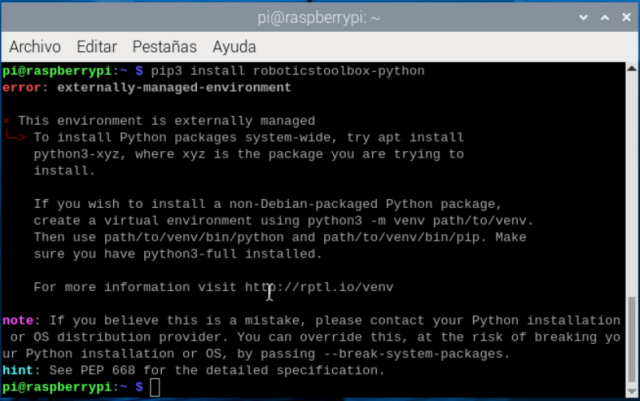

<h2>Aula 2</h2>

<h2>Introducción a Python :atom:</h2>

1. Instalar `Python`<br>
En Windows, descargar el instalador del siguiente link: https://www.python.org y al momento de instalarlo, seleccionar la opción Add path.<br>
En Raspbian, por defecto ya está instalado `Python` versión 3.1X

Para conocer la versión de `Python` sobre la cual se está trabajando, en el terminal ejecutar el siguiente comando: 

```
python --version
```

2. Instalar Visual Studio Code <br>
En Windows, descargar el instalador del siguiente link: https://code.visualstudio.com
En Raspbian, ejecutar en el terminal la siguiente línea de comando: sudo apt install code

3. Ejemplos de programación en `Python`

Es posible inicializar un <em>string</em> en comillas simples o dobles.

```python
print("Hola mundo '2024'")
print('Hola mundo "2024"')
```

No hay necesidad de declarar variables, sin embargo, pueden ser inicializadas y específicamente a las variables numéricas se les puede modificar el tipo de variable.

```python
#Variables int y float
a = 7
b = c = 5.2
print(a,b,c)
print(type(a),type(int(b)),type(c)) #up o down casting
text = 'Los valores de a, b y c, respectivamente son:'
print(text+str(a)+' '+str(b)+" "+str(c)+"\n")

#Operaciones aritméticas
temp = a
a += b
print('a += b es: %f'%a)
a = temp
a -= b
print('a -= b es: %f'%a)
a = temp
a *= b
print('a *= b es: %f'%a)
a = temp
a /= b
print('a /= b es: %f'%a)
a = temp
d = a/2 #cociente float
e = a//2 #cociente int
f = a%2 #residuo float
print('Los valores de d, e y f, respectivamente son: %f, %f y %f'%(d,e,f))

```

En el caso de variables tipo <em>string</em> se puede acceder a una posición específica de un vector tanto de izquierda a derecha (incrementando) como de derecha a izquierda (decrementando).

```python
#Variables string
nombre = "Fabian"
i1 = n[4]
i2 = n[-2]
print(i1,i2)

```
El segundo ejemplo es

```python
nombre = "Fabian"
i1 = n[4]
i2 = n[-2]
print(i1,i2)

```


<h2>Toolbox Peter Corke</h2>

(https://petercorke.github.io/robotics-toolbox-python/intro.html)

1. Instalar el toolbox de Peter Corke en `Python` (https://github.com/petercorke/robotics-toolbox-python)

En Windows y en Raspbian, en el terminal ejecutar el siguiente comando:

```
pip3 install roboticstoolbox-python
```

Sin embargo, en las últimas versiones de Raspbian se presenta el siguiente error posteriormente a la ejecución del comando anterior



Para solucionar ese error, se deben tener en cuenta los siguientes pasos:

I. En el terminal, con los comandos linux (`cd`, `cd ..`, `ls`, `pwd`, etc.) entrar a la carpeta /etc<br>
II. Para abrir el archivo `pi.conf` en el terminal, ejecutar la siguiente línea de comando: 
```
sudo nano pip.conf
```
III. Al final del archivo agregar la siguiente línea: 
```
break-system-packages = true
```
IV. Presionar `Ctrl+x`, luego presionar la `s` para guardar las modificaciones y finalmente presionar `enter`

2. Ejecutar un código en `Python` donde se importe la libreria `roboticstoolbox` para verificar la correcta instalación de la misma

```python
from roboticstoolbox import *
import math

l1 = 12
l2 = 14
l3 = 6
l4 = 4

q1 = 0
q2 = 0

R = []
R.append(RevoluteDH(d=l1, alpha=math.pi/2, a=l2, offset=0))
R.append(RevoluteDH(d=l3, alpha=0, a=l4, offset=0))

Robot = DHRobot(R, name='Bender')
print(Robot)

Robot.teach([q1, q2], limits=[-30,30,-30,30,-30,30])

#zlim([-15,30]);

MTH = Robot.fkine([q1,q2])
print(MTH)
```

<h2>Interfaces gráficas (GUI) con Qt designer</h2>

1. Instalar Qt designer<br>
En Windows, descargar el software a través del siguiente link: https://build-system.fman.io/qt-designer-download<br>
En Raspbian, en el terminal ejecutar el siguiente comando: 
```
sudo apt-get install qtcreator
```

2. Realizar el <em>front</em> end de la interfaz gráfica para la suma aritmética de dos números editando algunas propiedades de cada <em>widget</em> utilizado.


3. Convertir un archivo `.ui` a `.py`<br>

I. En el terminal, con los comandos linux (`cd`, `cd ..`, `ls`, `pwd`, etc.) entrar a la carpeta donde se encuentre el archivo `.ui`<br>

II. En Windows, ejecutar en el terminal el siguiente comando:
```
pyuic5 -x [FILENAME].ui -o [FILENAME].py (ej: pyuic5 -x suma.ui -o suma.py)
```
En Raspbian, ejecutar en el terminal el siguiente comando:
```
python -m PyQt5.uic.pyuic -x [FILENAME].ui -o [FILENAME].py (ej: python -m PyQt5.uic.pyuic -x suma.ui -o suma.py)
```

4. Realizar el <em>back end</em> de la interfaz gráfica, es decir, editar el archivo `.py` para que realice la tarea específica de la suma de dos números cuando se presione el botón.

```python
# -*- coding: utf-8 -*-

# Form implementation generated from reading ui file 'suma.ui'
#
# Created by: PyQt5 UI code generator 5.15.9
#
# WARNING: Any manual changes made to this file will be lost when pyuic5 is
# run again.  Do not edit this file unless you know what you are doing.


from PyQt5 import QtCore, QtGui, QtWidgets


class Ui_MainWindow(object):
    def setupUi(self, MainWindow):
        MainWindow.setObjectName("MainWindow")
        MainWindow.resize(800, 600)
        self.centralwidget = QtWidgets.QWidget(MainWindow)
        self.centralwidget.setObjectName("centralwidget")
        self.pushButton = QtWidgets.QPushButton(self.centralwidget)
        self.pushButton.setGeometry(QtCore.QRect(310, 270, 191, 61))
        font = QtGui.QFont()
        font.setPointSize(13)
        self.pushButton.setFont(font)
        self.pushButton.setObjectName("pushButton")
        self.label = QtWidgets.QLabel(self.centralwidget)
        self.label.setGeometry(QtCore.QRect(610, 150, 141, 71))
        font = QtGui.QFont()
        font.setPointSize(14)
        self.label.setFont(font)
        self.label.setText("")
        self.label.setAlignment(QtCore.Qt.AlignCenter)
        self.label.setObjectName("label")
        self.label_2 = QtWidgets.QLabel(self.centralwidget)
        self.label_2.setGeometry(QtCore.QRect(250, 160, 41, 51))
        font = QtGui.QFont()
        font.setPointSize(13)
        self.label_2.setFont(font)
        self.label_2.setTextFormat(QtCore.Qt.AutoText)
        self.label_2.setAlignment(QtCore.Qt.AlignCenter)
        self.label_2.setObjectName("label_2")
        self.textEdit = QtWidgets.QTextEdit(self.centralwidget)
        self.textEdit.setGeometry(QtCore.QRect(20, 170, 221, 41))
        font = QtGui.QFont()
        font.setPointSize(14)
        self.textEdit.setFont(font)
        self.textEdit.setLayoutDirection(QtCore.Qt.LeftToRight)
        self.textEdit.setSizeAdjustPolicy(QtWidgets.QAbstractScrollArea.AdjustIgnored)
        self.textEdit.setObjectName("textEdit")
        self.textEdit_2 = QtWidgets.QTextEdit(self.centralwidget)
        self.textEdit_2.setGeometry(QtCore.QRect(300, 170, 221, 41))
        font = QtGui.QFont()
        font.setPointSize(14)
        self.textEdit_2.setFont(font)
        self.textEdit_2.setObjectName("textEdit_2")
        self.label_3 = QtWidgets.QLabel(self.centralwidget)
        self.label_3.setGeometry(QtCore.QRect(540, 160, 41, 51))
        font = QtGui.QFont()
        font.setPointSize(13)
        self.label_3.setFont(font)
        self.label_3.setTextFormat(QtCore.Qt.AutoText)
        self.label_3.setAlignment(QtCore.Qt.AlignCenter)
        self.label_3.setObjectName("label_3")
        self.label_4 = QtWidgets.QLabel(self.centralwidget)
        self.label_4.setGeometry(QtCore.QRect(200, 40, 421, 71))
        font = QtGui.QFont()
        font.setPointSize(20)
        self.label_4.setFont(font)
        self.label_4.setAlignment(QtCore.Qt.AlignCenter)
        self.label_4.setObjectName("label_4")
        self.label_5 = QtWidgets.QLabel(self.centralwidget)
        self.label_5.setGeometry(QtCore.QRect(130, 370, 201, 141))
        self.label_5.setObjectName("label_5")
        self.label_6 = QtWidgets.QLabel(self.centralwidget)
        self.label_6.setGeometry(QtCore.QRect(440, 370, 301, 151))
        font = QtGui.QFont()
        font.setPointSize(14)
        self.label_6.setFont(font)
        self.label_6.setText("")
        self.label_6.setPixmap(QtGui.QPixmap("Aula2/ecci.jpg"))
        self.label_6.setScaledContents(True)
        self.label_6.setAlignment(QtCore.Qt.AlignCenter)
        self.label_6.setObjectName("label_6")
        MainWindow.setCentralWidget(self.centralwidget)
        self.menubar = QtWidgets.QMenuBar(MainWindow)
        self.menubar.setGeometry(QtCore.QRect(0, 0, 800, 26))
        self.menubar.setObjectName("menubar")
        MainWindow.setMenuBar(self.menubar)
        self.statusbar = QtWidgets.QStatusBar(MainWindow)
        self.statusbar.setObjectName("statusbar")
        MainWindow.setStatusBar(self.statusbar)

        self.retranslateUi(MainWindow)
        QtCore.QMetaObject.connectSlotsByName(MainWindow)

        #Acción al presionar el botón en la GUI
        self.pushButton.clicked.connect(self.Suma)

    def retranslateUi(self, MainWindow):
        _translate = QtCore.QCoreApplication.translate
        MainWindow.setWindowTitle(_translate("MainWindow", "Ejemplo1"))
        self.pushButton.setText(_translate("MainWindow", "CALCULAR"))
        self.label_2.setText(_translate("MainWindow", "+"))
        self.textEdit.setHtml(_translate("MainWindow", "<!DOCTYPE HTML PUBLIC \"-//W3C//DTD HTML 4.0//EN\" \"http://www.w3.org/TR/REC-html40/strict.dtd\">\n"
"<html><head><meta name=\"qrichtext\" content=\"1\" /><style type=\"text/css\">\n"
"p, li { white-space: pre-wrap; }\n"
"</style></head><body style=\" font-family:\'MS Shell Dlg 2\'; font-size:14pt; font-weight:400; font-style:normal;\">\n"
"<p align=\"center\" style=\"-qt-paragraph-type:empty; margin-top:0px; margin-bottom:0px; margin-left:0px; margin-right:0px; -qt-block-indent:0; text-indent:0px;\"><br /></p></body></html>"))
        self.textEdit_2.setHtml(_translate("MainWindow", "<!DOCTYPE HTML PUBLIC \"-//W3C//DTD HTML 4.0//EN\" \"http://www.w3.org/TR/REC-html40/strict.dtd\">\n"
"<html><head><meta name=\"qrichtext\" content=\"1\" /><style type=\"text/css\">\n"
"p, li { white-space: pre-wrap; }\n"
"</style></head><body style=\" font-family:\'MS Shell Dlg 2\'; font-size:14pt; font-weight:400; font-style:normal;\">\n"
"<p align=\"center\" style=\"-qt-paragraph-type:empty; margin-top:0px; margin-bottom:0px; margin-left:0px; margin-right:0px; -qt-block-indent:0; text-indent:0px;\"><br /></p></body></html>"))
        self.label_3.setText(_translate("MainWindow", "="))
        self.label_4.setText(_translate("MainWindow", "SUMA ARITMÉTICA"))
        self.label_5.setText(_translate("MainWindow", "<html><head/><body><p align=\"center\">Prof. Fabián Barrera Prieto (MSc.)</p><p align=\"center\">Ingeniería mecatrónica</p><p align=\"center\">Electiva de robótica</p><p align=\"center\">2024-1</p></body></html>"))

    #Función que se ejecuta con la acción anterior
    def Suma(self):
        a = self.textEdit.toPlainText()
        b = self.textEdit_2.toPlainText()
        c = int(a)+int(b)
        self.label.setText(str(c))


if __name__ == "__main__":
    import sys
    app = QtWidgets.QApplication(sys.argv)
    MainWindow = QtWidgets.QMainWindow()
    ui = Ui_MainWindow()
    ui.setupUi(MainWindow)
    MainWindow.show()
    sys.exit(app.exec_())
```
5. Ejecutar el archivo `.py` para probar la aplicación


<h2>Repositorio git</h2>
https://docs.github.com/en/authentication/keeping-your-account-and-data-secure/managing-your-personal-access-tokens

Los repositorios GitHub y GitLab son utilizados principalmente por el terminal, donde los comandos son similares a los de Linux, algunos de dichos comandos son:

```linux
COMANDOS LINUX
ls -> Muestra la lista de archivos en la ruta
pwd -> Muestra la ruta actual
cd -> Entra a una carpeta especificada
cd .. -> Regresa al punto anterior de la ruta
touch  -> Crea un archivo
mkdir -> Crea una carpeta 
```

Para iniciar con la sincronización del repositorio local con el repositorio local se debe realizar la configuración teniendo en cuenta los siguientes comandos:

```git
COMANDOS GIT
git config --global user.name “nombre_usuario” (ej: git config --global user.name “FBarreraP”)
git config --global user.email “correo_registrado” (ej: git config --global user.email “fbarrera6@gmail.com”)
```
Para crear un repositorio web a partir de una carpeta local (PC)

```git
Entrar a la carpeta a través del terminal teniendo en cuenta los comandos linux anteriormente presentados
git init -> Convierte la carpeta en un repositorio local a partir de la creación del archivo .git
git add README.md -> 
git commit -m "algun_comentario" ->
git branch -M main
git remote add origin https://github.com/FBarreraP/nombre_repositorio_web (ej: https://github.com/FBarreraP/ElectivaRobotica.git)
git push -u origin main ->
```

Para crear un repositorio local (PC) desde un repositorio web

```git
Entrar a la carpeta a través del terminal teniendo en cuenta los comandos linux anteriormente presentados
git clone https://github.com/FBarreraP/nombre_repositorio_web (ej: https://github.com/FBarreraP/ElectivaRobotica.git)
cd nombre_repositorio_web (ej: ElectivaRobotica)
```

Para sincronizar los repositorios (web y local) se utilizan los siguientes comandos de git

```git
git status -> lista todas los archivos o carpetas nuevas o modificadas que no han sido commit
git add --all ->
git commit -m "algun_comentario" ->
git push -u origin main ->
```