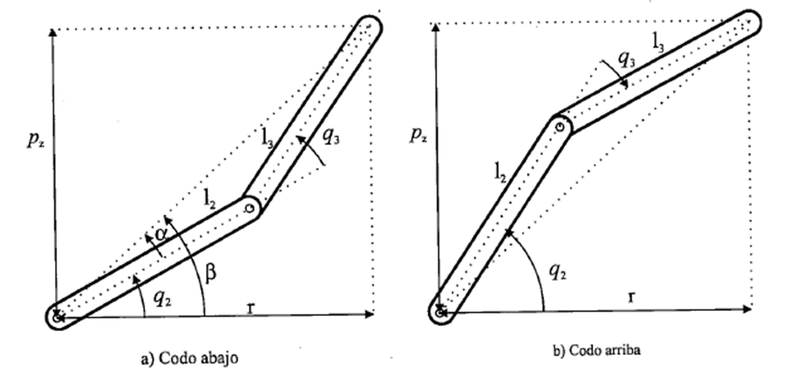
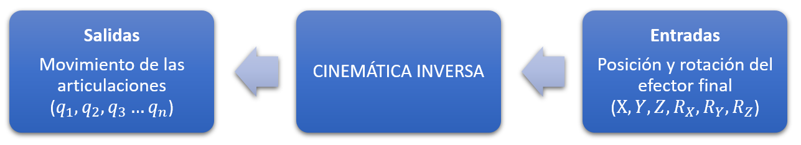
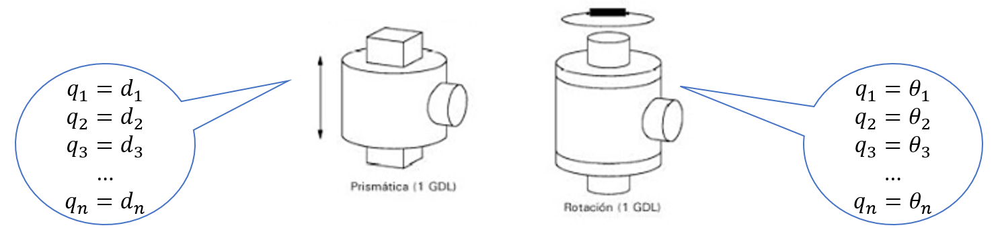
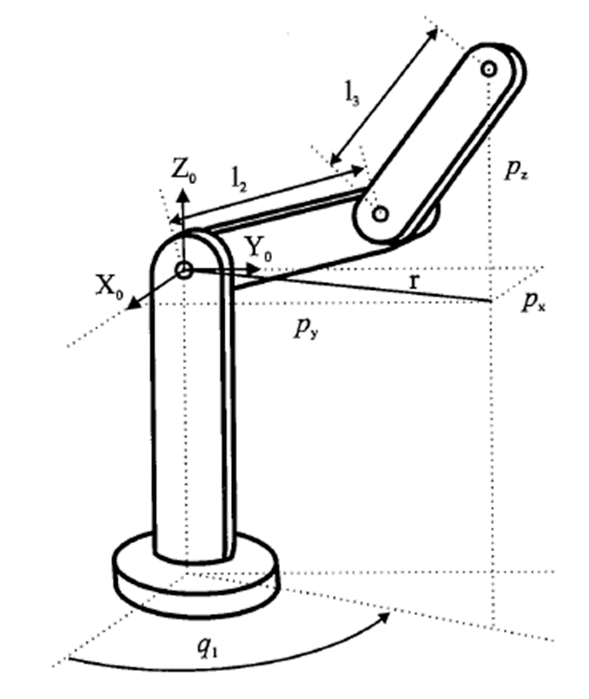
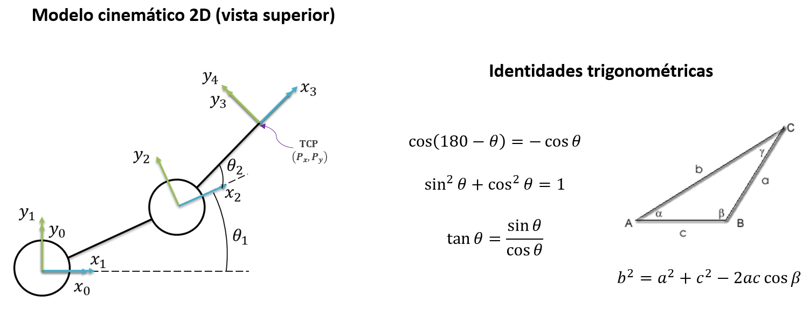

<h1>Aula 8</h1>

Esta clase consiste en comprender y analizar la cinemática inversa de un robot 2R

<h2>Introducción a la cinemática inversa con 2R</h2>

Consiste en determinar los movimientos angulares y/o lineales de las articulaciones rotacionales y/o prismáticas respectivamente a partir de la posición (traslación) y orientación (rotación) del efector final (TCP) con respecto al sistema coordenado de referencia (SC{0}).

La solución del problema cinemático inverso no solamente es una, es decir, se pueden tener diferentes valores de las articulaciones para un mismo punto específico del efector final.



Fuente: Barrientos, A., Peñín, L.F., Balaguer, C., y Aracil, R., 2007, Fundamentos de Robótica, 2nd edition, McGraw-Hill.





Método geométrico:
1. Conocimientos de geometría espacial y trigonometría
2. Los sistemas coordenados son arbitrarios (no tienen requisitos), pero se debe cumplir con la regla de la mano derecha
3. No es un método sistemático, es decir, para cada robot hay que realizar el análisis.

Métodos numéricos iterativos:
1. Se realizan en un computador debido a la complejidad en la solución.



Fuente: Barrientos, A., Peñín, L.F., Balaguer, C., y Aracil, R., 2007, Fundamentos de Robótica, 2nd edition, McGraw-Hill.

<h3>Método geométrico</h3>


```matlab
%% Peter Corke 2R (planar)

clear all
close all
clc

l1 = 10;
l2 = 10;

q1 = 0;
q2 = 0;

R(1) = Link('revolute','d',0,'alpha',0,'a',l1,'offset',0);
R(2) = Link('revolute','d',0,'alpha',0,'a',l2,'offset',0);

Robot = SerialLink(R,'name','Bender')

% Robot.plot([q1,q2],'scale',1.0,'workspace',[-30 30 -30 30 -30 30]);

Robot.teach([q1,q2],'scale',1.0,'workspace',[-30 30 -30 30 -30 30],'rpy/zyx');
zlim([-15,30]);
%Robot.fkine([q1,q2])
```



<h4>Theta 2</h4>

$$𝑏=\sqrt{𝑃_𝑥^2+𝑃_𝑦^2}$$

$$cos𝜃_2=\frac{𝑏^2−𝑙_2^2−𝑙_1^2}{2\cdot𝑙_1\cdot𝑙_2}$$

$$sin⁡𝜃_2=±\sqrt{1−(cos𝜃_2)^2}$$

$$𝜃_2=tan^{−1}\frac{sin𝜃_2}{cos𝜃_2}$$

<h3>Theta 1</h3>

$$𝛼=tan^{−1}⁡\frac{𝑃_𝑦}{𝑃_𝑥}$$

$$∅=tan^{−1}\frac{𝑙_2 \cdot sin⁡𝜃_2}{𝑙_1+𝑙_2 \cdot cos⁡𝜃_2}$$

$$𝜃_1=𝛼−∅$$

```matlab
%% Cinemática Inversa 2R (planar)

clear all
close all
clc

l1 = 10;
l2 = 10;

% Cinemática inversa
Px = -10.577;
Py = -3.808;

b = sqrt(Px^2+Py^2);
% Theta 2
cos_theta2 = (b^2-l2^2-l1^2)/(2*l1*l2);
sen_theta2 = sqrt(1-(cos_theta2)^2);%(+)codo abajo y (-)codo arriba
theta2 = atan2(sen_theta2, cos_theta2);
fprintf('theta 2 = %.4f \n',radtodeg(theta2));
% Theta 1
alpha = atan2(Py,Px);
phi = atan2(l2*sen_theta2, l1+l2*cos_theta2);
theta1 = alpha - phi;
fprintf('theta 1 = %.4f \n',radtodeg(theta1));
%-------------

q1 = theta1;
q2 = theta2;

R(1) = Link('revolute','d',0,'alpha',0,'a',l1,'offset',0);
R(2) = Link('revolute','d',0,'alpha',0,'a',l2,'offset',0);

Robot = SerialLink(R,'name','Bender')

Robot.plot([q1,q2],'scale',1.0,'workspace',[-30 30 -30 30 -30 30]);
zlim([-15,30]);
Robot.teach([q1,q2]);
Robot.fkine([q1,q2])
```
