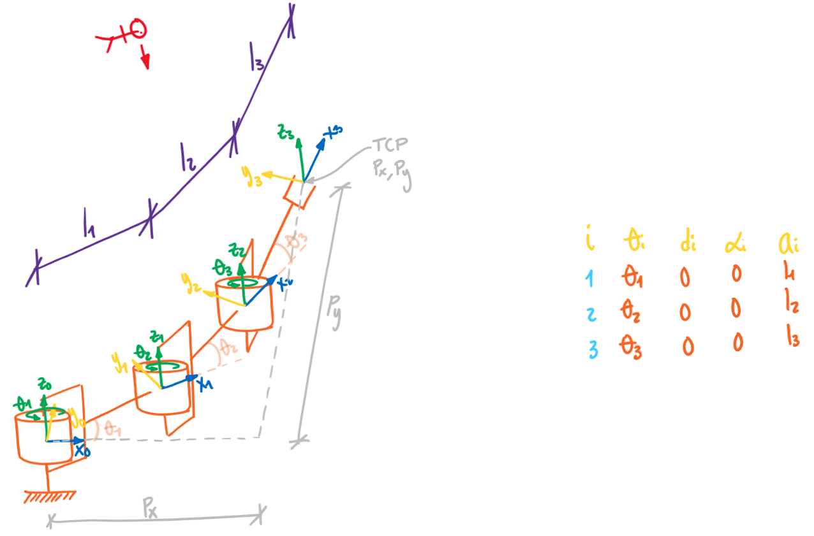
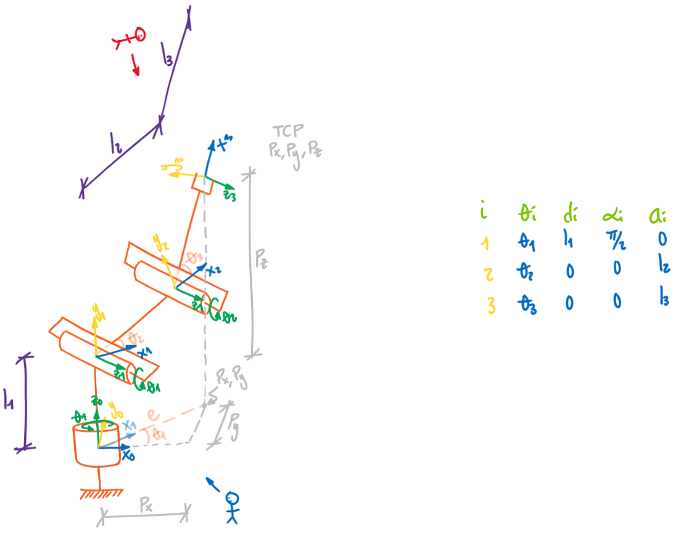

<h1>Aula 23</h1>

Esta clase consiste en comprender y analizar la cinemática inversa de dos robots 3R.

<h2>Robot 3R (planar)</h2>



$$e=𝑃_𝑥−𝑙_3 \cdot cos⁡𝛽$$

$$c=𝑃_𝑦−𝑙_3 \cdot 𝑠𝑒𝑛⁡𝛽$$

$𝜃_2$ y $𝜃_1$ son obtenidos a partir del análisis de la cinemática inversa del 2R

<h3>Theta 2</h3>

$$𝑏=\sqrt{e^2+c^2}$$

$$cos𝜃_2=\frac{𝑏^2−𝑙_2^2−𝑙_1^2}{2\cdot𝑙_1\cdot𝑙_2}$$

$$sin⁡𝜃_2=±\sqrt{1−(cos𝜃_2)^2}$$

$$𝜃_2=tan^{−1}\frac{sin𝜃_2}{cos𝜃_2}$$

<h3>Theta 1</h3>

$$𝛼=tan^{−1}⁡\frac{c}{e}$$

$$∅=tan^{−1}\frac{𝑙_2 \cdot sin⁡𝜃_2}{𝑙_1+𝑙_2 \cdot cos⁡𝜃_2}$$

$$𝜃_1=𝛼−∅$$

<h3>Theta 3</h3>

$$𝜃_3=𝛽−𝜃_1−𝜃_2$$

Siendo que $𝛽$ es el ángulo escogido para la rotación de la muñeca con respecto al eje horizontal.

Comprobación en `python`

```python
from roboticstoolbox import *
from spatialmath.base import *
import math
import numpy
from sympy import *

l1 = 10
l2 = 10
l3 = 10

# Cinemática inversa
Px = 27.071
Py = 7.071
beta = numpy.deg2rad(45)

e = Px - l3*round(cos(beta),4)
c = Py - l3*round(sin(beta),4)
# Theta 2
b = round(sqrt(e**2+c**2),4)
cos_theta2 = (b**2-l2**2-l1**2)/(2*l1*l2)
sen_theta2 = math.sqrt(1-(cos_theta2)**2)
theta2 = float(atan2(sen_theta2, cos_theta2))
print(f'theta 2 = {numpy.rad2deg(theta2):.4f}')
# Theta 1
alpha = math.atan2(c,e)
phi = math.atan2(l2*sen_theta2, l1+l2*cos_theta2)
theta1 = alpha - phi
if theta1 <= -numpy.pi:
    theta1 = (2*numpy.pi)+theta1

print(f'theta 1 = {numpy.rad2deg(theta1):.4f}')
#Theta 3
theta3 = beta - theta1 - theta2
print(f'theta 3 = {numpy.rad2deg(theta3):.4f}')
#-------------

q1 = theta1
q2 = theta2
q3 = theta3

R = []
R.append(RevoluteDH(d=0, alpha=0, a=l1, offset=0))
R.append(RevoluteDH(d=0, alpha=0, a=l2, offset=0))
R.append(RevoluteDH(d=0, alpha=0, a=l3, offset=0))

Robot = DHRobot(R, name='Bender')
print(Robot)

Robot.teach([q1, q2, q3], 'rpy/zyx', limits=[-30,30,-30,30,-30,30])

#zlim([-15,30]);

MTH = Robot.fkine([q1,q2,q3])
print(MTH)
print(f'Roll, Pitch, Yaw = {tr2rpy(MTH.R, 'deg', 'zyx')}')
```
Comprobación en `matlab`

```matlab
%% Robot 3R (planar)

clear all
close all
clc

l1 = 10;
l2 = 10;
l3 = 10;

% Cinemática inversa
Px = 27.071;
Py = 7.071;
beta = deg2rad(45)

%Px = 7.739;
%Py = 22.885;
%beta = deg2rad(95.2)

e = Px - l3*round(cos(beta),4)
c = Py - l3*round(sin(beta),4)
% Theta 2
b = sqrt(e^2+c^2)
cos_theta2 = (b^2-l2^2-l1^2)/(2*l1*l2);
sen_theta2 = sqrt(1-(cos_theta2)^2);
theta2 = atan2(sen_theta2, cos_theta2);
fprintf('theta 2 = %.4f \n',rad2deg(theta2));
% Theta 1
alpha = atan2(c,e);
phi = atan2(l2*sen_theta2, l1+l2*cos_theta2);
theta1 = alpha - phi;
if theta1 <= -pi
    theta1 = (2*pi)+theta1;
end
fprintf('theta 1 = %.4f \n',rad2deg(theta1));
%Theta 3
theta3 = beta - theta1 - theta2;
fprintf('theta 3 = %.4f \n',rad2deg(theta3));
%

q1 = theta1;
q2 = theta2;
q3 = theta3;

R(1) = Link('revolute','d',0,'alpha',0,'a',l1,'offset',0);
R(2) = Link('revolute','d',0,'alpha',0,'a',l2,'offset',0);
R(3) = Link('revolute','d',0,'alpha',0,'a',l3,'offset',0);

Robot = SerialLink(R,'name','Bender')

%Robot.plot([q1,q2,q3],'scale',1.0,'workspace',[-30 30 -30 30 -30 30]);
zlim([-15,30]);
Robot.teach([q1,q2,q3],'scale',1.0,'workspace',[-30 30 -30 30 -30 30],'rpy/zyx');
Robot.fkine([q1,q2,q3])
```

<h2>Robot 3R (3D)</h2>



<h3>Theta 1</h3>

$$𝜃_1=tan^{−1}\frac{⁡𝑃_𝑦}{𝑃_𝑥}$$

$$𝑒=\sqrt{𝑃_𝑥^2+𝑃_𝑦^2}$$

$𝜃_3$ y $𝜃_2$ son obtenidos a partir del análisis de la cinemática inversa del 2R

<h3>Theta 3</h3>

$$𝑐=𝑃_𝑧−𝑙_1$$

$$𝑏=\sqrt{𝑒^2+𝑐^2}$$

$$cos𝜃_3=\frac{𝑏^2−𝑙_3^2−𝑙_2^2}{2\cdot𝑙_2\cdot𝑙_3}$$

$$sin⁡𝜃_3=±\sqrt{1−(cos𝜃_3)^2}$$

$$𝜃_3=tan^{−1}\frac{sin𝜃_3}{cos𝜃_3}$$

<h3>Theta 2</h3>

$$𝛼=tan^{−1}⁡\frac{𝑐}{𝑒}$$

$$∅=tan^{−1}\frac{𝑙_3 \cdot sin⁡𝜃_3}{𝑙_2+𝑙_3 \cdot cos⁡𝜃_3}$$

$$𝜃_2=𝛼−∅$$

Comprobación en `python`

```python
from roboticstoolbox import *
from spatialmath.base import *
import math
import numpy
from sympy import *

l1 = 10
l2 = 10
l3 = 10

# Cinemática inversa
Px = -9.545
Py = 7.896
Pz = 23.192

e = sqrt(Px**2+Py**2)
c = Pz - l1
b = sqrt(e**2+c**2)
# Theta 1
theta1 = float(atan2(Py,Px))
print(f'theta 1 = {numpy.rad2deg(theta1):.4f}')
# Theta 3
cos_theta3 = (b**2-l2**2-l3**2)/(2*l2*l3)
sen_theta3 = sqrt(1-(cos_theta3)**2)
theta3 = float(atan2(sen_theta3, cos_theta3))
print(f'theta 3 = {numpy.rad2deg(theta3):.4f}')
# Theta 2
alpha = math.atan2(c,e)
phi = math.atan2(l3*sen_theta3, l2+l3*cos_theta3)
theta2 = float(alpha - phi)
if theta2 <= -numpy.pi:
    theta2 = (2*numpy.pi)+theta2

print(f'theta 2 = {numpy.rad2deg(theta2):.4f}')
#-------------

q1 = theta1
q2 = theta2
q3 = theta3

R = []
R.append(RevoluteDH(d=l1, alpha=numpy.pi/2, a=0, offset=0))
R.append(RevoluteDH(d=0, alpha=0, a=l2, offset=0))
R.append(RevoluteDH(d=0, alpha=0, a=l3, offset=0))

Robot = DHRobot(R, name='Bender')
print(Robot)

Robot.teach([q1, q2, q3], 'rpy/zyx', limits=[-30,30,-30,30,-30,30])

#zlim([-15,30]);

MTH = Robot.fkine([q1,q2,q3])
print(MTH)
print(f'Roll, Pitch, Yaw = {tr2rpy(MTH.R, 'deg', 'zyx')}')
```

Comprobación en `matlab`

```matlab
%% Robot 3R (angular)

clear all
close all
clc

l1 = 10;
l2 = 10;
l3 = 10;

% Cinemática inversa
Px = -9.545;
Py = 7.896;
Pz = 23.192;

e = sqrt(Px^2+Py^2);
c = Pz - l1;
b = sqrt(e^2+c^2);
% Theta 1
theta1 = atan2(Py,Px);
fprintf('theta 1 = %.4f \n',rad2deg(theta1));
% Theta 3
cos_theta3 = (b^2-l2^2-l3^2)/(2*l2*l3);
sen_theta3 = sqrt(1-(cos_theta3)^2);
theta3 = atan2(sen_theta3, cos_theta3);
fprintf('theta 3 = %.4f \n',rad2deg(theta3));
% Theta 2
alpha = atan2(c,e);
phi = atan2(l3*sen_theta3, l2+l3*cos_theta3);
theta2 = alpha - phi;
if theta2 <= -pi
    theta2 = (2*pi)+theta2;
end
fprintf('theta 2 = %.4f \n',rad2deg(theta2));

%

q1 = theta1;
q2 = theta2;
q3 = theta3;

R(1) = Link('revolute','d',l1,'alpha',pi/2,'a',0,'offset',0);
R(2) = Link('revolute','d',0,'alpha',0,'a',l2,'offset',0);
R(3) = Link('revolute','d',0,'alpha',0,'a',l3,'offset',0);

Robot = SerialLink(R,'name','Bender')

%Robot.plot([q1,q2,q3],'scale',1.0,'workspace',[-30 30 -30 30 -30 30]);
zlim([-15,30]);
Robot.teach([q1,q2,q3],'scale',1.0,'workspace',[-30 30 -30 30 -30 30],'rpy/zyx');
Robot.fkine([q1,q2,q3])
```

<h3>Ejercicios</h3>

Determinar la cinemática inversa para cada uno de los siguientes cinco tipos de robots: 1. Cartesiano, 2. Cilíndrico, 3. Esférico, 4. Scara y 5. Angular.

