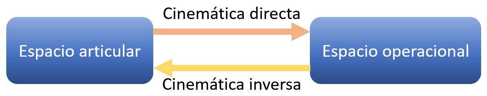

<h1>Aula 9</h1>

Esta clase consiste en comprender y analizar la cinemática inversa de dos robots 3R, así como las rutas y las trayectorias con perfil de velocidad trapezoidal.

<h2>Robot 3R (planar)</h2>


$$𝑚=𝑃_𝑥−𝑙_3 \cdot cos⁡𝛽$$

$$𝑛=𝑃_𝑦−𝑙_3 \cdot 𝑠𝑒𝑛⁡𝛽$$

$𝜃_2$ y $𝜃_1$ son obtenidos a partir del análisis de la cinemática inversa del 2R

<h3>Theta 2</h3>

$$𝑏=\sqrt{𝑚^2+𝑛^2}$$

$$cos𝜃_2=\frac{𝑏^2−𝑙_2^2−𝑙_1^2}{2\cdot𝑙_1\cdot𝑙_2}$$

$$sin⁡𝜃_2=±\sqrt{1−(cos𝜃_2)^2}$$

$$𝜃_2=tan^{−1}\frac{sin𝜃_2}{cos𝜃_2}$$

<h3>Theta 1</h3>

$$𝛼=tan^{−1}⁡\frac{𝑛}{𝑚}$$

$$∅=tan^{−1}\frac{𝑙_2 \cdot sin⁡𝜃_2}{𝑙_1+𝑙_2 \cdot cos⁡𝜃_2}$$

$$𝜃_1=𝛼−∅$$

<h3>Theta 3</h3>

$$𝜃_3=𝛽−𝜃_1−𝜃_2$$

Siendo que $𝛽$ es el ángulo escogido para la rotación de la muñeca con respecto al eje horizontal.

```matlab
%% Robot 3R (planar)

clear all
close all
clc

l1 = 10;
l2 = 10;
l3 = 10;

% Cinemática inversa
Px = 27.071;
Py = 7.071;
beta = deg2rad(45)

%Px = 7.739;
%Py = 22.885;
%beta = deg2rad(95.2)

m = Px - l3*round(cos(beta),4)
n = Py - l3*round(sin(beta),4)
% Theta 2
b = sqrt(m^2+n^2)
cos_theta2 = (b^2-l2^2-l1^2)/(2*l1*l2);
sen_theta2 = sqrt(1-(cos_theta2)^2);
theta2 = atan2(sen_theta2, cos_theta2);
fprintf('theta 2 = %.4f \n',rad2deg(theta2));
% Theta 1
alpha = atan2(n,m);
phi = atan2(l2*sen_theta2, l1+l2*cos_theta2);
theta1 = alpha - phi;
if theta1 <= -pi
    theta1 = (2*pi)+theta1;
end
fprintf('theta 1 = %.4f \n',rad2deg(theta1));
%Theta 3
theta3 = beta - theta1 - theta2;
fprintf('theta 3 = %.4f \n',rad2deg(theta3));
%

q1 = theta1;
q2 = theta2;
q3 = theta3;

R(1) = Link('revolute','d',0,'alpha',0,'a',l1,'offset',0);
R(2) = Link('revolute','d',0,'alpha',0,'a',l2,'offset',0);
R(3) = Link('revolute','d',0,'alpha',0,'a',l3,'offset',0);

Robot = SerialLink(R,'name','Bender')

%Robot.plot([q1,q2,q3],'scale',1.0,'workspace',[-30 30 -30 30 -30 30]);
zlim([-15,30]);
Robot.teach([q1,q2,q3],'scale',1.0,'workspace',[-30 30 -30 30 -30 30],'rpy/zyx');
Robot.fkine([q1,q2,q3])
```

<h2>Robot 3R (3D)</h2>


<h3>Theta 1</h3>

$$𝜃_1=tan^{−1}\frac{⁡𝑃_𝑦}{𝑃_𝑥}$$

$$𝑒=\sqrt{𝑃_𝑥^2+𝑃_𝑦^2}$$

$𝜃_3$ y $𝜃_2$ son obtenidos a partir del análisis de la cinemática inversa del 2R

<h3>Theta 3</h3>

$$𝑐=𝑃_𝑧−𝑙_1$$

$$𝑏=\sqrt{𝑒^2+𝑐^2}$$

$$cos𝜃_3=\frac{𝑏^2−𝑙_3^2−𝑙_2^2}{2\cdot𝑙_2\cdot𝑙_3}$$

$$sin⁡𝜃_3=±\sqrt{1−(cos𝜃_3)^2}$$

$$𝜃_3=tan^{−1}\frac{sin𝜃_3}{cos𝜃_3}$$

<h3>Theta 2</h3>

$$𝛼=tan^{−1}⁡\frac{𝑐}{𝑒}$$

$$∅=tan^{−1}\frac{𝑙_3 \cdot sin⁡𝜃_3}{𝑙_2+𝑙_3 \cdot cos⁡𝜃_3}$$

$$𝜃_2=𝛼−∅$$

```matlab
%% Robot 3R (angular)

clear all
close all
clc

l1 = 10;
l2 = 10;
l3 = 10;

% Cinemática inversa
Px = -9.545;
Py = 7.896;
Pz = 23.192;

e = sqrt(Px^2+Py^2);
c = Pz - l1;
b = sqrt(e^2+c^2);
% Theta 1
theta1 = atan2(Py,Px);
fprintf('theta 1 = %.4f \n',rad2deg(theta1));
% Theta 3
cos_theta3 = (b^2-l2^2-l3^2)/(2*l2*l3);
sen_theta3 = sqrt(1-(cos_theta3)^2);
theta3 = atan2(sen_theta3, cos_theta3);
fprintf('theta 3 = %.4f \n',rad2deg(theta3));
% Theta 2
alpha = atan2(c,e);
phi = atan2(l3*sen_theta3, l2+l3*cos_theta3);
theta2 = alpha - phi;
if theta2 <= -pi
    theta2 = (2*pi)+theta2;
end
fprintf('theta 2 = %.4f \n',rad2deg(theta2));

%

q1 = theta1;
q2 = theta2;
q3 = theta3;

R(1) = Link('revolute','d',l1,'alpha',pi/2,'a',0,'offset',0);
R(2) = Link('revolute','d',0,'alpha',0,'a',l2,'offset',0);
R(3) = Link('revolute','d',0,'alpha',0,'a',l3,'offset',0);

Robot = SerialLink(R,'name','Bender')

%Robot.plot([q1,q2,q3],'scale',1.0,'workspace',[-30 30 -30 30 -30 30]);
zlim([-15,30]);
Robot.teach([q1,q2,q3],'scale',1.0,'workspace',[-30 30 -30 30 -30 30],'rpy/zyx');
Robot.fkine([q1,q2,q3])
```

<h2>Trayectorias</h2>

Las trayectorias de los robots consisten en realizar tareas de movimiento del robot de un punto inicial a un punto final, en el espacio articular (espacio de movimientos de las articulaciones) o en el espacio operacional del robot (espacio (área o volumen) de trabajo).




<h3>Planeación de ruta (<i>path planning</i>)</h3>

Genera una ruta geométrica, desde un punto inicial hasta un punto final a través de puntos intermedios (waypoints) previamente definidos de manera discontinua (saltos bruscos), donde solo es relevante la posición.

Las rutas con puntos intermedios a través de la interpolación de ángulos del punto A y B generan un resultado circular (MoveJ).


```matlab
%% Ruta 1 (espacio articulacional (MoveJ) - interpolando ángulos)

clear all
close all
clc

l1 = 10;
l2 = 10;
l3 = 10;

% Cinemática inversa
% Punto 1
P1x = 2.456;
P1y = 0.31;
P1z = 26.933;

[theta1_P1, theta2_P1, theta3_P1] = InverseKinematics3R(l1,l2,l3,P1x,P1y,P1z);

% Punto 2
P2x = -9.804;
P2y = 11.851;
P2z = 20.723;

[theta1_P2, theta2_P2, theta3_P2] = InverseKinematics3R(l1,l2,l3,P2x,P2y,P2z);
%

n = 10;
x = 1:1:n;

theta1_P1toP2 = linspace(theta1_P1, theta1_P2, n);
theta2_P1toP2 = linspace(theta2_P1, theta2_P2, n);
theta3_P1toP2 = linspace(theta3_P1, theta3_P2, n);

figure(1)
for i=1:n
    % Cinemática directa (Peter corke)
    [MTH] = ForwardKinematics3R(l1,l2,l3,theta1_P1toP2(i),theta2_P1toP2(i),theta3_P1toP2(i));
    d(:,i) = MTH.t;
    hold on;
    plot3(d(1,i),d(2,i),d(3,i),'.b');
end

figure(2)
tiledlayout(2,1)
ax1 = nexttile;
plot(ax1, x, rad2deg(theta1_P1toP2),'r')
title('Espacio articulacional')
xlabel('Waypoint')
ylabel('Ángulo (°)')
hold on
grid on
plot(ax1, x, rad2deg(theta2_P1toP2),'g')
plot(ax1, x, rad2deg(theta3_P1toP2),'b')
legend('q1','q2','q3','Location','northwest')
hold off
ax2 = nexttile;
plot(ax2, x, d(1,:),'r')
title('Espacio operacional')
xlabel('Waypoint')
ylabel('Posición (m)')
hold on
grid on
plot(ax2, x, d(2,:),'g')
plot(ax2, x, d(3,:),'b')
legend('X','Y','Z','Location','northwest')
hold off
```

Las rutas con puntos intermedios a través de la interpolación de posiciones del punto A y B generan un resultado lineal (MoveL).


```matlab
%% Ruta 2 (espacio operacional (MoveL) - interpolando posiciones)

% clear all
% close all
% clc

l1 = 10;
l2 = 10;
l3 = 10;

% Punto 1
P1x = 2.456;
P1y = 0.31;
P1z = 26.933;

% Punto 2
P2x = -9.804;
P2y = 11.851;
P2z = 20.723;

n = 10
x = 1:1:n

Px_P1toP2 = linspace(P1x, P2x, n);
Py_P1toP2 = linspace(P1y, P2y, n);
Pz_P1toP2 = linspace(P1z, P2z, n);

figure(1)
for i=1:n
    % Cinemática inversa
    [theta1(i), theta2(i), theta3(i)] = InverseKinematics3R(l1,l2,l3,Px_P1toP2(i),Py_P1toP2(i),Pz_P1toP2(i));
    
    % Cinemática directa (Peter corke)
    [MTH] = ForwardKinematics3R(l1,l2,l3,theta1(i),theta2(i),theta3(i));
    hold on;
    plot3(MTH.t(1),MTH.t(2),MTH.t(3),'.r');
end

figure(3)
tiledlayout(2,1)
ax1 = nexttile;
plot(ax1, x, rad2deg(theta1),'r')
title('Espacio articulacional')
xlabel('Waypoint')
ylabel('Ángulo (°)')
hold on
grid on
plot(ax1, x, rad2deg(theta2),'g')
plot(ax1, x, rad2deg(theta3),'b')
legend('q1','q2','q3','Location','northwest')
hold off
ax2 = nexttile;
plot(ax2, x, Px_P1toP2(:),'r')
title('Espacio operacional')
xlabel('Waypoint')
ylabel('Posición (m)')
hold on
grid on
plot(ax2, x, Py_P1toP2(:),'g')
plot(ax2, x, Pz_P1toP2(:),'b')
legend('X','Y','Z','Location','northwest')
hold off
```

<h3>Planeación de trayectoria (<i>trajectory planning</i>)</h3>

A partir de una ruta geométrica determinada, se genera una trayectoria continua (movimiento suave) en función del tiempo, es decir, contemplando las velocidades y las aceleraciones de las articulaciones.

Las trayectorias se pueden obtener a través de diferentes métodos:

- Polinomios
- Perfil de velocidad trapezoidal
- Jacobianos  

<h4>Perfil de velocidad trapezoidal</h4>

El perfil de velocidad trapezoidal es realizado en el espacio de las articulaciones. Una de las combinaciones más utilizadas en este perfil es 1/4, 1/2, 1/4; sin embargo, esto depende de la velocidad máxima y el tiempo final.


$$𝑉𝑚á𝑥=\frac{𝑑_1−𝑑_0}{𝑡_𝑓} \cdot 1.5$$

Las trayectorias con puntos intermedios a través de la interpolación de ángulos del punto A y B generan un resultado circular (MoveJ).


```matlab
%% Trayectoria de perfil de velocidad trapezoidal 3R (MoveJ)

% clear all
% close all
% clc

l1 = 10;
l2 = 10;
l3 = 10;

R(1) = Link('revolute','d',l1,'alpha',pi/2,'a',0,'offset',0);
R(2) = Link('revolute','d',0,'alpha',0,'a',l2,'offset',0);
R(3) = Link('revolute','d',0,'alpha',0,'a',l3,'offset',0);

Robot = SerialLink(R,'name','Bender')

%Trayectoria 1 - perfil trapezoidal
t0 = 0
tf = 10
t = linspace(t0,tf,50)

% v1 = [1 0.9]
% v2 = [2 1.8]

% Punto 1
P1x = 2.456;
P1y = 0.31;
P1z = 26.933;

[theta1_P1, theta2_P1, theta3_P1] = InverseKinematics3R(l1,l2,l3,P1x,P1y,P1z);

% Punto 2
P2x = -9.804;
P2y = 11.851;
P2z = 20.723;

[theta1_P2, theta2_P2, theta3_P2] = InverseKinematics3R(l1,l2,l3,P2x,P2y,P2z);

[q1T, dq1T, d2q1T] = lspb(theta1_P1,theta1_P2,t)
[q2T, dq2T, d2q2T] = lspb(theta2_P1,theta2_P2,t)
[q3T, dq3T, d2q3T] = lspb(theta3_P1,theta3_P2,t)

% AT = qf - q0
% dq_max = AT*(2/(1.5*tf))*1.2 %Velocidad de la articulación

figure(4)
title('Articulación 1')
figA = subplot(3,1,1);
%axis([t0 tf -Inf Inf])
grid on
hold on
title('Posición angular')
xlabel('tiempo (s)')
ylabel('ángulo (grados)')

figB = subplot(3,1,2);
%axis([t0 tf -Inf Inf])
grid on
hold on
title('Velocidad angular')
xlabel('tiempo (s)')
ylabel('velocidad (rad/s)')

figC = subplot(3,1,3);
%axis([t0 tf -Inf Inf])
grid on
hold on
title('Aceleración angular')
xlabel('tiempo (s)')
ylabel('aceleración (rad/s^2)')


for i=1:length(q1T)
    t_(i,1) = t(i);
    % Gráfica de posición
    q1T_(i,1) = rad2deg(q1T(i))
    plot(figA,t_(:),q1T_(:,1),'-b')
    q2T_(i,1) = rad2deg(q2T(i))
    plot(figA,t_(:),q2T_(:,1),'-g')
    q3T_(i,1) = rad2deg(q3T(i))
    plot(figA,t_(:),q3T_(:,1),'-r')
    % Gráfica de velocidad
    dq1T_(i,1) = dq1T(i)
    plot(figB,t_(:),dq1T_(:,1),'-b')
    dq2T_(i,1) = dq2T(i)
    plot(figB,t_(:),dq2T_(:,1),'-g')
    dq3T_(i,1) = dq3T(i)
    plot(figB,t_(:),dq3T_(:,1),'-r')
    % Gráfica de aceleración
    d2q1T_(i,1) = d2q1T(i)
    plot(figC,t_(:),d2q1T_(:,1),'-b')
    d2q2T_(i,1) = d2q2T(i)
    plot(figC,t_(:),d2q2T_(:,1),'-g')
    d2q3T_(i,1) = d2q3T(i)
    plot(figC,t_(:),d2q3T_(:,1),'-r')
    
    figure(1)
    %Robot.plot([q1T(i),q2T(i),q3T(i)],'scale',1.0,'workspace',[-30 30 -30 30 -30 30]);
    Robot.teach([q1T(i),q2T(i),q3T(i)],'scale',1.0,'workspace',[-30 30 -30 30 -30 30]);
%     zlim([-15,30]);
    MTH = Robot.fkine([q1T(i),q2T(i),q3T(i)])
    hold on
    plot3(MTH.t(1),MTH.t(2),MTH.t(3),'.g')
end

legend(figA,'q1','q2','q3','Location','northwest')
legend(figB,'dq1','dq2','dq3','Location','southeast')
legend(figC,'d2q1','d2q2','d2q3','Location','northeast')
```

Las trayectorias con puntos intermedios a través de la interpolación de posiciones del punto A y B generan un resultado lineal (MoveL).

![![Interpolación de posiciones PVT 3R]](image-9.png)

```matlab
%% Trayectoria de perfil de velocidad trapezoidal 3R (MoveL)

%clear all
%close all
%clc

l1 = 10;
l2 = 10;
l3 = 10;

R(1) = Link('revolute','d',l1,'alpha',pi/2,'a',0,'offset',0);
R(2) = Link('revolute','d',0,'alpha',0,'a',l2,'offset',0);
R(3) = Link('revolute','d',0,'alpha',0,'a',l3,'offset',0);

Robot = SerialLink(R,'name','Bender')

%Trayectoria 1 - perfil trapezoidal
t0 = 0
tf = 1
t = linspace(t0,tf,50)

% v1 = [1 0.9]
% v2 = [2 1.8]

% Punto 1
P1x = 2.456;
P1y = 0.31;
P1z = 26.933;

% Punto 2
P2x = -9.804;
P2y = 11.851;
P2z = 20.723;

[x1T, dx1T, d2x1T] = lspb(P1x,P2x,t)
[y2T, dy2T, d2y2T] = lspb(P1y,P2y,t)
[z3T, dz3T, d2z3T] = lspb(P1z,P2z,t)

% AT = qf - q0
% dq_max = AT*(2/(1.5*tf))*1.2 %Velocidad de la articulación

figure(5)
title('Articulación 1')
figD = subplot(3,1,1);
%axis([t0 tf -Inf Inf])
grid on
hold on
title('Posición lineal')
xlabel('tiempo (s)')
ylabel('distancia (m)')

figE = subplot(3,1,2);
%axis([t0 tf -Inf Inf])
grid on
hold on
title('Velocidad lineal')
xlabel('tiempo (s)')
ylabel('velocidad (m/s)')

figF = subplot(3,1,3);
%axis([t0 tf -Inf Inf])
grid on
hold on
title('Aceleración lineal')
xlabel('tiempo (s)')
ylabel('aceleración (m/s^2)')


for i=1:length(x1T)
    t2_(i,1) = t(i);
    % Gráfica de posición
    x1T_(i,1) = x1T(i)
    plot(figD,t2_(:),x1T_(:,1),'-b')
    y2T_(i,1) = y2T(i)
    plot(figD,t2_(:),y2T_(:,1),'-g')
    z3T_(i,1) = z3T(i)
    plot(figD,t2_(:),z3T_(:,1),'-r')
    % Gráfica de velocidad
    dx1T_(i,1) = dx1T(i)
    plot(figE,t2_(:),dx1T_(:,1),'-b')
    dy2T_(i,1) = dy2T(i)
    plot(figE,t2_(:),dy2T_(:,1),'-g')
    dz3T_(i,1) = dz3T(i)
    plot(figE,t2_(:),dz3T_(:,1),'-r')
    % Gráfica de aceleración
    d2x1T_(i,1) = d2x1T(i)
    plot(figF,t2_(:),d2x1T_(:,1),'-b')
    d2y2T_(i,1) = d2y2T(i)
    plot(figF,t2_(:),d2y2T_(:,1),'-g')
    d2z3T_(i,1) = d2z3T(i)
    plot(figF,t2_(:),d2z3T_(:,1),'-r')
    
    figure(1)
    %Robot.plot([q1T(i),q2T(i),q3T(i)],'scale',1.0,'workspace',[-30 30 -30 30 -30 30]);
    
%     zlim([-15,30]);
    
    [theta1(i), theta2(i), theta3(i)] = InverseKinematics3R(l1,l2,l3,x1T(i),y2T(i),z3T(i));
    Robot.teach([theta1(i),theta2(i),theta3(i)],'scale',1.0,'workspace',[-30 30 -30 30 -30 30]);
    % Cinemática directa (Peter corke)
    MTH = Robot.fkine([theta1(i),theta2(i),theta3(i)])
    hold on
    plot3(MTH.t(1),MTH.t(2),MTH.t(3),'.m')
end

legend(figD,'X','Y','Z','Location','northwest')
legend(figE,'dX','dy','dZ','Location','southeast')
legend(figF,'d2X','d2Y','d2Z','Location','northeast')
```

<h3>Ejercicios</h3>

Determinar la cinemática inversa para cada uno de los siguientes cinco tipos de robots: 1. Cartesiano, 2. Cilíndrico, 3. Esférico, 4. Scara y 5. Angular.


