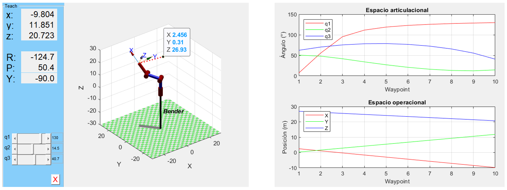

<h1>Aula 24</h1>

Esta clase consiste en comprender y analizar las rutas y las trayectorias con perfil de velocidad trapezoidal de un brazo robótico serial.

<h2>Trayectorias</h2>

Las trayectorias de los robots consisten en realizar tareas de movimiento del robot de un punto inicial a un punto final, en el espacio articular (espacio de movimientos de las articulaciones) o en el espacio operacional del robot (espacio (área o volumen) de trabajo).


<h3>Planeación de ruta (<i>path planning</i>)</h3>

Genera una ruta geométrica, desde un punto inicial hasta un punto final a través de puntos intermedios (waypoints) previamente definidos de manera discontinua (saltos bruscos), donde solo es relevante la posición.

Las rutas con puntos intermedios a través de la interpolación de ángulos del punto A y B generan un resultado circular (MoveJ).


```python
# Ruta 1 (espacio articulacional (MoveJ) - interpolando ángulos)
import math
import numpy
from sympy import *
from InverseKinematics3R import *
from ForwardKinematics3R import *
import matplotlib.pyplot as plt
import time

l1 = 10
l2 = 10
l3 = 10

# Cinemática inversa
# Punto 1
P1x = 2.456
P1y = 0.31
P1z = 26.933

[theta1_P1, theta2_P1, theta3_P1] = InverseKinematics3R(l1,l2,l3,P1x,P1y,P1z)

# Punto 2
P2x = -9.804
P2y = 11.851
P2z = 20.723

[theta1_P2, theta2_P2, theta3_P2] = InverseKinematics3R(l1,l2,l3,P2x,P2y,P2z)

n = 10
x = numpy.arange(1,n+1,1)

theta1_P1toP2 = numpy.linspace(theta1_P1, theta1_P2, n)
theta2_P1toP2 = numpy.linspace(theta2_P1, theta2_P2, n)
theta3_P1toP2 = numpy.linspace(theta3_P1, theta3_P2, n)

d = numpy.zeros((3,n))

fig1 = plt.figure().add_subplot(projection='3d')
fig1.set_xlabel('X')
fig1.set_ylabel('Y')
fig1.set_zlabel('Z')
fig1.set_xlim(-30, 30)
fig1.set_ylim(-30, 30)
fig1.set_zlim(-30, 30)

for i in range (0,n):
    MTH = ForwardKinematics3R(l1,l2,l3,theta1_P1toP2[i],theta2_P1toP2[i],theta3_P1toP2[i])
    d[:,i] =  MTH.t    
    fig1.plot(d[0,i],d[1,i],d[2,i],'.b')

plt.show(block=True)

fig2 = plt.figure(2)
ax1, ax2 = fig2.subplots(2,1)
ax1.plot(x, numpy.rad2deg(theta1_P1toP2),'tab:red')
ax1.set_title('Espacio articulacional')
ax1.set_xlabel('Waypoint')
ax1.set_ylabel('ﾃ］gulo (ﾂｰ)')
plt.grid()
ax1.plot(x, numpy.rad2deg(theta2_P1toP2),'tab:green')
ax1.plot(x, numpy.rad2deg(theta3_P1toP2),'tab:blue')
ax1.legend(['q1','q2','q3'],loc="upper left")

ax2.plot(x, d[0,:],'tab:red')
ax2.set_title('Espacio operacional')
ax2.set_xlabel('Waypoint')
ax2.set_ylabel('Posición (m)')
plt.grid()
ax2.plot(x, d[1,:],'tab:green')
ax2.plot(x, d[2,:],'tab:blue')
ax2.legend(['X','Y','Z'],loc="upper left")
plt.show(block=True)
```

```matlab
%% Ruta 1 (espacio articulacional (MoveJ) - interpolando ángulos)

clear all
close all
clc

l1 = 10;
l2 = 10;
l3 = 10;

% Cinemática inversa
% Punto 1
P1x = 2.456;
P1y = 0.31;
P1z = 26.933;

[theta1_P1, theta2_P1, theta3_P1] = InverseKinematics3R(l1,l2,l3,P1x,P1y,P1z);

% Punto 2
P2x = -9.804;
P2y = 11.851;
P2z = 20.723;

[theta1_P2, theta2_P2, theta3_P2] = InverseKinematics3R(l1,l2,l3,P2x,P2y,P2z);
%

n = 10;
x = 1:1:n;

theta1_P1toP2 = linspace(theta1_P1, theta1_P2, n);
theta2_P1toP2 = linspace(theta2_P1, theta2_P2, n);
theta3_P1toP2 = linspace(theta3_P1, theta3_P2, n);

figure(1)
for i=1:n
    % Cinemática directa (Peter corke)
    [MTH] = ForwardKinematics3R(l1,l2,l3,theta1_P1toP2(i),theta2_P1toP2(i),theta3_P1toP2(i));
    d(:,i) = MTH.t;
    hold on;
    plot3(d(1,i),d(2,i),d(3,i),'.b');
end

figure(2)
tiledlayout(2,1)
ax1 = nexttile;
plot(ax1, x, rad2deg(theta1_P1toP2),'r')
title('Espacio articulacional')
xlabel('Waypoint')
ylabel('ﾃ］gulo (ﾂｰ)')
hold on
grid on
plot(ax1, x, rad2deg(theta2_P1toP2),'g')
plot(ax1, x, rad2deg(theta3_P1toP2),'b')
legend('q1','q2','q3','Location','northwest')
hold off
ax2 = nexttile;
plot(ax2, x, d(1,:),'r')
title('Espacio operacional')
xlabel('Waypoint')
ylabel('Posición (m)')
hold on
grid on
plot(ax2, x, d(2,:),'g')
plot(ax2, x, d(3,:),'b')
legend('X','Y','Z','Location','northwest')
hold off
```

Las rutas con puntos intermedios a través de la interpolación de posiciones del punto A y B generan un resultado lineal (MoveL).



```python
# Ruta 2 (espacio operacional (MoveL) - interpolando posiciones)

import math
import numpy
from sympy import *
from InverseKinematics3R import *
from ForwardKinematics3R import *
import matplotlib.pyplot as plt
import time

l1 = 10
l2 = 10
l3 = 10

# Cinemática inversa
# Punto 1
P1x = 2.456
P1y = 0.31
P1z = 26.933

# Punto 2
P2x = -9.804
P2y = 11.851
P2z = 20.723

n = 10
x = numpy.arange(1,n+1,1)

Px_P1toP2 = numpy.linspace(P1x, P2x, n)
Py_P1toP2 = numpy.linspace(P1y, P2y, n)
Pz_P1toP2 = numpy.linspace(P1z, P2z, n)

d = numpy.zeros((3,n))

fig1 = plt.figure().add_subplot(projection='3d')
fig1.set_xlabel('X')
fig1.set_ylabel('Y')
fig1.set_zlabel('Z')
fig1.set_xlim(-30, 30)
fig1.set_ylim(-30, 30)
fig1.set_zlim(-30, 30)

theta1 = []
theta2 = []
theta3 = []

for i in range (0,n):
    [q1, q2, q3] = InverseKinematics3R(l1,l2,l3,Px_P1toP2[i],Py_P1toP2[i],Pz_P1toP2[i])
    theta1.append(q1)
    theta2.append(q2)
    theta3.append(q3)

    MTH = ForwardKinematics3R(l1,l2,l3,theta1[i],theta2[i],theta3[i])
    d[:,i] =  MTH.t    
    fig1.plot(d[0,i],d[1,i],d[2,i],'.b')

plt.show(block=True)

fig2 = plt.figure(2)
ax1, ax2 = fig2.subplots(2,1)
ax1.plot(x, numpy.rad2deg(theta1),'tab:red')
ax1.set_title('Espacio articulacional')
ax1.set_xlabel('Waypoint')
ax1.set_ylabel('ﾃ］gulo (ﾂｰ)')
plt.grid()
ax1.plot(x, numpy.rad2deg(theta2),'tab:green')
ax1.plot(x, numpy.rad2deg(theta3),'tab:blue')
ax1.legend(['q1','q2','q3'],loc="upper left")

ax2.plot(x, Px_P1toP2[:],'tab:red')
ax2.set_title('Espacio operacional')
ax2.set_xlabel('Waypoint')
ax2.set_ylabel('Posición (m)')
plt.grid()
ax2.plot(x, Py_P1toP2[:],'tab:green')
ax2.plot(x, Pz_P1toP2[:],'tab:blue')
ax2.legend(['X','Y','Z'],loc="upper left")
plt.show(block=True)
```

```matlab
%% Ruta 2 (espacio operacional (MoveL) - interpolando posiciones)

% clear all
% close all
% clc

l1 = 10;
l2 = 10;
l3 = 10;

% Punto 1
P1x = 2.456;
P1y = 0.31;
P1z = 26.933;

% Punto 2
P2x = -9.804;
P2y = 11.851;
P2z = 20.723;

n = 10
x = 1:1:n

Px_P1toP2 = linspace(P1x, P2x, n);
Py_P1toP2 = linspace(P1y, P2y, n);
Pz_P1toP2 = linspace(P1z, P2z, n);

figure(1)
for i=1:n
    % Cinemática inversa
    [theta1(i), theta2(i), theta3(i)] = InverseKinematics3R(l1,l2,l3,Px_P1toP2(i),Py_P1toP2(i),Pz_P1toP2(i));
    
    % Cinemática directa (Peter corke)
    [MTH] = ForwardKinematics3R(l1,l2,l3,theta1(i),theta2(i),theta3(i));
    hold on;
    plot3(MTH.t(1),MTH.t(2),MTH.t(3),'.r');
end

figure(3)
tiledlayout(2,1)
ax1 = nexttile;
plot(ax1, x, rad2deg(theta1),'r')
title('Espacio articulacional')
xlabel('Waypoint')
ylabel('ﾃ］gulo (ﾂｰ)')
hold on
grid on
plot(ax1, x, rad2deg(theta2),'g')
plot(ax1, x, rad2deg(theta3),'b')
legend('q1','q2','q3','Location','northwest')
hold off
ax2 = nexttile;
plot(ax2, x, Px_P1toP2(:),'r')
title('Espacio operacional')
xlabel('Waypoint')
ylabel('Posición (m)')
hold on
grid on
plot(ax2, x, Py_P1toP2(:),'g')
plot(ax2, x, Pz_P1toP2(:),'b')
legend('X','Y','Z','Location','northwest')
hold off
```

<h3>Planeación de trayectoria (<i>trajectory planning</i>)</h3>

A partir de una ruta geométrica determinada, se genera una trayectoria continua (movimiento suave) en función del tiempo, es decir, contemplando las velocidades y las aceleraciones de las articulaciones.

Las trayectorias se pueden obtener a través de diferentes métodos:

- Polinomios
- Perfil de velocidad trapezoidal
- Jacobianos  

<h4>Perfil de velocidad trapezoidal</h4>

El perfil de velocidad trapezoidal es realizado en el espacio de las articulaciones. Una de las combinaciones más utilizadas en este perfil es 1/4, 1/2, 1/4; sin embargo, esto depende de la velocidad máxima y el tiempo final.


$$搗解搗堙｡搗･=\frac{搗狙1竏挺搗狙0}{搗｡_搗党 \cdot 1.5$$

Las trayectorias con puntos intermedios a través de la interpolación de ángulos del punto A y B generan un resultado circular (MoveJ).


<!-- ```python
# Ruta 1 (espacio articulacional (MoveJ) - interpolando ángulos)
import math
import numpy
from sympy import *
from InverseKinematics3R import *
from ForwardKinematics3R import *
import matplotlib.pyplot as plt
import time
from roboticstoolbox import trapezoidal

l1 = 10
l2 = 10
l3 = 10

#Trayectoria 1 - perfil trapezoidal
t0 = 0
tf = 10
t = numpy.linspace(t0,tf,50)

# Punto 1
P1x = 2.456
P1y = 0.31
P1z = 26.933

[theta1_P1, theta2_P1, theta3_P1] = InverseKinematics3R(l1,l2,l3,P1x,P1y,P1z)

# Punto 2
P2x = -9.804
P2y = 11.851
P2z = 20.723

[theta1_P2, theta2_P2, theta3_P2] = InverseKinematics3R(l1,l2,l3,P2x,P2y,P2z)

q1 = trapezoidal(theta1_P1,theta1_P2,t)
q2 = trapezoidal(theta2_P1,theta2_P2,t)
q3 = trapezoidal(theta3_P1,theta3_P2,t)

fig1 = plt.figure().add_subplot(projection='3d')
fig1.set_xlabel('X')
fig1.set_ylabel('Y')
fig1.set_zlabel('Z')
fig1.set_xlim(-30, 30)
fig1.set_ylim(-30, 30)
fig1.set_zlim(-30, 30)


# q1.plot()
# q2.plot()
# q3.plot()
fig2 = plt.figure(2)
ax1, ax2, ax3 = fig2.subplots(3,1)
ax1.set_title('Posición angular')
ax1.grid()
ax1.set_xlabel('Tiempo (s)')
ax1.set_ylabel('ﾃ］gulo (ﾂｰ)')

ax2.set_title('Velocidad angular')
ax2.grid()
ax2.set_xlabel('Tiempo (s)')
ax2.set_ylabel('ﾃ］gulo (rad/s)')

ax3.set_title('Aceleración angular')
ax3.grid()
ax3.set_xlabel('Tiempo (s)')
ax3.set_ylabel('ﾃ］gulo (rad/s^2)')

t_ = numpy.zeros((len(q1),1))
q1T_ = numpy.zeros((len(q1),1))
q2T_ = numpy.zeros((len(q2),1))
q3T_ = numpy.zeros((len(q2),1))

for i in range (0,n):
    t_[i,0] = t[i];
    # Gráfica de posición
    q1T_[i,0] = numpy.rad2deg(q1.q[i])
    ax1.plot(t_[i,0],q1T_[i,0],'-b')
    q2T_[i,0] = numpy.rad2deg(q2.q[i])
    ax1.plot(t_[i,0],q2T_[i,0],'-b')
    q3T_[i,0] = numpy.rad2deg(q3.q[i])
    ax1.plot(t_[i,0],q3T_[i,0],'-b')
    
    # ax1.plot(x, numpy.rad2deg(theta1_P1toP2),'tab:red')
    # ax1.plot(x, numpy.rad2deg(theta2_P1toP2),'tab:green')
    # ax1.plot(x, numpy.rad2deg(theta3_P1toP2),'tab:blue')
    
    
    
    MTH = ForwardKinematics3R(l1,l2,l3,q1.q[i],q2.q[i],q3.q[i])
    d[:,i] =  MTH.t    
    fig1.plot(d[0,i],d[1,i],d[2,i],'.b')

ax1.legend(['q1','q2','q3'],loc="upper left")

plt.show(block=True)
``` -->

```matlab
%% Trayectoria de perfil de velocidad trapezoidal 3R (MoveJ)

% clear all
% close all
% clc

l1 = 10;
l2 = 10;
l3 = 10;

%Trayectoria 1 - perfil trapezoidal
t0 = 0
tf = 10
t = linspace(t0,tf,50)

% v1 = [1 0.9]
% v2 = [2 1.8]

% Punto 1
P1x = 2.456;
P1y = 0.31;
P1z = 26.933;

[theta1_P1, theta2_P1, theta3_P1] = InverseKinematics3R(l1,l2,l3,P1x,P1y,P1z);

% Punto 2
P2x = -9.804;
P2y = 11.851;
P2z = 20.723;

[theta1_P2, theta2_P2, theta3_P2] = InverseKinematics3R(l1,l2,l3,P2x,P2y,P2z);

[q1T, dq1T, d2q1T] = lspb(theta1_P1,theta1_P2,t)
[q2T, dq2T, d2q2T] = lspb(theta2_P1,theta2_P2,t)
[q3T, dq3T, d2q3T] = lspb(theta3_P1,theta3_P2,t)

% AT = qf - q0
% dq_max = AT*(2/(1.5*tf))*1.2 %Velocidad de la articulación

figure(4)
title('Articulación 1')
figA = subplot(3,1,1);
%axis([t0 tf -Inf Inf])
grid on
hold on
title('Posición angular')
xlabel('tiempo (s)')
ylabel('ángulo (grados)')

figB = subplot(3,1,2);
%axis([t0 tf -Inf Inf])
grid on
hold on
title('Velocidad angular')
xlabel('tiempo (s)')
ylabel('velocidad (rad/s)')

figC = subplot(3,1,3);
%axis([t0 tf -Inf Inf])
grid on
hold on
title('Aceleración angular')
xlabel('tiempo (s)')
ylabel('aceleración (rad/s^2)')


for i=1:length(q1T)
    t_(i,1) = t(i);
    % Gráfica de posición
    q1T_(i,1) = rad2deg(q1T(i))
    plot(figA,t_(:),q1T_(:,1),'-b')
    q2T_(i,1) = rad2deg(q2T(i))
    plot(figA,t_(:),q2T_(:,1),'-g')
    q3T_(i,1) = rad2deg(q3T(i))
    plot(figA,t_(:),q3T_(:,1),'-r')
    % Gráfica de velocidad
    dq1T_(i,1) = dq1T(i)
    plot(figB,t_(:),dq1T_(:,1),'-b')
    dq2T_(i,1) = dq2T(i)
    plot(figB,t_(:),dq2T_(:,1),'-g')
    dq3T_(i,1) = dq3T(i)
    plot(figB,t_(:),dq3T_(:,1),'-r')
    % Gráfica de aceleración
    d2q1T_(i,1) = d2q1T(i)
    plot(figC,t_(:),d2q1T_(:,1),'-b')
    d2q2T_(i,1) = d2q2T(i)
    plot(figC,t_(:),d2q2T_(:,1),'-g')
    d2q3T_(i,1) = d2q3T(i)
    plot(figC,t_(:),d2q3T_(:,1),'-r')
    
    figure(1)
    [MTH] = ForwardKinematics3R(l1,l2,l3,q1T(i),q2T(i),q3T(i));
    hold on
    plot3(MTH.t(1),MTH.t(2),MTH.t(3),'.g')
end

legend(figA,'q1','q2','q3','Location','northwest')
legend(figB,'dq1','dq2','dq3','Location','southeast')
legend(figC,'d2q1','d2q2','d2q3','Location','northeast')
```

Las trayectorias con puntos intermedios a través de la interpolación de posiciones del punto A y B generan un resultado lineal (MoveL).

![![Interpolación de posiciones PVT 3R]](Imagenes/image-9.png)

```matlab
%% Trayectoria de perfil de velocidad trapezoidal 3R (MoveL)

%clear all
%close all
%clc

l1 = 10;
l2 = 10;
l3 = 10;

%Trayectoria 1 - perfil trapezoidal
t0 = 0
tf = 1
t = linspace(t0,tf,50)

% v1 = [1 0.9]
% v2 = [2 1.8]

% Punto 1
P1x = 2.456;
P1y = 0.31;
P1z = 26.933;

% Punto 2
P2x = -9.804;
P2y = 11.851;
P2z = 20.723;

[x1T, dx1T, d2x1T] = lspb(P1x,P2x,t)
[y2T, dy2T, d2y2T] = lspb(P1y,P2y,t)
[z3T, dz3T, d2z3T] = lspb(P1z,P2z,t)

% AT = qf - q0
% dq_max = AT*(2/(1.5*tf))*1.2 %Velocidad de la articulación

figure(5)
title('Articulación 1')
figD = subplot(3,1,1);
%axis([t0 tf -Inf Inf])
grid on
hold on
title('Posición lineal')
xlabel('tiempo (s)')
ylabel('distancia (m)')

figE = subplot(3,1,2);
%axis([t0 tf -Inf Inf])
grid on
hold on
title('Velocidad lineal')
xlabel('tiempo (s)')
ylabel('velocidad (m/s)')

figF = subplot(3,1,3);
%axis([t0 tf -Inf Inf])
grid on
hold on
title('Aceleración lineal')
xlabel('tiempo (s)')
ylabel('aceleración (m/s^2)')


for i=1:length(x1T)
    t2_(i,1) = t(i);
    % Gráfica de posición
    x1T_(i,1) = x1T(i)
    plot(figD,t2_(:),x1T_(:,1),'-b')
    y2T_(i,1) = y2T(i)
    plot(figD,t2_(:),y2T_(:,1),'-g')
    z3T_(i,1) = z3T(i)
    plot(figD,t2_(:),z3T_(:,1),'-r')
    % Gráfica de velocidad
    dx1T_(i,1) = dx1T(i)
    plot(figE,t2_(:),dx1T_(:,1),'-b')
    dy2T_(i,1) = dy2T(i)
    plot(figE,t2_(:),dy2T_(:,1),'-g')
    dz3T_(i,1) = dz3T(i)
    plot(figE,t2_(:),dz3T_(:,1),'-r')
    % Gráfica de aceleración
    d2x1T_(i,1) = d2x1T(i)
    plot(figF,t2_(:),d2x1T_(:,1),'-b')
    d2y2T_(i,1) = d2y2T(i)
    plot(figF,t2_(:),d2y2T_(:,1),'-g')
    d2z3T_(i,1) = d2z3T(i)
    plot(figF,t2_(:),d2z3T_(:,1),'-r')
    
    figure(1)
    %Robot.plot([q1T(i),q2T(i),q3T(i)],'scale',1.0,'workspace',[-30 30 -30 30 -30 30]);
    
%     zlim([-15,30]);
    [theta1(i), theta2(i), theta3(i)] = InverseKinematics3R(l1,l2,l3,x1T(i),y2T(i),z3T(i));
    
    [MTH] = ForwardKinematics3R(l1,l2,l3,theta1(i),theta2(i),theta3(i));
    hold on
    plot3(MTH.t(1),MTH.t(2),MTH.t(3),'.m')
end

legend(figD,'X','Y','Z','Location','northwest')
legend(figE,'dX','dy','dZ','Location','southeast')
legend(figF,'d2X','d2Y','d2Z','Location','northeast')
```