<h1>Aula 25</h1>

Esta clase consiste en comprender y analizar el desacople cinemático, el cual es un método de realizar la cinemática inversa de un robot de 6 GDL.

<h2>Desacople cinemático</h2>

El desacople cinemático consiste en calcular la cinemática inversa de un robot de 6 GDL a partir de la separación de las tres primeras articulaciones (posicionamiento en el centro de la muñeca), las cuales pueden ser cualquier configuración (Cartesiano, Scara, Cilíndrico, Esférico, Angular 3R) y de las tres últimas articulaciones (orientación del efector final), para lo cual, la configuración más utilizada es la muñeca esférica.

La metodología de aplicación del desacople cinemático en un robot de 6 GDL consiste en los siguientes 8 pasos:

1. Establecer la posición y orientación deseada del TCP y devolver el desplazamiento de l5 y l6 para encontrar la posición en el centro de la muñeca.
2. Realizar la cinemática inversa de las tres primeras articulaciones para determinar la posición en el centro de la muñeca esférica.
3. Determinar la rotación del SC{0} al SC{3} para las tres primeras articulaciones.
4. Encontrar la matriz inversa de la rotación del SC{0} al SC{3}.
5. Determinar la matriz numérica de rotación del SC{3} al SC{6}.
6. Determinar la matriz simbólica de rotación del SC{3} al SC{6}.
7. Igualar las matrices $𝑅_6^3 𝐴$ y $𝑅_6^3 𝐵$ para resolver las últimas tres articulaciones.
8. Verificar la cinemática inversa 6R por el método de desacople cinemático.

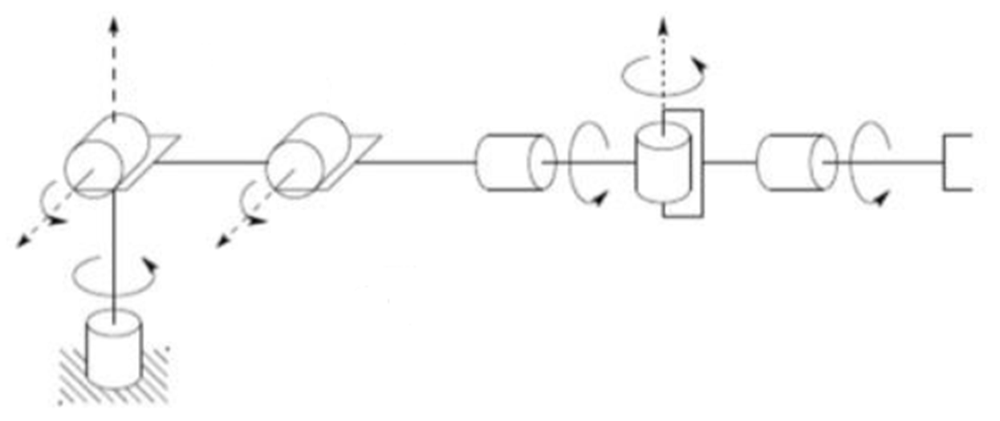

<h3>Robot 6R</h3>

El centro de la muñeca es el punto donde las tres primeras articulaciones son las únicas que cambian la posición de dicho punto. En este punto se cruzan los tres ejes de movimiento ($𝑍_3$, $𝑍_4$, $𝑍_5$).

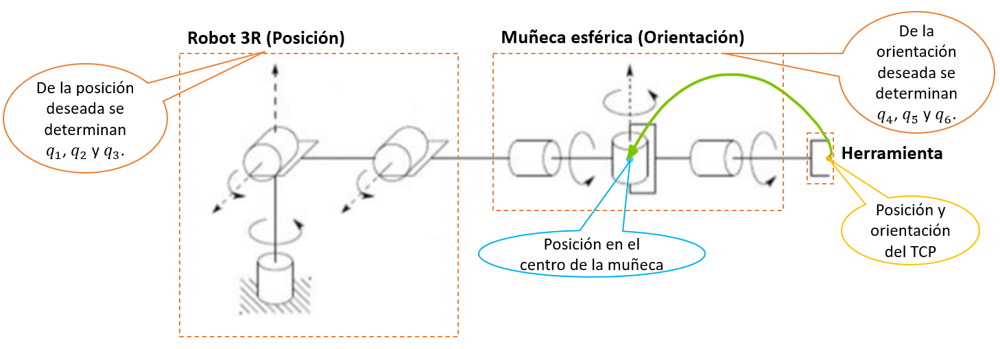

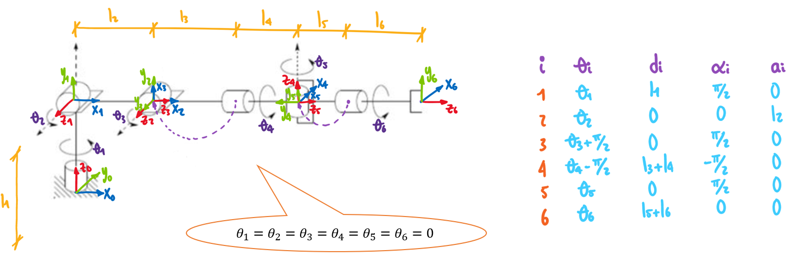

```python
#------------------------------- Peter Corke ----------------------------------
from roboticstoolbox import *
from spatialmath.base import *
import numpy
from sympy import *
from InverseKinematics3R import *

l1 = 12
l2 = 10
l3 = 10
l4 = 10
l5 = 10
l6 = 10

q1 = 0
q2 = 0
q3 = 0
q4 = 0
q5 = 0
q6 = 0

q = [q1,q2,q3,q4,q5,q6]

R = []
R.append(RevoluteDH(d=l1, alpha=numpy.pi/2, a=0, offset=0))
R.append(RevoluteDH(d=0, alpha=0, a=l2, offset=0))
R.append(RevoluteDH(d=0, alpha=numpy.pi/2, a=0, offset=numpy.pi/2))
R.append(RevoluteDH(d=l3+l4, alpha=-numpy.pi/2, a=0, offset=-numpy.pi/2))
R.append(RevoluteDH(d=0, alpha=numpy.pi/2, a=0, offset=0))
R.append(RevoluteDH(d=l5+l6, alpha=0, a=0, offset=0))

Robot = DHRobot(R, name='Bender')
print(Robot)

Robot.teach(q, 'rpy/zyx', limits=[-50,50,-50,50,-50,50])

#zlim([-15,30]);

MTH = Robot.fkine(q)
print(MTH)
print(f'Roll, Pitch, Yaw = {tr2rpy(MTH.R, 'deg', 'zyx')}')
#theta = Robot.ikine_6s(MTH,'llllll',)
#print(f'theta1, theta2, theta3, theta4, theta5, theta6 = {theta}')
```

```matlab
% DH 6R
clear all
close all
clc

l1 = 12;
l2 = 10;
l3 = 10;
l4 = 10;
l5 = 10;
l6 = 10;

q1 = 0; q2 = 0; q3 = 0; q4 = 0; q5 = 0; q6 = 0;
% q1 = deg2rad(99.6);
% q2 = deg2rad(9);
% q3 = deg2rad(26.4);
% q4 = deg2rad(68.4);
% q5 = deg2rad(30);
% q6 = deg2rad(151);
q = [q1,q2,q3,q4,q5,q6]
L(1) = Link('revolute','d',l1,'alpha',pi/2,'a',0,'offset',0);
L(2) = Link('revolute','d',0,'alpha',0,'a',l2,'offset',0);
L(3) = Link('revolute','d',0,'alpha',pi/2,'a',0,'offset',pi/2);
L(4) = Link('revolute','d',l3+l4,'alpha',-pi/2,'a',0,'offset',-pi/2);
L(5) = Link('revolute','d',0,'alpha',pi/2,'a',0,'offset',0);
L(6) = Link('revolute','d',l5+l6,'alpha',0,'a',0,'offset',0);

Robot = SerialLink(L,'name','Bumblebee');
Robot.plot(q,'scale',1.0,'workspace',[-50 50 -50 50 -50 50]);
zlim([-15,50]);
Robot.teach(q,'rpy/zyx')
MTH = Robot.fkine(q)
Robot.ikunc(MTH)
```

<h3>$R_3^0 = R_1^0 \cdot R_2^1 \cdot R_3^2$</h3>

<h4>$R_1^0$</h4>

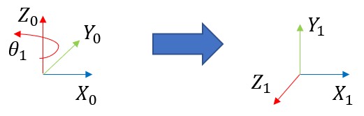

$$R_1^0 = 𝑅_𝑍(𝜃_1) \cdot 𝑅_𝑋(𝜋/2)$$

$$R_1^0 = \begin{bmatrix}
𝐶𝜃_1 & -𝑆𝜃_1 & 0 \\ 
𝑆𝜃_1 & 𝐶𝜃_1 & 0 \\ 
0 & 0 & 1 \\ 
\end{bmatrix} \cdot \begin{bmatrix}
1 & 0 & 0 \\ 
0 & 0 & -1 \\ 
0 & 1 & 0 \\ 
\end{bmatrix} = \begin{bmatrix}
𝐶𝜃_1 & 0 & 𝑆𝜃_1 \\ 
𝑆𝜃_1 & 0 & -𝐶𝜃_1 \\ 
0 & 1 & 0 \\ 
\end{bmatrix} 
$$

```python
from sympy import *
from SRotarZ import *
from SRotarX import *
import numpy

theta1 = symbols('theta1')

R01 = numpy.matmul(SRotarZ(theta1),SRotarX(pi/2))
print(f'R01 = {R01}')
```

```matlab
clear all
close all
clc

syms theta1

R01 = RotarZ(theta1)*round(RotarX(pi/2))
```

<h4>$R_2^1$</h4>

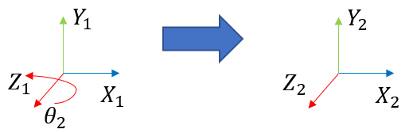

$$R_2^1 = 𝑅_𝑍(𝜃_2)$$

$$R_2^1 = \begin{bmatrix}
𝐶𝜃_2 & -𝑆𝜃_2 & 0 \\ 
𝑆𝜃_2 & 𝐶𝜃_2 & 0 \\ 
0 & 0 & 1 \\ 
\end{bmatrix}
$$

```python
from sympy import *
from SRotarZ import *

theta2 = symbols('theta2')

R12 = SRotarZ(theta2)
print(f'R12 = {R12}')
```

```matlab
clear all
close all
clc

syms theta2

R12 = RotarZ(theta2)
```

<h4>$R_3^2$</h4>

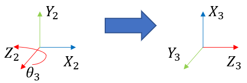

$$𝑅_3^2 = 𝑅_𝑍(𝜃_3) \cdot 𝑅_𝑋(𝜋/2) \cdot 𝑅_𝑌(𝜋/2)$$

$$R_3^2 = \begin{bmatrix}
𝐶𝜃_3 & -𝑆𝜃_3 & 0 \\ 
𝑆𝜃_3 & 𝐶𝜃_3 & 0 \\ 
0 & 0 & 1 \\ 
\end{bmatrix} \cdot \begin{bmatrix}
1 & 0 & 0 \\ 
0 & 0 & -1 \\ 
0 & 1 & 0 \\ 
\end{bmatrix} \cdot \begin{bmatrix}
0 & 0 & 1 \\ 
0 & 1 & 0 \\ 
-1 & 0 & 0 \\ 
\end{bmatrix}= \begin{bmatrix}
-𝑆𝜃_3 & 0 & 𝐶𝜃_3 \\ 
𝐶𝜃_3 & 0 & 𝑆𝜃_3 \\ 
0 & 1 & 0 \\ 
\end{bmatrix} 
$$

```python
from sympy import *
from SRotarZ import *
from SRotarX import *
from SRotarY import *
from numpy.linalg import multi_dot

theta3 = symbols('theta3')

R23 = multi_dot([SRotarZ(theta3),SRotarX(pi/2),SRotarY(pi/2)])
print(f'R23 = {R23}')
```

```matlab
clear all
close all
clc

syms theta3

R23 = RotarZ(theta3)*round(RotarX(pi/2)*RotarY(pi/2))
```

<h3>$R_6^3 = R_4^3 \cdot R_5^4 \cdot R_6^5$</h3>

<h4>$R_4^3$</h4>

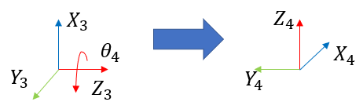

$$𝑅_4^3 = 𝑅_𝑍(𝜃_4) \cdot 𝑅_𝑍(−𝜋/2) \cdot 𝑅_𝑋(−𝜋/2)$$

$$R_4^3 = \begin{bmatrix}
𝐶𝜃_4 & -𝑆𝜃_4 & 0 \\ 
𝑆𝜃_4 & 𝐶𝜃_4 & 0 \\ 
0 & 0 & 1 \\ 
\end{bmatrix} \cdot \begin{bmatrix}
0 & 1 & 0 \\ 
-1 & 0 & 0 \\ 
0 & 0 & 1 \\ 
\end{bmatrix} \cdot \begin{bmatrix}
1 & 0 & 0 \\ 
0 & 0 & 1 \\ 
0 & -1 & 0 \\ 
\end{bmatrix}= \begin{bmatrix}
𝑆𝜃_4 & 0 & 𝐶𝜃_4 \\ 
-𝐶𝜃_4 & 0 & 𝑆𝜃_4 \\ 
0 & -1 & 0 \\ 
\end{bmatrix} 
$$

```python
from sympy import *
from SRotarZ import *
from SRotarX import *
from SRotarY import *
from numpy.linalg import multi_dot

theta4 = symbols('theta4')

R34 = multi_dot([SRotarZ(theta4),SRotarZ(-pi/2),SRotarX(-pi/2)])
print(f'R34 = {R34}')
```

```matlab
clear all
close all
clc

syms theta4

R34 = RotarZ(theta4)*round(RotarZ(-pi/2)*RotarX(-pi/2))
```

<h4>$R_5^4$</h4>

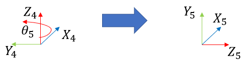

$$𝑅_5^4 = 𝑅_𝑍(𝜃_5) \cdot 𝑅_𝑋(𝜋/2)$$

$$R_5^4 = \begin{bmatrix}
𝐶𝜃_5 & -𝑆𝜃_5 & 0 \\ 
𝑆𝜃_5 & 𝐶𝜃_5 & 0 \\ 
0 & 0 & 1 \\ 
\end{bmatrix} \cdot \begin{bmatrix}
1 & 0 & 0 \\ 
0 & 0 & -1 \\ 
0 & 1 & 0 \\ 
\end{bmatrix} = \begin{bmatrix}
𝐶𝜃_5 & 0 & 𝑆𝜃_5 \\ 
𝑆𝜃_5 & 0 & -𝐶𝜃_5 \\ 
0 & 1 & 0 \\ 
\end{bmatrix} 
$$

```python
from sympy import *
from SRotarZ import *
from SRotarX import *
import numpy

theta5 = symbols('theta5')

R45 = numpy.matmul(SRotarZ(theta5),SRotarX(pi/2))
print(f'R45 = {R45}')
```

```matlab
clear all
close all
clc

syms theta5

R45 = RotarZ(theta5)*round(RotarX(pi/2))
```

<h4>$R_6^5$</h4>

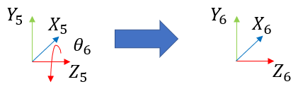

$$𝑅_6^5 = 𝑅_𝑍(𝜃_6)$$

$$R_6^5 = \begin{bmatrix}
𝐶𝜃_6 & -𝑆𝜃_6 & 0 \\ 
𝑆𝜃_6 & 𝐶𝜃_6 & 0 \\ 
0 & 0 & 1 \\ 
\end{bmatrix}
$$

```python
from sympy import *
from SRotarZ import *

theta6 = symbols('theta6')

R56 = SRotarZ(theta6)
print(f'R56 = {R56}')
```

```matlab
clear all
close all
clc

syms theta6

R56 = RotarZ(theta6)
```

<h4>Paso 1</h4>

Establecer la posición y orientación deseada del TCP y devolver el desplazamiento de l5 y l6 para encontrar la posición en el centro de la muñeca.

$$𝑃_X = −9.4519$$

$$𝑃_Y = 33.8090$$

$$𝑃_Z = 42.7623$$

$$𝑅𝑜𝑙𝑙 = −26.5610$$

$$𝑃𝑖𝑡𝑐ℎ = 10.0935$$

$$𝑌𝑎𝑤 = 51.7776$$

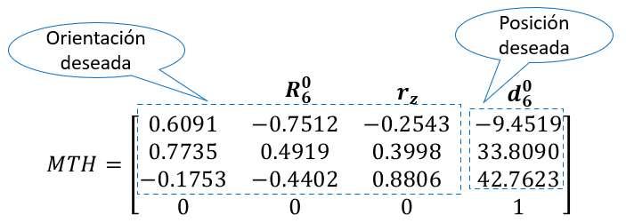

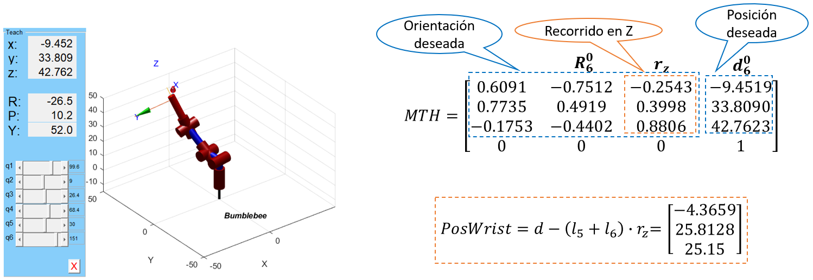

```python
#------------------------------- Paso 1 ----------------------------------
#Paso 1 (Posición y orientación deseada del TCP) DH 6R
from NRotarX import *
from NRotarY import *
from NRotarZ import *
from numpy.linalg import multi_dot

d = [-9.4519, 33.8090, 42.7623]
R = multi_dot([NRotarZ(numpy.deg2rad(51.7776)),NRotarY(numpy.deg2rad(10.0935)),NRotarX(numpy.deg2rad(-26.561))])
mth = numpy.array([[R[0][0],R[0][1],R[0][2],d[0]], [R[1][0],R[1][1],R[1][2],d[1]], [R[2][0],R[2][1],R[2][2],d[2]], [0, 0, 0, 1]])
print(f'MTH = {mth}')

rz = R[0:3,2]#Desplazamiento en Z
print(f'rz = {rz}')
PosWrist = d-(l5+l6)*rz
print(f'PosWrist = {PosWrist}')
Tw = mth
Tw[0,3] = PosWrist[0]
Tw[1,3] = PosWrist[1]
Tw[2,3] = PosWrist[2]
print(f'Tw = {Tw}')
```

```matlab
% Paso 1 (Posición y orientación deseada del TCP) DH 6R
d = [-9.4519; 33.8090; 42.7623]
% d = [-4.6; 11.75; 52.992]
% d = [20.507; 37.305; 25.669]      
% d = [-3.656; -1.032; 47.478]
% d = [-2.737; 12.770; 53.891]
R = RotarZ(deg2rad(51.7776))*RotarY(deg2rad(10.0935))*RotarX(deg2rad(-26.561))
% R = RotarZ(deg2rad(-110.6))*RotarY(deg2rad(11.5))*RotarX(deg2rad(36.5))
% R = RotarZ(deg2rad(-168.9))*RotarY(deg2rad(-13.5))*RotarX(deg2rad(69.5))
% R = RotarZ(deg2rad(82.6))*RotarY(deg2rad(-46.8))*RotarX(deg2rad(22.9))
% R = RotarZ(deg2rad(35.3))*RotarY(deg2rad(0.6))*RotarX(deg2rad(11.3))
mth = [R,d; 0 0 0 1]

rz = R(1:3,3)%Desplazamiento en Z
PosWrist = d-(l5+l6)*rz
Tw = mth
Tw(1:3,4) = PosWrist
```

<h4>Paso 2</h4>

Realizar la cinemática inversa de las tres primeras articulaciones para determinar la posición en el centro de la muñeca esférica.

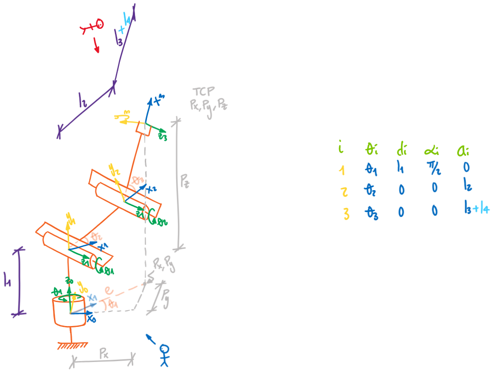

<h3>Theta 1</h3>

$$𝜃_1=tan^{−1}\frac{⁡𝑃_𝑦}{𝑃_𝑥} = 1.7383 𝑟𝑎𝑑$$

$$𝑒=\sqrt{𝑃_𝑥^2+𝑃_𝑦^2}$$

<h3>Theta 3</h3>

$$𝑐=𝑃_𝑧−𝑙_1$$

$$𝑏=\sqrt{𝑒^2+𝑐^2}$$

$$cos𝜃_3=\frac{𝑏^2−(𝑙_3+𝑙_4)^2−𝑙_2^2}{2\cdot𝑙_2 \cdot (𝑙_3+𝑙_4)}$$

$$sin⁡𝜃_3=±\sqrt{1−(cos𝜃_3)^2}$$

$$𝜃_3=tan^{−1}\frac{sin𝜃_3}{cos𝜃_3} = 0.4608 𝑟𝑎𝑑$$

<h3>Theta 2</h3>

$$𝛼=tan^{−1}⁡\frac{𝑐}{𝑒}$$

$$∅=tan^{−1}\frac{(𝑙_3+𝑙_4) \cdot sin⁡𝜃_3}{𝑙_2+((𝑙_3+𝑙_4) \cdot cos⁡𝜃_3}$$

$$𝜃_2=𝛼−∅ = 0.1571 𝑟𝑎𝑑$$

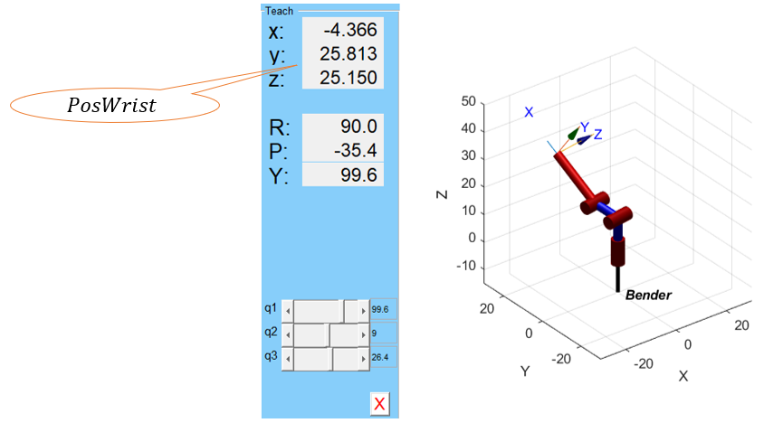

```python
#------------------------------- Paso 2 ----------------------------------
# Cinemática inversa
import math

Px = PosWrist[0]
Py = PosWrist[1]
Pz = PosWrist[2]

e = sqrt(Px**2+Py**2)
c = Pz - l1
b = sqrt(e**2+c**2)
# Theta 1
theta1 = float(atan2(Py,Px))
print(f'theta 1 = {numpy.rad2deg(theta1):.4f}')
# Theta 3
cos_theta3 = (b**2-l2**2-(l3+l4)**2)/(2*l2*(l3+l4))
sen_theta3 = sqrt(1-(cos_theta3)**2)
theta3 = float(atan2(sen_theta3, cos_theta3))
print(f'theta 3 = {numpy.rad2deg(theta3):.4f}')
# Theta 2
alpha = math.atan2(c,e)
phi = math.atan2((l3+l4)*sen_theta3, l2+(l3+l4)*cos_theta3)
theta2 = float(alpha - phi)
if theta2 <= -numpy.pi:
    theta2 = (2*numpy.pi)+theta2

print(f'theta 2 = {numpy.rad2deg(theta2):.4f}')
#-------------

q1 = theta1
q2 = theta2
q3 = theta3

R = []
R.append(RevoluteDH(d=l1, alpha=numpy.pi/2, a=0, offset=0))
R.append(RevoluteDH(d=0, alpha=0, a=l2, offset=0))
R.append(RevoluteDH(d=0, alpha=0, a=l3+l4, offset=0))

Robot = DHRobot(R, name='Bender')
print(Robot)

Robot.teach([q1, q2, q3], 'rpy/zyx', limits=[-30,30,-30,30,-30,30])

#zlim([-15,30]);

MTH = Robot.fkine([q1,q2,q3])
print(MTH)
print(f'Roll, Pitch, Yaw = {tr2rpy(MTH.R, 'deg', 'zyx')}')
```

```matlab
% Cinemática inversa
Px = PosWrist(1);
Py = PosWrist(2);
Pz = PosWrist(3);

b = sqrt(Px^2+Py^2)
c = Pz - l1
e = sqrt(b^2+c^2)
% Theta 1
theta1 = atan2(Py,Px)
fprintf('theta 1 = %.4f \n',rad2deg(theta1));
% Theta 3
cos_theta3 = (e^2-l2^2-(l3+l4)^2)/(2*l2*(l3+l4))
sen_theta3 = sqrt(1-(cos_theta3)^2)
theta3 = atan2(sen_theta3, cos_theta3)
fprintf('theta 3 = %.4f \n',rad2deg(theta3));
% Theta 2
alpha = atan2(c,b)
phi = atan2((l3+l4)*sen_theta3, l2+(l3+l4)*cos_theta3)
theta2 = alpha - phi
if theta2 <= -pi
    theta2 = (2*pi)+theta2;
end
fprintf('theta 2 = %.4f \n',rad2deg(theta2));

%

q1 = theta1
q2 = theta2
q3 = theta3

F(1) = Link('revolute','d',12,'alpha',pi/2,'a',0,'offset',0);
F(2) = Link('revolute','d',0,'alpha',0,'a',l2,'offset',0);
F(3) = Link('revolute','d',0,'alpha',0,'a',l3+l4,'offset',0);

Robot2 = SerialLink(F,'name','Bender')
Robot2.plot([q1,q2,q3],'scale',1.0,'workspace',[-30 30 -30 30 -30 30]);
zlim([-15,50]);
Robot2.teach([q1,q2,q3],'rpy/zyx');
MTH2 = Robot2.fkine([q1,q2,q3])
Robot2.ikunc(MTH2)
```

<h4>Paso 3</h4>

Determinar la rotación del SC{0} al SC{3} para las tres primeras articulaciones.

$$R_3^0 = R_1^0 \cdot R_2^1 \cdot R_3^2$$

$$R_1^0 = \begin{bmatrix}
𝐶𝜃_1 & 0 & 𝑆𝜃_1 \\ 
𝑆𝜃_1 & 0 & -𝐶𝜃_1 \\ 
0 & 1 & 0 \\ 
\end{bmatrix} R_2^1 = \begin{bmatrix}
𝐶𝜃_2 & -𝑆𝜃_2 & 0 \\ 
𝑆𝜃_2 & 𝐶𝜃_2 & 0 \\ 
0 & 0 & 1 \\ 
\end{bmatrix} R_3^2 = \begin{bmatrix}
-𝑆𝜃_3 & 0 & 𝐶𝜃_3 \\ 
𝐶𝜃_3 & 0 & 𝑆𝜃_3 \\ 
0 & 1 & 0 \\ 
\end{bmatrix} 
$$

$$R_3^0 = \begin{bmatrix}
−𝑆⁡(𝜃_2+𝜃_3) \cdot 𝐶(𝜃_1) & 𝑆⁡(𝜃_1) & 𝐶⁡(𝜃_2+𝜃_3) \cdot 𝐶(𝜃_1) \\ 
−𝑆⁡(𝜃_2+𝜃_3) \cdot 𝑆⁡(𝜃_1) & -𝐶(𝜃_1) & 𝐶⁡(𝜃_2+𝜃_3) \cdot 𝑆(𝜃_1) \\ 
𝐶⁡(𝜃_2+𝜃_3) & 0 & 𝑆⁡(𝜃_2+𝜃_3) \\ 
\end{bmatrix}
$$

$$R_3^0 = \begin{bmatrix}
0.0966 & 0.986 & −0.1359 \\ 
−0.5712 & 0.1668 & 0.8037 \\ 
0.8151 & 0 & 0.5793 \\ 
\end{bmatrix}
$$

```python
#------------------------------- Paso 3 ----------------------------------
# R03 = R01*R12*R23
# from SRotarX import *
# from SRotarY import *
# from SRotarZ import *
# theta1, theta2, theta3, theta4, theta5, theta6 = symbols('theta1 theta2 theta3 theta4 theta5 theta6')
# R01 = numpy.matmul(SRotarZ(theta1),SRotarX(pi/2))
# R12 = SRotarZ(theta2)
# R23 = multi_dot([SRotarZ(theta3),SRotarX(pi/2),SRotarY(pi/2)])
# R03 = simplify(multi_dot([R01,R12,R23]))
# print(f'R03 = {R03}')
# LR03 = latex(R03)
# print(f'Latex R03 = {LR03}')

R01 = numpy.matmul(NRotarZ(theta1),NRotarX(pi/2))
print(f'R01 = {R01}')
R12 = NRotarZ(theta2)
print(f'R12 = {R12}')
R23 = multi_dot([NRotarZ(theta3),NRotarX(pi/2),NRotarY(pi/2)])
print(f'R23 = {R23}')
R03 = multi_dot([R01,R12,R23])
print(f'R03 = {R03}')
RPY = tr2rpy(R03,'deg','zyx')
print(f'Roll, Pitch, Yaw = {RPY}')
```

```matlab
% syms theta1 theta2 theta3 
% R01 = RotarZ(theta1)*round(RotarX(pi/2))
% R12 = RotarZ(theta2)*RotarZ(0)
% R23 = RotarZ(theta3)*round(RotarX(pi/2)*RotarY(pi/2))
% R03=simplify(R01*R12*R23)
% LR03 = latex(R03)
R01 = RotarZ(theta1)*round(RotarX(pi/2))
R12 = RotarZ(theta2)*RotarZ(0)
R23 = RotarZ(theta3)*round(RotarX(pi/2)*RotarY(pi/2))
R03 = R01*R12*R23
RPY = rad2deg(tr2rpy(R03,'zyx'))
```

<h4>Paso 4</h4>

Encontrar la matriz inversa de la rotación del SC{0} al SC{3}.

$$𝑅_6^0 = 𝑅_3^0 \cdot 𝑅_6^3$$

$$(𝑅_3^0)^{−1} \cdot 𝑅_6^0 = 𝑅_6^3$$

$$R_3^0 = \begin{bmatrix}
−𝑆⁡(𝜃_2+𝜃_3) \cdot 𝐶(𝜃_1) & 𝑆⁡(𝜃_1) & 𝐶⁡(𝜃_2+𝜃_3) \cdot 𝐶(𝜃_1) \\ 
−𝑆⁡(𝜃_2+𝜃_3) \cdot 𝑆⁡(𝜃_1) & -𝐶(𝜃_1) & 𝐶⁡(𝜃_2+𝜃_3) \cdot 𝑆(𝜃_1) \\ 
𝐶⁡(𝜃_2+𝜃_3) & 0 & 𝑆⁡(𝜃_2+𝜃_3) \\ 
\end{bmatrix}
$$

$$(R_3^0)^{−1} = \begin{bmatrix}
−𝑆⁡(𝜃_2+𝜃_3) \cdot 𝐶⁡(𝜃_1) & −𝑆⁡(𝜃_2+𝜃_3) \cdot 𝑆⁡(𝜃_1) & 𝐶⁡(𝜃_2+𝜃_3) \\ 
𝑆⁡(𝜃_1) & -𝐶(𝜃_1) & 0 \\ 
𝐶⁡(𝜃_2+𝜃_3) \cdot 𝐶(𝜃_1) & 𝐶⁡(𝜃_2+𝜃_3) \cdot 𝑆(𝜃_1) & 𝑆⁡(𝜃_2+𝜃_3) \\ 
\end{bmatrix}
$$

$$(R_3^0)^{−1} = \begin{bmatrix}
0.0966 & −0.5712 & 0.8151 \\ 
0.986 & 0.1668 & 0 \\ 
-0.1359 & 0.8037 & 0.5793 \\ 
\end{bmatrix}
$$

```python
#------------------------------- Paso 4 ----------------------------------
#Inversa de R03
# R03i = simplify(numpy.linalg.inv(R03))#Error de dtype('O') 
# LR03 = latex(R03)
# I = simplify(multi_dot([R03,R03i]))

R03i = numpy.linalg.inv(R03)
print(f'R03i = {R03i}')
I = numpy.matmul(R03i,R03) #Matriz identidad
print(f'I = {I}')
```

```matlab
%R03i = simplify(inv(R03))
% LR03 = latex(R03)
%I = simplify(R03*R03_)
R03i = inv(R03)
I = R03i*R03 %Matriz identidad
```

<h4>Paso 5</h4>

Determinar la matriz numérica de rotación del SC{3} al SC{6}

$$R_6^0 = \begin{bmatrix}
0.6065 & −0.7533 & −0.2543 \\ 
0.7752 & 0.4891 & 0.3998 \\ 
−0.1768 & −0.4396 & 0.8806 \\ 
\end{bmatrix}
$$

$$(𝑅_3^0)^{−1} \cdot 𝑅_6^0 = 𝑅_6^3 A$$

$$𝑅_6^3 A= \begin{bmatrix}
0.0966 & −0.5712 & 0.8151 \\ 
0.986 & 0.1668 & 0 \\ 
-0.1359 & 0.8037 & 0.5793 \\ 
\end{bmatrix} \cdot \begin{bmatrix}
0.6065 & −0.7533 & −0.2543 \\ 
0.7752 & 0.4891 & 0.3998 \\ 
−0.1768 & −0.4396 & 0.8806 \\ 
\end{bmatrix}
$$ 

$$𝑅_6^3 A= \begin{bmatrix}
−0.5258 & −0.7123 & 0.4649 \\ 
0.7296 & −0.6586 & −0.1841 \\ 
0.4373 & 0.2424 & 0.866 \\ 
\end{bmatrix}
$$ 

```python
#------------------------------- Paso 5 ----------------------------------
# R36 numérica
R06 = R #Rotación deseada en el efector final
R36A = numpy.matmul(R03i,R06)
print(f'R36A = {R36A}')
# R36 = simplify(R03i*round(Tw.R)) #Error por R03i simbólica
# LR36 = latex(R36)
```

```matlab
R06 = R %Rotación deseada en el efector final
R36A = R03i*R06
% R36 = simplify(R03i*round(Tw.R))
% LR36 = latex(R36)
```

<h4>Paso 6</h4>

Determinar la matriz simbólica de rotación del SC{3} al SC{6}.

$$𝑅_6^3 𝐵 = 𝑅_4^3 \cdot 𝑅_5^4 \cdot 𝑅_6^5$$

$$R_4^3 = \begin{bmatrix}
𝑆𝜃_4 & 0 & 𝐶𝜃_4 \\ 
-𝐶𝜃_4 & 0 & 𝑆𝜃_4 \\ 
0 & -1 & 0 \\ 
\end{bmatrix} R_5^4 = \begin{bmatrix}
𝐶𝜃_5 & 0 & 𝑆𝜃_5 \\ 
𝑆𝜃_5 & 0 & -𝐶𝜃_5 \\ 
0 & 1 & 0 \\ 
\end{bmatrix}  R_6^5 = \begin{bmatrix}
𝐶𝜃_6 & -𝑆𝜃_6 & 0 \\ 
𝑆𝜃_6 & 𝐶𝜃_6 & 0 \\ 
0 & 0 & 1 \\ 
\end{bmatrix} 
$$

$$𝑅_6^3 𝐵 = \begin{bmatrix}
𝐶(𝜃_4) \cdot 𝑆(𝜃_6)+𝐶(𝜃_5) \cdot 𝐶(𝜃_6) \cdot 𝑆(𝜃_4) & 𝐶(𝜃_4) \cdot 𝐶(𝜃_6)−𝐶(𝜃_5) \cdot 𝑆(𝜃_4) \cdot 𝑆(𝜃_6) & 𝑆(𝜃_4) \cdot 𝑆(𝜃_5) \\ 
𝑆(𝜃_4) \cdot 𝑆(𝜃_6)−𝐶(𝜃_4) \cdot 𝐶(𝜃_5) \cdot 𝐶(𝜃_6) & 𝐶(𝜃_6) \cdot 𝑆(𝜃_4)+𝐶(𝜃_4) \cdot 𝐶(𝜃_5) \cdot 𝑆(𝜃_6) & −𝐶(𝜃_4) \cdot 𝑆(𝜃_5) \\ 
−𝐶(𝜃_6) \cdot 𝑆(𝜃_5) & 𝑆(𝜃_5) \cdot 𝑆(𝜃_6) & 𝐶(𝜃_5) \\ 
\end{bmatrix}
$$

```python
#------------------------------- Paso 6 ----------------------------------
# R36 simbólica
from SRotarX import *
from SRotarY import *
from SRotarZ import *
theta4, theta5, theta6 = symbols('theta4 theta5 theta6')
R34 = multi_dot([SRotarZ(theta4),SRotarZ(-pi/2),SRotarX(-pi/2)])
R45 = numpy.matmul(SRotarZ(theta5),SRotarX(pi/2))
R56 = SRotarZ(theta6)
R36B=simplify(multi_dot([R34,R45,R56]))
print(f'R36B = {R36B}')
LR36 = latex(R36B)
print(f'Latex R36B = {LR36}')

# R34 = numpy.matmul(NRotarZ(theta4),NRotarX(-pi/2))
# R45 = numpy.matmul(NRotarZ(theta5),NRotarX(pi/2))
# R56 = NRotarZ(theta6)
# R36B = multi_dot([R34,R45,R56])
```

```matlab
syms theta4 theta5 theta6 
R34 = RotarZ(theta4)*round(RotarZ(-pi/2)*RotarX(-pi/2))
R45 = RotarZ(theta5)*round(RotarX(pi/2))
R56 = RotarZ(theta6)*RotarZ(0)
R36B=simplify(R34*R45*R56)
LR36 = latex(R36B)
% R34 = RotarZ(theta4)*round(RotarX(-pi/2))
% R45 = RotarZ(theta5)*round(RotarX(pi/2))
% R56 = RotarZ(theta6)*RotarZ(0)
% R36B = R34*R45*R56
```

<h4>Paso 7</h4>

Igualar las matrices $𝑅_6^3$ 𝐴 y $𝑅_6^3$ 𝐵 para resolver las últimas tres articulaciones

$$𝜃_4=tan^{−1}⁡\frac{𝑆(𝜃_4) \cdot 𝑆(𝜃_5)}{−(−𝐶(𝜃_4) \cdot 𝑆(𝜃_5))}=tan^{−1}\frac{𝑅_6^3 𝐴(1,3)}{(−𝑅_6^3 𝐴(2,3))} = 1.1938 𝑟𝑎𝑑$$

$𝜃_4$ tiene singularidad para $𝜃_5=0°=180°=360°$

$$𝜃_6=tan^{−1}\frac{𝑆(𝜃_5) \cdot 𝑆(𝜃_6)}{−(−𝐶(𝜃_6) \cdot 𝑆(𝜃_5))}=tan^{−1}⁡\frac{(𝑅_6^3 𝐴(3,2))}{(−𝑅_6^3 𝐴(3,1))} = 2.6354 𝑟𝑎𝑑$$

$𝜃_6$ tiene singularidad para $𝜃_5=0°=180°=360°$

$$𝜃_5=tan^{−1}⁡\frac{\sqrt{1−(𝐶(𝜃_5))^2}}{𝐶(𝜃_5)}=tan^{−1}\frac{\sqrt{1−(𝑅_6^3 𝐴(3,3))^2}}{(𝑅_6^3 𝐴(3,3))} = 0.5236 𝑟𝑎𝑑$$

$𝜃_5$ tiene singularidad para $𝜃_5=90°=270°$

```python

```

```matlab
theta4 = atan2(R36A(1,3),-R36A(2,3))
theta6 = atan2(R36A(3,2),-R36A(3,1))
theta5 = atan2(sqrt(1-(R36A(3,3))^2),R36A(3,3))
```

<h4>Paso 8</h4>

Verificar la cinemática inversa 6R por el método de desacople cinemático.

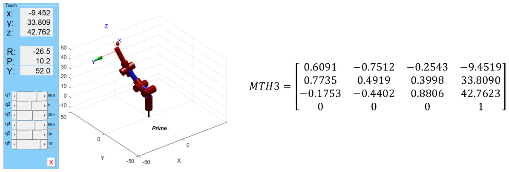

```python

```

```matlab
q1 = theta1;
q2 = theta2;
q3 = theta3;
q4 = theta4;
q5 = theta5;
q6 = theta6;
q = [q1,q2,q3,q4,q5,q6]
L(1) = Link('revolute','d',l1,'alpha',pi/2,'a',0,'offset',0);
L(2) = Link('revolute','d',0,'alpha',0,'a',l2,'offset',0);
L(3) = Link('revolute','d',0,'alpha',pi/2,'a',0,'offset',pi/2);
L(4) = Link('revolute','d',l3+l4,'alpha',-pi/2,'a',0,'offset',-pi/2);
L(5) = Link('revolute','d',0,'alpha',pi/2,'a',0,'offset',0);
L(6) = Link('revolute','d',l5+l6,'alpha',0,'a',0,'offset',0);

Robot = SerialLink(L,'name','Prime');
Robot.plot(q,'scale',1.0,'workspace',[-50 50 -50 50 -50 50]);
zlim([-15,50]);
Robot.teach(q,'rpy/zyx')
MTH3 = Robot.fkine(q)
Robot.ikunc(MTH3)
m=MTH3.R
rad2deg(tr2rpy(m))
```

<h3>Ejercicios</h3>

Realizar el desacople cinemático de un robot de 6 DOF con muñeca esférica y con las siguientes tres primeras articulaciones de los siguientes cinco tipos de robots: 1. Cartesiano, 2. Cilíndrico, 3. Esférico, 4. Scara.

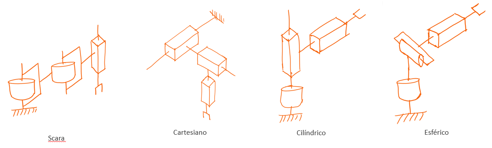