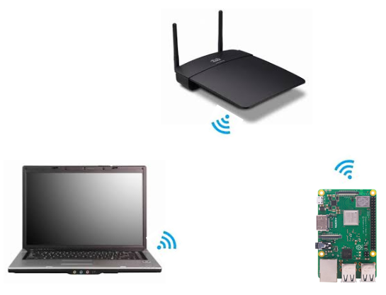

<h1>Aula 3</h1>

Esta clase consiste en la presentación de la Raspberry Pi y contextualizar el toolbox de Peter Corke.

<h2>Introducción a Raspberry</h2>

La Raspberry Pi es un microcomputador sobre la cual pueden correr diferentes sistemas operativos (Raspbian, Linux, Windows, Android), siendo Raspbian el sistema operativo sobre el cual se programa con `Python`, además, esta placa proporciona funcionalidades de pines GPIO. Algunas aplicaciones este sistema embebido son: 

1. Aprender habilidades de programación en `Python`
2. Construir proyectos de <i>hardware</i> (automatización, robótica, IoT, control, etc.)
3. Emuladores de video juegos (NES, play, SEGA, etc.)
4. Crear bots con redes sociales (Whatsapp, Facebook, Twitter, Instagram, etc.)

La documentación detallada de la RPi, en relación a: la placa, la instalación del sistema operativo, las configuraciones de la RPi, el software y librerias de la cámara, el acceso remoto, los datasheets, los tutoriales, etc, se encuentran en: https://www.raspberrypi.com/documentation/computers/


Fuente: https://www.sharetechnote.com/html/RaspberryPi_WhatIsIt.html


Fuente: https://www.seeedstudio.com/blog/2020/05/28/meet-the-brand-new-raspberry-pi-4-8gb-ram/


Fuente: https://www.sharetechnote.com/html/RaspberryPi_WhatIsIt.html



Fuente: https://www.sharetechnote.com/html/RaspberryPi_WhatIsIt.html

<h3>Hola mundo con GPIOs</h3>

Algunos ejemplos con GPIOs se encuentran en: https://www.raspberrypi.com/documentation/computers/raspberry-pi.html


```python
from gpiozero import LED
from time import sleep

led = LED(17)

while True:
    led.on()
    sleep(1)
    led.off()
    sleep(1)
```

<h3>Instalación de Raspbian en la SD Card</h3>

Toda la información necesaria para instalar de forma adecuada Raspbian en la SD Card (clase 10) para la Raspberry Pi se encuentra en: https://www.raspberrypi.com/software/operating-systems/

1. Descarga la Imagenes/imagen (.iso) correspondiente a la opción <i>Raspberry Pi OS with desktop and recommended software</i>
2. Cargar la Imagenes/imagen (.iso) de Raspbian en la SD Card a través de Balena etcher (https://etcher.balena.io)
3. Colocar la SD Card en la RPi y realizar las configuraciones iniciales, además de instalar las actualizaciones del sistema operativo, para lo cual se necesitará un monitor HDMI, un teclado y un mouse

> [!IMPORTANT]
>Verificar que en Raspbian se instalaron las actualizaciones iniciales al momento de la configuración del sistema operativo, lo cual se realiza en la primera vez que se ejecuta en la Raspberry el sistema operativo en la SD Card o con el asistente de actualización en Raspbian, instalar dichas actualizaciones o ejecutar en la terminal los siguientes comandos:<br>
>1. sudo apt-get -y update<br>
>2. sudo apt-get -y dist-upgrade<br>
>3. sudo apt-get -y autoremove<br>
>4. sudo apt-get autoclean<br>
>5. sudo reboot<br>
>Fuente: https://www.luisllamas.es/actualizar-version-raspbian-raspberry-pi/#:~:text=En%20primer%20lugar%2C%20verificamos%20la%20versi%C3%B3n%20actual%20con,apt-get%20-y%20autoremove%20sudo%20apt-get%20autoclean%20sudo%20reboot

<h3>Habilitar comunicación remota por VNC entre PC y RPi</h3>

Para realizar la comunicación remota por VNC entre PC y RPi es indispensable que los dos dispositivos estén conectados en la misma red de internet.

<h4>PC</h4>

1. Descargar e instalar RealVNC Viewer para Windows
2. Ingresar la IP del dispositivo (computador, celular, etc.) a controlar remotamente

<h4>RPi</h4>

1. Acceder al menú Inicio > Preferencias > Raspberry Pi Configuración
2. Seleccionar la pestaña Interfaces
3. Habilitar la opción VNC
4. Clic en aceptar
5. Obtener la IP de la RPi
5. Apagar la RPi y desconectar el HDMI del monitor
6. Encender la RPi

<h3>Actualización del Raspbian por consola</h3>

La actualización consiste en descargar todos los paquetes disponibles por el fabricante y posteriormente instalarlos, para esto se debe contar con un buena conexión a internet. El comando para descargar los paquetes es:

```
sudo apt update
```
El comando para instalar los paquetes previamente descargados es:

```
sudo apt upgrade
```

<h2>Toolbox Peter Corke</h2>

La documentación del Toolbox de Peter Corke para `Python` se encuentra en: https://petercorke.github.io/robotics-toolbox-python/intro.html

1. Instalar desde pip el toolbox de Peter Corke en `Python` (https://github.com/petercorke/robotics-toolbox-python)

En Windows, en el terminal ejecutar el siguiente comando:

```
pip3 install roboticstoolbox-python
```

En Raspbian, en el terminal buscar la siguiente ruta: /home/[USER] con el comando `cd ~`y ejecutar el siguiente comando:

```
sudo pip3 install roboticstoolbox-python
```

>[!WARNING]
>En las últimas versiones de Raspbian se presenta el siguiente error posteriormente a la ejecución del comando de instalación del toolbox de Peter Corke en Raspberry


Para solucionar ese error, se deben tener en cuenta los siguientes pasos:

I. En el terminal, con los comandos linux (`cd`, `cd ..`, `ls`, `pwd`, etc.) entrar a la carpeta /etc<br>
II. Para abrir el archivo `pi.conf` en el terminal, ejecutar la siguiente línea de comando: 
```
sudo nano pip.conf
```
III. Al final del archivo agregar la siguiente línea: 
```
break-system-packages = true
```
IV. Presionar `Ctrl+x`, luego presionar la `s` para guardar las modificaciones y finalmente presionar `enter`

>[!WARNING]
>En las últimas versiones de Scipy se presenta el siguiente error posteriormente a la ejecución de un código de prueba importando el toolbox de Peter Corke en Python


Para solucionar ese error, se deben tener en cuenta los siguientes pasos:

I. Verificar la versión de la librería Scipy a través de un código en `Python`:
```python
import scipy
scipy.__version__
```
II. Si la versión de Scipy es mayor a 1.12.0, desinstalar dicha versión a través de la siguiente línea comando:
```
sudo pip uninstall scipy
```
III. Instalar una versión de Scipy menor a 1.12.0
```
sudo pip install "scipy<1.12.0"
```

Fuente: https://github.com/petercorke/RVC3-python/issues/16

>[!WARNING]
>En las últimas versiones de Numpy se presenta el siguiente error posteriormente a la ejecución del comando de instalación del toolbox de Peter Corke en Raspberry


Para solucionar ese error, se deben tener en cuenta los siguientes pasos:

I. Verificar la versión de la librería Numpy a través del siguiente comando:
```
pip show numpy
```
II. Si la versión de Numpy es mayor a 1.23.2, desinstalar dicha versión a través de la siguiente línea comando:
```
sudo pip uninstall numpy
```
III. Instalar una versión de Numpy menor a 1.23.2
```
sudo pip install "numpy<1.23.2"
``` 

>[!WARNING]
>En las versiones de 32 bits de Raspbian se presenta el siguiente error posteriormente a la ejecución del comando de instalación del toolbox de Peter Corke en Raspberry

Original error was: libcblas.so.3: cannot open shared object file: No such file or directory

Para solucionar ese error, se deben tener en cuenta los siguientes pasos:

I. Instalar las siguientes dependencias en el terminal de Raspberry:
```
sudo apt-get install libcblas-dev
sudo apt-get install libhdf5-dev
sudo apt-get install libhdf5-serial-dev
sudo apt-get install libatlas-base-dev
sudo apt-get install libjasper-dev 
sudo apt-get install libqtgui4 
sudo apt-get install libqt4-test
```

Fuente: https://stackoverflow.com/questions/53347759/importerror-libcblas-so-3-cannot-open-shared-object-file-no-such-file-or-dire

>[!WARNING]
>En algunas versiones de Raspbian (ej:buster) se presenta el siguiente error posteriormente a la ejecución del comando de instalación del toolbox de Peter Corke en Raspberry


Para solucionar ese error, se debe ejecutar el siguiente comando:

```
sudo apt-get install libatlas-base-dev
```

Fuente: https://github.com/numpy/numpy/issues/14772

>[!WARNING]
>En las versiones de 32 bits de Raspbian se presenta el siguiente error posteriormente a la ejecución del comando de instalación del toolbox de Peter Corke en Raspberry


Para solucionar ese error, se deben tener en cuenta los siguientes pasos:

I. Instalar la siguiente dependencia en el terminal de Raspberry:
```
sudo apt-get install libopenblas-dev
```

Fuente: https://stackoverflow.com/questions/36893382/scipy-installation-issue-getting-importerror-libopenblas-so-0-cannot-open-sha

>[!WARNING]
>En algunas versiones de Raspbian (ej:buster) se presenta el siguiente error posteriormente a la ejecución del comando de instalación del toolbox de Peter Corke en Raspberry


Para solucionar ese error, se debe ejecutar el siguiente comando:

```
sudo pip3 install "cython>=0.29.24"
```

*Si se presenta este error con otro paquete de `Python` (ej. scipy, rtb-data, etc), se debe instalar el paquete específico de manera independiente, así como se realizó con el paquete cython. Además de esto, es recomendable intentar la instalación con otra red de Internet.

2. Ejecutar un código en `Python` donde se importe la libreria `roboticstoolbox` para verificar la correcta instalación de la misma

```python
from roboticstoolbox import *
import math

l1 = 12
l2 = 14
l3 = 6
l4 = 4

q1 = 0
q2 = 0

R = []
R.append(RevoluteDH(d=l1, alpha=math.pi/2, a=l2, offset=0))
R.append(RevoluteDH(d=l3, alpha=0, a=l4, offset=0))

Robot = DHRobot(R, name='Bender')
print(Robot)

Robot.teach([q1, q2], limits=[-30,30,-30,30,-30,30])

#zlim([-15,30]);

MTH = Robot.fkine([q1,q2])
print(MTH)
```
>[!WARNING]
>En algunas versiones de Raspbian (ej:buster), se presenta este error posteriormente a la instalación del toolbox de Peter Corke en Raspberry y al momento de ejecutar un código con dicho toolbox, específicamente con la función teach.


Para solucionar ese error, se debe ejecutar el siguiente comando:

Reemplazar teach por plot.