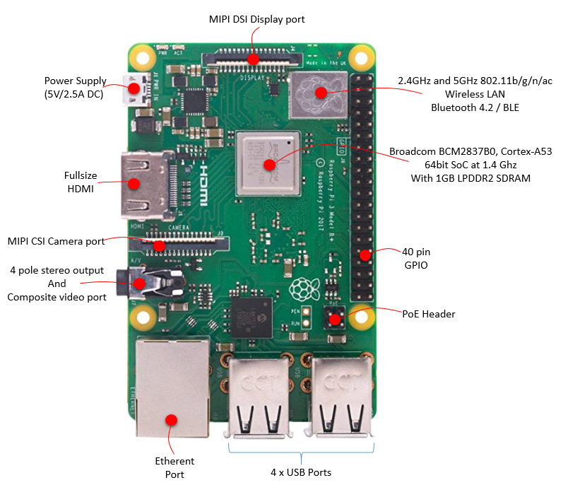
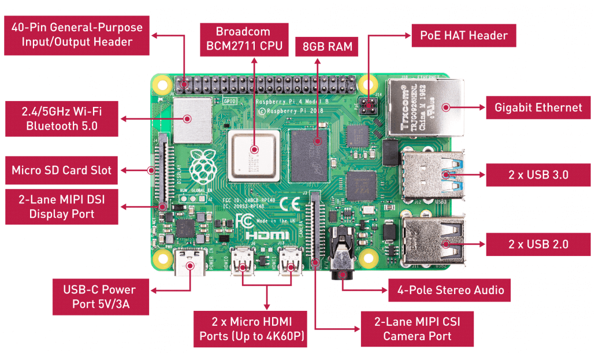
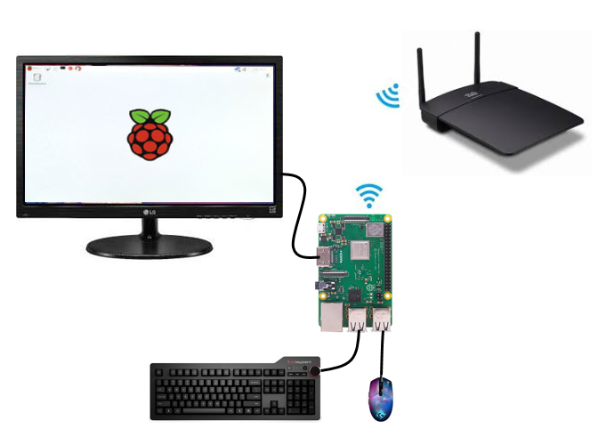
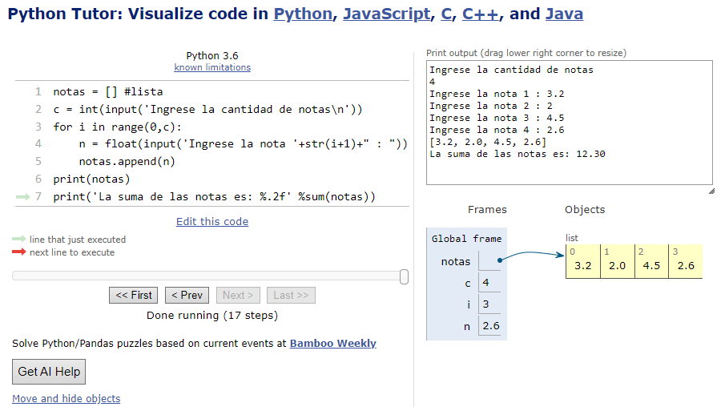
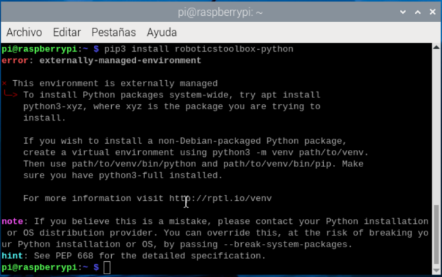
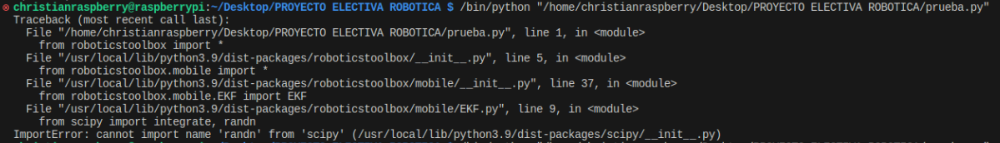
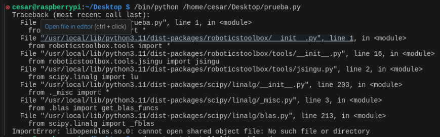

<h1>Aula 3</h1>

Esta clase consiste en la presentación de la Raspberry Pi y en realizar un repaso de `Python`.

<h2>Introducción a Raspberry</h2>

La Raspberry Pi es un microcomputador sobre la cual pueden correr diferentes sistemas operativos (Raspbian, Linux, Windows, Android), siendo Raspbian el sistema operativo sobre el cual se programa con `Python`, además, esta placa proporciona funcionalidades de pines GPIO. Algunas aplicaciones este sistema embebido son: 

1. Aprender habilidades de programación en `Python`
2. Construir proyectos de <i>hardware</i> (automatización, robótica, IoT, control, etc.)
3. Emuladores de video juegos (NES, play, SEGA, etc.)
4. Crear bots con redes sociales (Whatsapp, Facebook, Twitter, Instagram, etc.)

La documentación detallada de la RPi, en relación a: la placa, la instalación del sistema operativo, las configuraciones de la RPi, el software y librerias de la cámara, el acceso remoto, los datasheets, los tutoriales, etc, se encuentran en: https://www.raspberrypi.com/documentation/computers/



Fuente: https://www.sharetechnote.com/html/RaspberryPi_WhatIsIt.html



Fuente: https://www.seeedstudio.com/blog/2020/05/28/meet-the-brand-new-raspberry-pi-4-8gb-ram/



Fuente: https://www.sharetechnote.com/html/RaspberryPi_WhatIsIt.html


Fuente: https://www.sharetechnote.com/html/RaspberryPi_WhatIsIt.html

<h3>Hola mundo con GPIOs</h3>

Algunos ejemplos con GPIOs se encuentran en: https://www.raspberrypi.com/documentation/computers/raspberry-pi.html


```python
from gpiozero import LED
from time import sleep

led = LED(17)

while True:
    led.on()
    sleep(1)
    led.off()
    sleep(1)
```

<h3>Instalación de Raspbian en la SD Card</h3>

Toda la información necesaria para instalar de forma adecuada Raspbian en la SD Card (clase 10) para la Raspberry Pi se encuentra en: https://www.raspberrypi.com/software/operating-systems/

1. Descarga la imagen (.iso) correspondiente a la opción <i>Raspberry Pi OS with desktop and recommended software</i>
2. Cargar la imagen (.iso) de Raspbian en la SD Card a través de Balena etcher (https://etcher.balena.io)
3. Colocar la SD Card en la RPi y realizar las configuraciones iniciales, además de instalar las actualizaciones del sistema operativo, para lo cual se necesitará un monitor HDMI, un teclado y un mouse

> [!IMPORTANT]
>Verificar que en Raspbian se instalaron las actualizaciones iniciales al momento de la configuración del sistema operativo, lo cual se realiza en la primera vez que se ejecuta en la Raspberry el sistema operativo en la SD Card o con el asistente de actualización en Raspbian, instalar dichas actualizaciones o ejecutar en la terminal los siguientes comandos:<br>
>1. sudo apt-get -y update<br>
>2. sudo apt-get -y dist-upgrade<br>
>3. sudo apt-get -y autoremove<br>
>4. sudo apt-get autoclean<br>
>5. sudo reboot<br>
>Fuente: https://www.luisllamas.es/actualizar-version-raspbian-raspberry-pi/#:~:text=En%20primer%20lugar%2C%20verificamos%20la%20versi%C3%B3n%20actual%20con,apt-get%20-y%20autoremove%20sudo%20apt-get%20autoclean%20sudo%20reboot

<h3>Habilitar comunicación remota por VNC entre PC y RPi</h3>

Para realizar la comunicación remota por VNC entre PC y RPi es indispensable que los dos dispositivos estén conectados en la misma red de internet.

<h4>PC</h4>

1. Descargar e instalar RealVNC Viewer para Windows
2. Ingresar la IP del dispositivo (computador, celular, etc.) a controlar remotamente

<h4>RPi</h4>

1. Acceder al menú Inicio > Preferencias > Raspberry Pi Configuración
2. Seleccionar la pestaña Interfaces
3. Habilitar la opción VNC
4. Clic en aceptar
5. Obtener la IP de la RPi
5. Apagar la RPi y desconectar el HDMI del monitor
6. Encender la RPi

<h3>Actualización del Raspbian por consola</h3>

La actualización consiste en descargar todos los paquetes disponibles por el fabricante y posteriormente instalarlos, para esto se debe contar con un buena conexión a internet. El comando para descargar los paquetes es:

```
sudo apt update
```
El comando para instalar los paquetes previamente descargados es:

```
sudo apt upgrade
```

<h2>Introducción a Python :atom:</h2>

`Python` es un lenguaje de programación interpretado, entre sus principales ventajas están: facilidad de sintaxis, no necesita declarar variables, indispensable indentar las líneas de código, fácil manejo de arreglos (vectores y matrices)

<h3>1. Instalar Python</h3><br>
En Windows, descargar el instalador del siguiente link: https://www.python.org y al momento de instalarlo, seleccionar la opción Add path.<br>
En Raspbian, por defecto ya está instalado `Python` versión 3.1X

Para conocer la versión de `Python` sobre la cual se está trabajando, en el terminal ejecutar el siguiente comando: 

```
python --version
```

<h3>2. Instalar Visual Studio Code</h3><br>
En Windows, descargar el instalador del siguiente link: https://code.visualstudio.com<br>
En Raspbian, ejecutar en el terminal la siguiente línea de comando: 

```
sudo apt install code
```

<h3>3. Ejemplos de programación en Python</h3>

Los ejemplos de esta clase están orientados a un repaso básico de programación, teniendo en cuenta la impresión de datos en consola, variables, ingreso de datos por consola, arreglos, condicionales, bucles, funciones y clases.

<h4>Impresión de datos en consola</h4>

Para imprimir informacion se utiliza la funcion `print`, en la cual es posible inicializar un <em>string</em> en comillas simples o dobles.

```python
print("Hola mundo '2024'")
print('Hola mundo "2024"')
```

<h4>Variables</h4>

No hay necesidad de declarar variables, sin embargo, pueden ser inicializadas y específicamente a las variables numéricas se les puede modificar el tipo de variable.

```python
a = 'Hola'
b = "Mundo"
c = 2024.0

print("Texto: %s %s %.2f" %(a,b,c))
print("Texto:",a,b,c)  
print("Texto: "+str(a)+' '+str(b)+' '+str(c))
print(f"Texto: {a} {b} {c:.2f}")
print("Texto: {0} {1} {2:.2f}".format(a,b,c))
```

Este tipo de operaciones se ejecutan de izquierda a derecha teniendo en cuenta la prioridad:

1. Paréntesis `()`
2. Exponente `**`
3. Negación `-x`
4. Multiplicación, División, Cociente, Módulo `*` `/` `//` `%`
5. Suma, Resta `+` `-`

```python
#Variables int y float
a = 7
b = c = 5.2
print(a,b,c)
print(type(a),type(int(b)),type(c)) #up o down casting
text = 'Los valores de a, b y c, respectivamente son:'
print(f'{text} {a}, {b} y {c}')

#Operaciones aritméticas
temp = a
a += b
print(f'a += b es: %f {a}')
a = temp
a -= b
print(f'a -= b es: %f {a}')
a = temp
a *= b
print(f'a *= b es: %f {a}')
a = temp
a /= b
print(f'a /= b es: %f {a}')
a = temp
a **= b #potencia o elevado
print(f'a **= b es: %f {a}')
a = temp
d = a/2 #cociente float
e = a//2 #cociente int
f = a%2 #residuo float
print(f'Los valores de d, e y f, respectivamente son: {d}, {e} y {f}')

```

Ademas, es posible realizar operaciones logicas con las variables numericas

``` python
num1 = 7
num2 = 2
equal = num1 == num2
different = num1 != num2
greater = num1 >= num2
less = num1 <= num2
print(equal, different, greater, less)
```

En el caso de variables tipo <em>string</em>, tambien se pueden hacer comparaciones, teniendo en cuenta los valores de codificacion Unicode (similar a ASCII)

``` python
word1 = "Hola"
word2 = "hola"
equal = word1 == word2
different = word1 != word2
greater = word1 >= word2
less = word1 <= word2
print(equal, different, greater, less)
```

Es posible acceder a un caracter determinado de un <em>string</em> a traves de una posición específica tanto de izquierda a derecha (incrementando) como de derecha a izquierda (decrementando).

```python
n = "Fabián"
i1 = n[4]
i2 = n[-2]
print(i1,i2)

```
Asi mismo, en `Python` se pueden obtener y concatenar diferentes caracteres de un <em>string</em> 

```python
n = "Fabián" #string
s = "Barrera Prieto"
o = 'PROFESOR'
a = '2024'

print(f'Primera letra del nombre: {n[0]}')
print(f"Primer apellido: {s[:7]}")
print(f"Segundo apellido: {s[8:]}")

c = n.upper()+' '+s+" es "+o.lower()+' en el semestre '+a+ " \"2\" "
c = f"{n.upper()} {s} es {o.lower()} en el semestre {a}-\"1\" "
print(c)
print(c[:int(len(c)/2)])
```

Las listas, al igual que las tuplas y los strings se acceden a las posiciones de igual manera, sin embargo, las listas y las tuplas pueden ser heterogeneas. Las tuplas no pueden ser modificadas, ni en datos, ni en tamaño.

```python
a = ('Fabián', "Barrera Prieto", "PROFESOR", 2024) #tupla
print(type(a))

print(f'Primera letra del nombre: {a[0][0]}')
print(f"Primer apellido: {a[1][:7]}")
print(f"Segundo apellido: {a[1][8:]}")

b = f"{a[0].upper()} {a[1]} es {a[2].lower()} en el semestre {a[3]}-\"2\"" 
print(b)
print(type(b))
print(b[:int(len(b)/2)])
```

<h4>Ingreso de datos por consola</h4>

Para ingresar datos por teclado se utiliza la funcion `input`

```python
name = input('Ingrese el nombre \n') 
age = input("Ingrese la edad \n")
print(f'{name} tiene {age} años')
```
<h4>Arreglos</h4>

```python
import numpy

nums1 = numpy.array([3,7,4,9,1])
nums2 = numpy.array([[6.3,7.2,1.1],[9.6,5.7,2.4]])
print(f"Datos y tamaño del vector nums1: {nums1[0:4]} y {nums1.size}")
print(f"Datos y tamaño del vector nums2: {nums2}, {len(nums2)}({nums2.size})")

nums1[2] = 100
nums2[0,:] = 83
print(f"Datos y tamaño del vector nums1: {nums1[1:4]} y {nums1.size}")
print(f"Datos y tamaño del vector nums2: {nums2}, {len(nums2)}({nums2.size})")
```
<h4>Condicionales</h4>

```python
name = input('Ingrese el nombre \n') 
age = int(input("Ingrese la edad \n"))
if age>=0 and age<3:
    print(f'{name} es un bebé')
elif age>=3 and age<12:
    print(f'{name} es un niño')
elif age>=12 and age<20:
    print(f'{name} es un adolescente')
elif age>=20 and age<30:
    print(f'{name} es un joven')
elif age>=30 and age<70:
    print(f'{name} es un adulto')
elif age>=70:
    print(f'{name} es un abuelo')
else:
    print("La edad no es válida")
```
<h4>Bucles o ciclos</h4>

El bucle `for` permite realizar iteraciones teniendo en cuenta una condición de inicio, de final y de incremento

```python
suma = 0
for i in range (1,101,1):
    suma += i
print(f'La suma de los números del 1 al 100 es: {suma}')
```

De igual manera, para ejecutar un código una cantidad determinada de veces, como por ejemplo para recorrer listas y tuplas

```python
ciudades = ["Bogotá", 'Medellín', 'Cali', "Pasto"]
for ciudad in ciudades: #for ciudad in range (0,len(ciudades)):
    print(ciudad) #print(ciudades[ciudad])
```
Otra herramienta muy útil para depurar código es <a href="https://pythontutor.com">PythonTutor</a>; sin embargo, no todas las librerias funcionan en esta página (ej: numpy, roboticstoolbox, entre otras)

```python
notas = [] #lista 
c = int(input('Ingrese la cantidad de notas\n'))
for i in range(0,c):
    n = float(input(f'Ingrese la nota {(i+1)}: '))
    notas.append(n)
print(notas)
print(f'La suma de las notas es: {sum(notas)}')
```



El ciclo `while` se utiliza para ejecutar un código una cantidad indeterminada de veces, teniendo en cuenta una condición

```python
r = "S"
while r != 'n':
    name = input('Ingrese el nombre \n') 
    age = int(input("Ingrese la edad \n"))
    while age<=0:
        print('La edad no es válida')    
        age = int(input("Ingrese nuevamente la edad \n"))
    if age>=18:
        print(f"{name} es mayor de edad \n")
    else:
        print(f"{name} es menor de edad \n")
          
    r = input('Desea ingresar la información de otro estudiante (s/n) \n')
    
print('Fin') 
```

En algunas ocasiones resulta necesario utilizar un ciclo `while` para garantizar ciertas tareas durante un tiempo específico, teniendo en cuenta el temporizador de la librería `time`.

```python
import time

t1 = time.time()
t2 = 0.0
while t2 <= 20.0:
    print(f"El tiempo es {t2}s \n")
    t2 = time.time() - t1
```
<h4>Funciones</h4>

Una suma es posible independizarla en una función, para que esta sea recursiva, flexible

```python
def sum(a,b):
    c = a + b
    return c

num1 = float(input('Ingrese el primer número: \n'))
num2 = float(input('Ingrese el segundo número: \n'))
num3 = sum(num1,num2)
print(f'{num1:.2f} + {num2:.2f} = {num3:.2f}')
```

<h4>Arreglos + funciones</h4>

Este ejemplo es la serie de Fibonacci, la cual consiste en una sucesión que se calcula a partir de la suma de los dos últimos números de dicha sucesión

Es posible leer una variable `global` en cualquier parte del código, sin embargo no es posible escribirla dentro de una función, para editarla, se requiere definir con `global` dicha variable al comienzo de la función

```python
def fibonacci(x):
    global data
    a = 1
    b = 1
    index = 0
    while index < x:
        data.append(a)
        temp = b
        b = a + b
        a = temp
        index += 1

data = []
fibonacci(12)
print(data)
```
Otro ejemplo son el ingreso de cinco calificaciones de un estudiantes y el cálculo del promedio de dichas notas, siendo que cada tarea se realiza en una función diferente

```python
def data(n):
    global grades
    for i in range(0,n,1):
        n = float(input('Ingrese la nota '+str(i+1)+" : "))
        grades.append(n)

def average(notas,n):
    s = 0.0
    for i in range(0,n,1):
        s += notas[i]
    a = s/len(notas)
    return s,a

grades = []
data(5)
r1,r2 = average(grades,5)
print('La suma y el promedio de las notas son: %.2f y %.2f' %(r1,r2))
```

Sin embargo, para realizar operaciones matemáticas con una lista de números, se recomienda utilizar vectores con numpy.arrays. Así mismo, se debe restringir el uso de global debido a la seguridad de las variables.

``` python
import numpy

def data(notas, n):
    #global grades
    for i in range(0,n,1):
        n = float(input(f'Ingrese la nota {i+1}: '))
        notas.append(n)
    calificaciones = numpy.array(notas)
    calificaciones = calificaciones + 0.5
    return calificaciones

def average(notas, n):
    s = 0.0
    for i in range(0,n,1):
        s += notas[i]
    a = s/len(notas)
    return s,a

grades = []
grades = data(grades, 5)
r1,r2 = average(grades, 5)
print(f'La suma y el promedio de las notas son: {r1:.2f} y {r2:.2f}')
```

<h4>Clases</h4>

Para programar a través de clases en `Python`, es importante tener en cuenta que las clases son estructuras de datos creadas a partir de variables (atributos o propiedades) y funciones (métodos). Los objetos (variables) son instancias de dichas clases, es decir, una entidad que puede aprovechar todos los recursos (atributos y métodos) de una clase. Además, se debe tener en cuenta que toda clase tiene un constructor que inicializa algunos atributos del objeto instanciado de dicha clase

```python
class Estudiante():
    #constructor
    def __init__(self, nombre, edad, notas):
        #atributos
        self.nombre = nombre
        self.edad = edad 
        self.notas = notas
        self.ocupacion = "Estudiante"
        self.grades = []
        self.s = 0.0
        self.a = 0
    
    #métodos        
    def data(self):
        for i in range(0,self.notas,1):
            n = float(input(f'Ingrese la nota {i+1}: '))
            self.grades.append(n)

    def average(self):
        for i in range(0,self.notas,1):
            self.s += self.grades[i]
        self.a = self.s/len(self.grades)
        return self.s,self.a
    
    def result(self):
        print(f'La suma y el promedio de las notas son: {self.s} y {self.a}')
    
Fabian = Estudiante('Fabián',20,5) #instancia
Fabian.data()
r1,r2 = Fabian.average()
print(f'La suma y el promedio de las notas son: {r1} y {r2}')
Fabian.result()
```

<h2>Toolbox Peter Corke</h2>

La documentación del Toolbox de Peter Corke para `Python` se encuentra en: https://petercorke.github.io/robotics-toolbox-python/intro.html

1. Instalar desde pip el toolbox de Peter Corke en `Python` (https://github.com/petercorke/robotics-toolbox-python)

En Windows, en el terminal ejecutar el siguiente comando:

```
pip3 install roboticstoolbox-python
```

En Raspbian, en el terminal buscar la siguiente ruta: /home/[USER] con el comando `cd ~`y ejecutar el siguiente comando:

```
sudo pip3 install roboticstoolbox-python
```

>[!WARNING]
>En las últimas versiones de Raspbian se presenta el siguiente error posteriormente a la ejecución del comando de instalación del toolbox de Peter Corke en Raspberry



Para solucionar ese error, se deben tener en cuenta los siguientes pasos:

I. En el terminal, con los comandos linux (`cd`, `cd ..`, `ls`, `pwd`, etc.) entrar a la carpeta /etc<br>
II. Para abrir el archivo `pi.conf` en el terminal, ejecutar la siguiente línea de comando: 
```
sudo nano pip.conf
```
III. Al final del archivo agregar la siguiente línea: 
```
break-system-packages = true
```
IV. Presionar `Ctrl+x`, luego presionar la `s` para guardar las modificaciones y finalmente presionar `enter`

>[!WARNING]
>En las últimas versiones de Scipy se presenta el siguiente error posteriormente a la ejecución de un código de prueba importando el toolbox de Peter Corke en Python



Para solucionar ese error, se deben tener en cuenta los siguientes pasos:

I. Verificar la versión de la librería Scipy a través de un código en `Python`:
```python
import scipy
scipy.__version__
```
II. Si la versión de Scipy es mayor a 1.12.0, desinstalar dicha versión a través de la siguiente línea comando:
```
sudo pip uninstall scipy
```
III. Instalar una versión de Scipy menor a 1.12.0
```
sudo pip install "scipy<1.12.0"
```

Fuente: https://github.com/petercorke/RVC3-python/issues/16

>[!WARNING]
>En las últimas versiones de Numpy se presenta el siguiente error posteriormente a la ejecución del comando de instalación del toolbox de Peter Corke en Raspberry


Para solucionar ese error, se deben tener en cuenta los siguientes pasos:

I. Verificar la versión de la librería Numpy a través del siguiente comando:
```
pip show numpy
```
II. Si la versión de Numpy es mayor a 1.23.2, desinstalar dicha versión a través de la siguiente línea comando:
```
sudo pip uninstall numpy
```
III. Instalar una versión de Numpy menor a 1.23.2
```
sudo pip install "numpy<1.23.2"
``` 

>[!WARNING]
>En las versiones de 32 bits de Raspbian se presenta el siguiente error posteriormente a la ejecución del comando de instalación del toolbox de Peter Corke en Raspberry

Original error was: libcblas.so.3: cannot open shared object file: No such file or directory

Para solucionar ese error, se deben tener en cuenta los siguientes pasos:

I. Instalar las siguientes dependencias en el terminal de Raspberry:
```
sudo apt-get install libcblas-dev
sudo apt-get install libhdf5-dev
sudo apt-get install libhdf5-serial-dev
sudo apt-get install libatlas-base-dev
sudo apt-get install libjasper-dev 
sudo apt-get install libqtgui4 
sudo apt-get install libqt4-test
```

Fuente: https://stackoverflow.com/questions/53347759/importerror-libcblas-so-3-cannot-open-shared-object-file-no-such-file-or-dire

>[!WARNING]
>En las versiones de 32 bits de Raspbian se presenta el siguiente error posteriormente a la ejecución del comando de instalación del toolbox de Peter Corke en Raspberry

Para solucionar ese error, se deben tener en cuenta los siguientes pasos:

I. Instalar la siguiente dependencia en el terminal de Raspberry:
```
sudo apt-get install libopenblas-dev
```

Fuente: https://stackoverflow.com/questions/36893382/scipy-installation-issue-getting-importerror-libopenblas-so-0-cannot-open-sha



2. Ejecutar un código en `Python` donde se importe la libreria `roboticstoolbox` para verificar la correcta instalación de la misma

```python
from roboticstoolbox import *
import math

l1 = 12
l2 = 14
l3 = 6
l4 = 4

q1 = 0
q2 = 0

R = []
R.append(RevoluteDH(d=l1, alpha=math.pi/2, a=l2, offset=0))
R.append(RevoluteDH(d=l3, alpha=0, a=l4, offset=0))

Robot = DHRobot(R, name='Bender')
print(Robot)

Robot.teach([q1, q2], limits=[-30,30,-30,30,-30,30])

#zlim([-15,30]);

MTH = Robot.fkine([q1,q2])
print(MTH)
```