<h1>Aula 3</h1>

Esta clase consiste en comprender los conceptos de posición y orientación de un cuerpo rígido y su representación a través de matrices.

<h2>Posición y orientación del cuerpo rígido y matrices de rotación</h2>

<h3>Coordenadas cartesianas</h3>

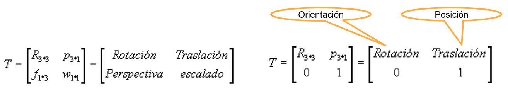

Fuente: Barrientos, A., Peñín, L.F., Balaguer, C., y Aracil, R., 2007, Fundamentos de Robótica, 2nd edition, McGraw-Hill.

<h3>Coordenadas polares (2D) y cilíndricas (3D)</h3>

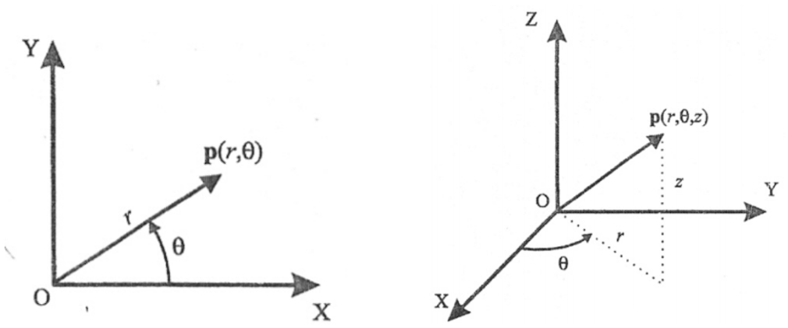

Fuente: Barrientos, A., Peñín, L.F., Balaguer, C., y Aracil, R., 2007, Fundamentos de Robótica, 2nd edition, McGraw-Hill.

<h3>Coordenadas esféricas</h3>

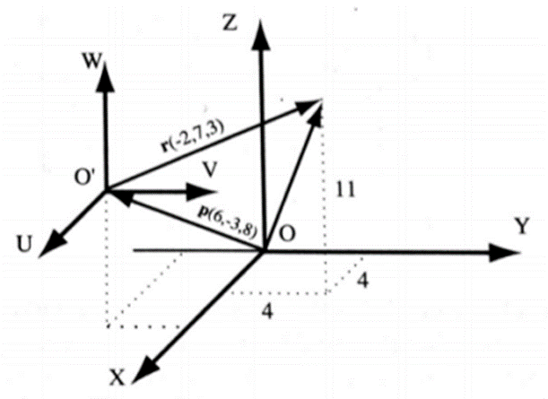

Fuente: Barrientos, A., Peñín, L.F., Balaguer, C., y Aracil, R., 2007, Fundamentos de Robótica, 2nd edition, McGraw-Hill.

<h3>Conversión de coordenadas</h3>

Encontrar la representación en coordenadas cilíndricas y esféricas de vector de coordenadas cartesianas en el sistema OXYZ (4,7,3)

<h2>Cilíndricas</h2>

$$𝑟=\sqrt{𝑥^{2}+𝑦^{2}}=8.062$$

$$𝜃=tan^{−1}\frac{𝑦}{𝑥}=60.255°$$

$$𝑧=𝑧=3$$

<h2>Esféricas</h2>

$$𝑟=\sqrt{𝑥^{2}+𝑦^{2}+𝑧^{2}}=8.602$$

$$𝜃=tan^{−1}⁡\frac{𝑦}{𝑥}=60.255°$$

$$𝜑=cos^{−1}\frac{𝑧}{𝑟}=69.588°$$

<h3>Posición y orientación</h3>

La posición (traslación) es el punto en la coordenada XYZ y la orientación (rotación) es la localización de los ejes alrededor de dicho punto con respecto a un sistema coordenado de origen (cuerpo rígido). Cada articulación tiene un sistema coordenado.

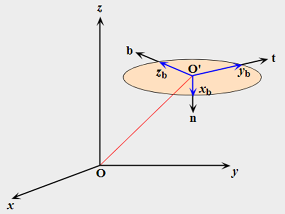

Fuente: http://www.udesantiagovirtual.cl/moodle2/pluginfile.php?file=/55554/mod_book/chapter/285/figuras/Ch3_fig3-1.svg

<h3>Traslación</h3>

La traslación consiste en desplazar un objeto linealmente (modificar la posición) sobre los ejes de un plano cartesiano XYZ.


Fuente: http://galia.fc.uaslp.mx/~medellin/Applets/Trans3D/transformaciones_en_3d.htm

<h2>Ejercicio 1</h2>

En la figura, el sistema 𝑂’𝑈𝑉𝑊 está trasladado de un vector 𝑝(6,−3,8) con respecto del sistema 𝑂𝑋𝑌𝑍. Calcular las coordenadas ($𝑟_{𝑥}$, $𝑟_{𝑦}$, $𝑟_{𝑧}$) del vector 𝑟, cuyas coordenadas con respecto al sistema 𝑂’𝑈𝑉𝑊 son $𝑟_{𝑢𝑣𝑤}$ (−2,7,3)


Fuente: Barrientos, A., Peñín, L.F., Balaguer, C., y Aracil, R., 2007, Fundamentos de Robótica, 2nd edition, McGraw-Hill.

```matlab
clear all
close all
clc

p = [6; -3; 8]
r = [-2; 7; 3]
pr = p + r
```

$$\vec{p}= \begin{bmatrix}
6\\ 
-3\\ 
8
\end{bmatrix}$$

$$\vec{r}= \begin{bmatrix}
-2\\ 
7\\ 
3
\end{bmatrix}$$

$$\vec{p}+\vec{r}= \begin{bmatrix}
6\\ 
-3\\ 
8
\end{bmatrix} + \begin{bmatrix}
-2\\ 
7\\ 
3
\end{bmatrix} = \begin{bmatrix}
4\\ 
4\\ 
11
\end{bmatrix}$$

<h2>Ejercicio 2</h2>

Calcular el vector $𝑟_{𝑥𝑦𝑧}'$ resultante de trasladar el vector $𝑟_{𝑥𝑦𝑧}$ (4,4,11) las coordenadas $𝑝_{𝑥𝑦𝑧}$ (6,−3,8)

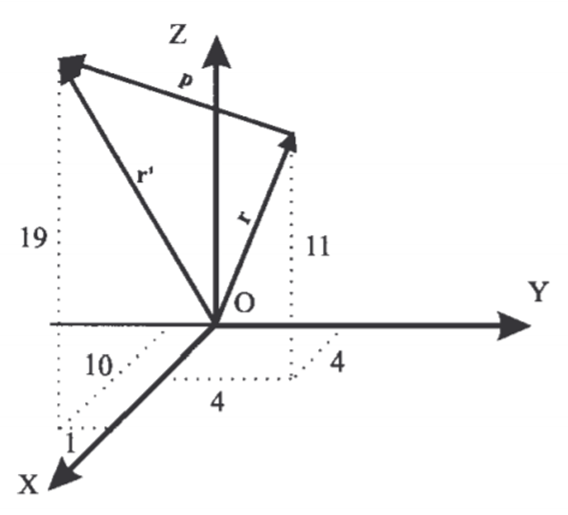

Fuente: Barrientos, A., Peñín, L.F., Balaguer, C., y Aracil, R., 2007, Fundamentos de Robótica, 2nd edition, McGraw-Hill.

```matlab
clear all
close all
clc

r = [4; 4; 11]
p = [6; -3; 8]
rp = r + p
```

$$\vec{r}= \begin{bmatrix}
4\\ 
4\\ 
11
\end{bmatrix}$$

$$\vec{r}= \begin{bmatrix}
6\\ 
-3\\ 
8
\end{bmatrix}$$

$$\vec{r}+\vec{p}= \begin{bmatrix}
4\\ 
4\\ 
11
\end{bmatrix} + \begin{bmatrix}
6\\ 
-3\\ 
8
\end{bmatrix} = \begin{bmatrix}
10\\ 
1\\ 
19
\end{bmatrix}$$

<h3>Rotación</h3>

La rotación consiste en girar un objeto (modificar la orientación) sobre los ejes de un plano cartesiano XYZ.

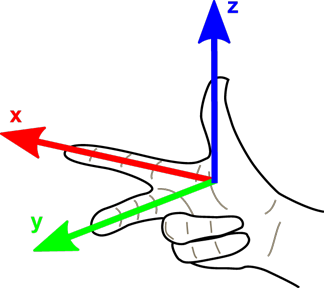

Fuente: https://livebook.manning.com/book/robotics-for-software-engineers/chapter-4/v-2/47

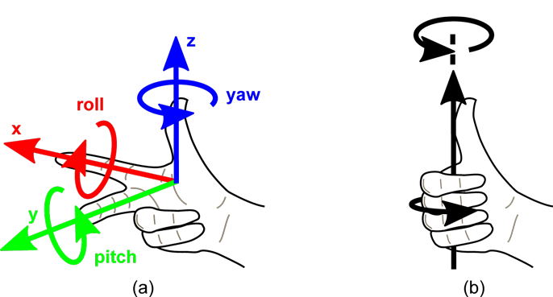

Fuente: https://livebook.manning.com/book/robotics-for-software-engineers/chapter-4/v-2/47


```matlab
clear all
close all
clc

alfa = 0
RotarX(alfa)
RotarY(alfa)
RotarZ(alfa)
```

No es lo mismo primero rotar en X y luego rotar en Y, que primero rotar en Y y luego rotar en X, independientemente si es con respecto al sistema fijo (premultiplicar) o al sistema móvil o actual (posmultiplicar). Por tanto, las rotaciones no son conmutativas.

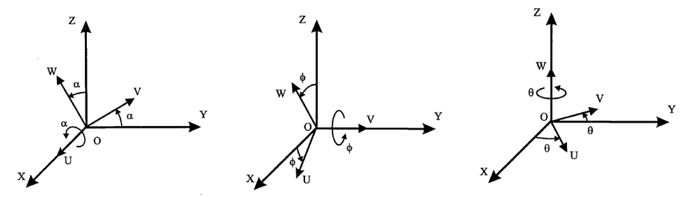

Fuente: Barrientos, A., Peñín, L.F., Balaguer, C., y Aracil, R., 2007, Fundamentos de Robótica, 2nd edition, McGraw-Hill.

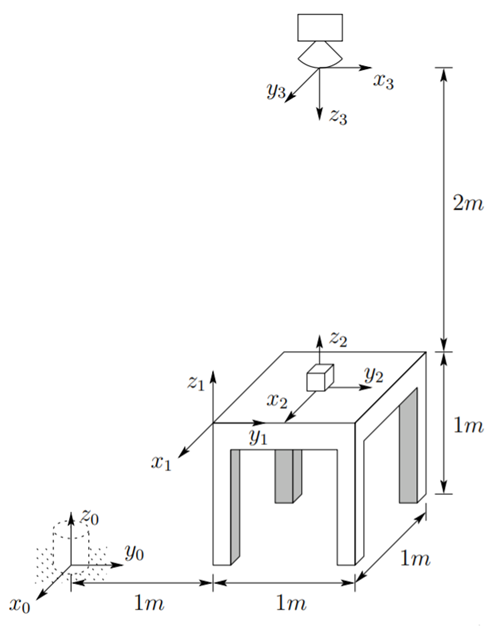

```matlab
clear all
close all
clc

a = round(RotarZ(pi/2)*RotarY(pi/2))
b = round(RotarY(pi/2)*RotarZ(pi/2))

%Excepción si gira en el mismo eje
c = round(RotarX(pi/2)*RotarX(pi))
d = round(RotarX(pi)*RotarX(pi/2))
e = round(RotarX(pi+pi/2))
```

<h2>Sistema actual</h2>

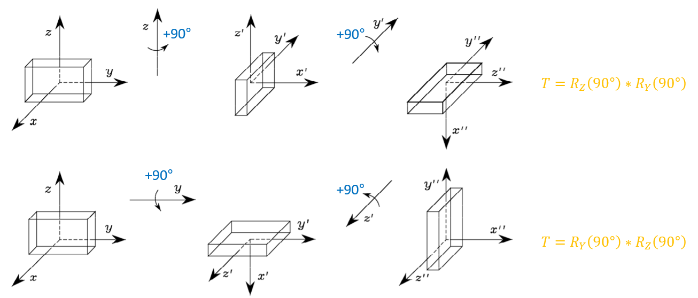

Fuente: Adaptado de Siciliano, B., Sciavicco, L., Villani, L., & Oriolo, G. (2010). Robotics: modelling, planning and control. Springer Science & Business Media.

<h2>Sistema fijo</h2>

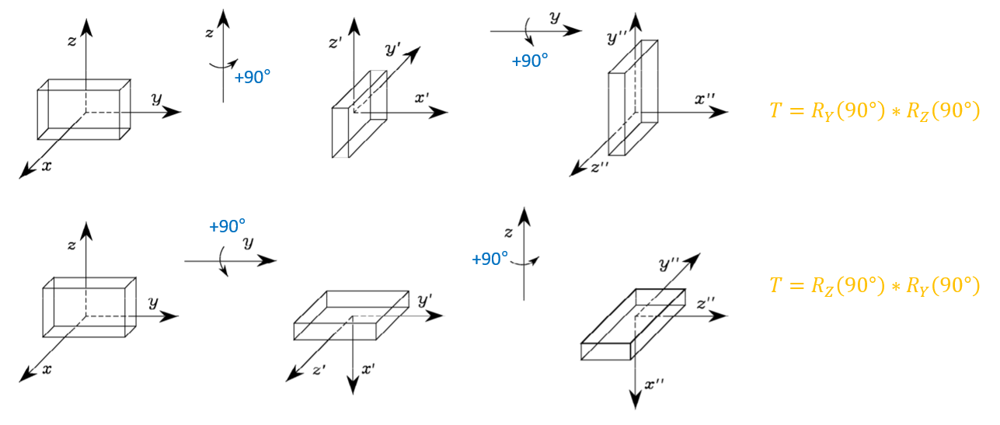

Fuente: Adaptado de Siciliano, B., Sciavicco, L., Villani, L., & Oriolo, G. (2010). Robotics: modelling, planning and control. Springer Science & Business Media.

<h2>Composición de rotaciones</h2>

Determinar la expresión de la matriz de transformación resultantes para las siguientes rotaciones:

1. Rotación de 𝜃 alrededor del eje X actual -> $𝑅_{x}(𝜃)$
2. Rotación de 𝜙 alrededor del eje Z actual -> $𝑅_{x}(𝜃)\cdot𝑅_{z}(𝜙)$
3. Rotación de 𝛼 alrededor del eje Z fijo -> $𝑅_{z}(𝛼)\cdot𝑅_{x}(𝜃)\cdot𝑅_{z}(𝜙)$
4. Rotación de 𝛽 alrededor del eje Y actual -> $𝑅_{z}(𝛼)\cdot𝑅_{x}(𝜃)\cdot𝑅_{z}(𝜙)\cdot𝑅_{y}(𝛽)$
5. Rotación de 𝛾 alrededor del eje X fijo -> $𝑅_{x}(𝛾)\cdot𝑅_{z}(𝛼)\cdot𝑅_{x}(𝜃)\cdot𝑅_{z}(𝜙)\cdot𝑅_{y}(𝛽)$

<!-- 
4. Rotación de 𝛽 alrededor del eje Y actual -> $𝑅_{z}(𝛼)\cdot𝑅_{x}(𝜃)\cdot𝑅_{z}(𝜙)\cdotR_{y}(𝛽)$
-->

<h2>Ejercicio 3</h2>

En la figura, el sistema 𝑂𝑈𝑉𝑊 se encuentra girado −90° alrededor del eje 𝑍 con respecto al sistema 𝑂𝑋𝑌𝑍. Calcular las coordenadas del vector $𝑟_{𝑥𝑦𝑧}$, si $𝑟_{𝑢𝑣𝑤}=[4,8,12]^{𝑇}$

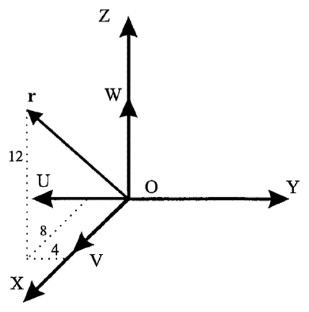

Fuente: Barrientos, A., Peñín, L.F., Balaguer, C., y Aracil, R., 2007, Fundamentos de Robótica, 2nd edition, McGraw-Hill.

```matlab
clear all
close all
clc

Rz = RotarZ(-pi/2)
r = [4; 8; 12]
Rzr = Rz * r
```

$$R_z=\begin{bmatrix}
 cos(-90)&  -sin(-90)& 0\\ 
 sin(-90)&  cos(-90)& 0\\ 
 0 & 0 & 1
\end{bmatrix}$$

$$\vec{r}= \begin{bmatrix}
4\\ 
8\\ 
12
\end{bmatrix}$$

$$R_z\cdot \vec{r} =\begin{bmatrix}
0&  1& 0\\ 
 -1&  0& 0\\ 
 0 & 0 & 1
\end{bmatrix}\cdot \begin{bmatrix}
4\\ 
8\\ 
12
\end{bmatrix} = \begin{bmatrix}
8\\ 
-4\\ 
12
\end{bmatrix}$$