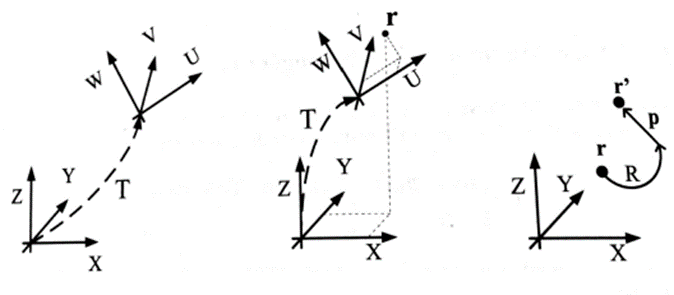
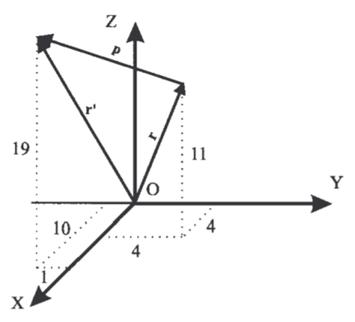
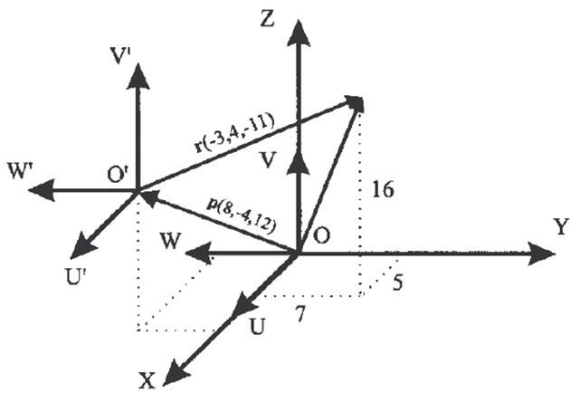
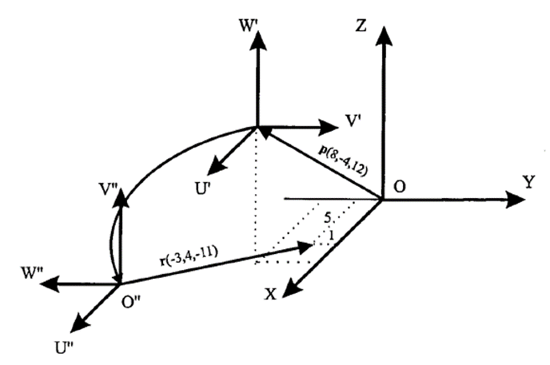
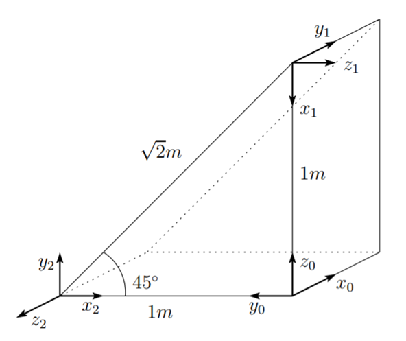

<h1>Aula 4</h1>

Esta clase consiste en relacionar la traslación y la rotación de un cuerpo rígido en la matriz de transformación homogénea (MTH).

<h2>Matriz de transformación homogénea (MTH)</h2>

Representa la transformación de la localización (orientación y posición) de un vector de coordenadas homogéneas de un sistema de coordenadas 𝑂𝑈𝑉𝑊 con respecto al sistema de referencia 𝑂𝑋𝑌𝑍.


Fuente: Barrientos, A., Peñín, L.F., Balaguer, C., y Aracil, R., 2007, Fundamentos de Robótica, 2nd edition, McGraw-Hill.

<h3>Justificaciones de la MTH</h3>

1. Representar la posición y orientación de un sistema girado y trasladado 𝑂’𝑈𝑉𝑊 con respecto a un sistema fijo de referencia 𝑂𝑋𝑌𝑍, que es lo mismo que representar una rotación y traslación realizada sobre un sistema de referencia.
2. Transformar un vector expresado en coordenadas con respecto a un sistema 𝑂’𝑈𝑉𝑊, a su expresión en coordenadas del sistema de referencia 𝑂𝑋𝑌𝑍.
3. Rotar y trasladar un vector con respecto a un sistema de referencia fijo 𝑂𝑋𝑌𝑍.



Fuente: Barrientos, A., Peñín, L.F., Balaguer, C., y Aracil, R., 2007, Fundamentos de Robótica, 2nd edition, McGraw-Hill.

<h3>Traslación (MTH)</h3>

En la figura, el sistema 𝑂’𝑈𝑉𝑊 está trasladado de un vector 𝑝(6,−3,8) con respecto del sistema 𝑂𝑋𝑌𝑍. Calcular las coordenadas ($𝑟_{𝑥}$, $𝑟_{𝑦}$, $𝑟_{𝑧}$) del vector 𝑟, cuyas coordenadas con respecto al sistema 𝑂’𝑈𝑉𝑊 son $𝑟_{𝑢𝑣𝑤}$ (−2,7,3)


Fuente: Barrientos, A., Peñín, L.F., Balaguer, C., y Aracil, R., 2007, Fundamentos de Robótica, 2nd edition, McGraw-Hill.

```matlab
clear all
close all
clc

MTH=[1 0 0 6;
   0 1 0 -3;
   0 0 1 8;
   0 0 0 1];
r = [-2; 7; 3; 1]
MTHr = MTH*r
```

$$
\begin{bmatrix}
𝑟_𝑥\\ 
𝑟_𝑦\\ 
𝑟_𝑧\\ 
1
\end{bmatrix} = \begin{bmatrix}
1 & 0 & 0 & 𝑝_𝑥\\ 
0 & 1 & 0 & 𝑝_𝑦\\ 
0 & 0 & 1 & 𝑝_𝑧\\ 
0 & 0 & 0 & 1
\end{bmatrix} \cdot \begin{bmatrix}
𝑟_𝑢\\ 
𝑟_𝑣\\ 
𝑟_𝑤\\ 
1
\end{bmatrix} = \begin{bmatrix}
𝑟_𝑢+𝑝_𝑥\\ 
𝑟_𝑣+𝑝_𝑦\\ 
𝑟_𝑤+𝑝_𝑧\\ 
1
\end{bmatrix}
$$

$$
\begin{bmatrix}
𝑟_𝑥\\ 
𝑟_𝑦\\ 
𝑟_𝑧\\ 
1
\end{bmatrix} = \begin{bmatrix}
1 & 0 & 0 & 6\\ 
0 & 1 & 0 & -3\\ 
0 & 0 & 1 & 8\\ 
0 & 0 & 0 & 1
\end{bmatrix} \cdot \begin{bmatrix}
-2\\ 
7\\ 
3\\ 
1
\end{bmatrix} = \begin{bmatrix}
4\\ 
4\\ 
11\\ 
1
\end{bmatrix}
$$

Calcular el vector $𝑟_{𝑥𝑦𝑧}^′$ resultante de trasladar el vector $𝑟_{𝑥𝑦𝑧}$ (4,4,11) las coordenadas $𝑝_{𝑥𝑦𝑧}$ (6,−3,8)



Fuente: Barrientos, A., Peñín, L.F., Balaguer, C., y Aracil, R., 2007, Fundamentos de Robótica, 2nd edition, McGraw-Hill.

```matlab
clear all
close all
clc

MTH=[1 0 0 6;
   0 1 0 -3;
   0 0 1 8;
   0 0 0 1];
r = [4; 4; 11; 1]
MTHr = MTH*r
```

$$
\begin{bmatrix}
{𝑟}'_𝑥\\ 
{𝑟}'_𝑦\\ 
{𝑟}'_𝑧\\ 
1
\end{bmatrix} = \begin{bmatrix}
1 & 0 & 0 & 𝑝_𝑥\\ 
0 & 1 & 0 & 𝑝_𝑦\\ 
0 & 0 & 1 & 𝑝_𝑧\\ 
0 & 0 & 0 & 1
\end{bmatrix} \cdot \begin{bmatrix}
𝑟_𝑥\\ 
𝑟_𝑦\\ 
𝑟_𝑧\\ 
1
\end{bmatrix} = \begin{bmatrix}
𝑟_𝑥+𝑝_𝑥\\ 
𝑟_𝑦+𝑝_𝑦\\ 
𝑟_𝑧+𝑝_𝑧\\ 
1
\end{bmatrix}
$$

$$
\begin{bmatrix}
{𝑟}'_{𝑥}\\ 
{𝑟}'_𝑦\\ 
{𝑟}'_𝑧\\ 
1
\end{bmatrix} = \begin{bmatrix}
1 & 0 & 0 & 6\\ 
0 & 1 & 0 & -3\\ 
0 & 0 & 1 & 8\\ 
0 & 0 & 0 & 1
\end{bmatrix} \cdot \begin{bmatrix}
4\\ 
4\\ 
11\\ 
1
\end{bmatrix} = \begin{bmatrix}
10\\ 
1\\ 
19\\ 
1
\end{bmatrix}
$$

<h3>Rotación (MTH)</h3>

En la figura, el sistema 𝑂𝑈𝑉𝑊 se encuentra girado -90° alrededor del eje 𝑍 con respecto al sistema 𝑂𝑋𝑌𝑍. Calcular las coordenadas del vector $𝑟_{𝑥𝑦𝑧}$, si $𝑟_{𝑢𝑣𝑤} = [4,8,12]^{𝑇}$


Fuente: Barrientos, A., Peñín, L.F., Balaguer, C., y Aracil, R., 2007, Fundamentos de Robótica, 2nd edition, McGraw-Hill.

```matlab
clear all
close all
clc

theta = -pi/2;
MTH=[cos(theta) -sin(theta) 0 0;
    sin(theta) cos(theta) 0 0;
    0 0 1 0
    0 0 0 1];
r = [4; 8; 12; 1]
MTHr =MTH*r
```

$$
\begin{bmatrix}
𝑟_𝑥\\ 
𝑟_𝑦\\ 
𝑟_𝑧\\ 
1
\end{bmatrix} = \begin{bmatrix}
cosθ & -sinθ & 0 & 0\\ 
sinθ & cosθ & 0 & 0\\ 
0 & 0 & 1 & 0\\ 
0 & 0 & 0 & 1
\end{bmatrix} \cdot \begin{bmatrix}
𝑟_𝑢\\ 
𝑟_𝑣\\ 
𝑟_𝑤\\ 
1
\end{bmatrix}
$$

$$
\begin{bmatrix}
𝑟_𝑥\\ 
𝑟_𝑦\\ 
𝑟_𝑧\\ 
1
\end{bmatrix} = \begin{bmatrix}
0 & 1 & 0 & 0\\ 
-1 & 0 & 0 & 0\\ 
0 & 0 & 1 & 0\\ 
0 & 0 & 0 & 1
\end{bmatrix} \cdot \begin{bmatrix}
4\\ 
8\\ 
12\\ 
1
\end{bmatrix} = \begin{bmatrix}
8\\ 
-4\\ 
12\\ 
1
\end{bmatrix}
$$

<h3>Rotación y traslación (MTH)</h3>

La traslación y rotación no son conmutativas, por tanto, no es lo mismo rotar y trasladar que trasladar y rotar.


Fuente: Barrientos, A., Peñín, L.F., Balaguer, C., y Aracil, R., 2007, Fundamentos de Robótica, 2nd edition, McGraw-Hill.

<h3>1. Rotación y 2. traslación (MTH)</h3>

En la figura, el sistema 𝑂𝑈𝑉𝑊 ha sido girado 90° alrededor del eje 𝑋 y posteriormente trasladado um vector 𝑝(8,−4,12) con respecto al sistema 𝑂𝑋𝑌𝑍. Calcular las coordenadas ($𝑟_{𝑥}$, $𝑟_{𝑦}$, $𝑟_{𝑧}$) del vector 𝑟 con coordenadas $𝑟_{𝑢^′ 𝑣^′ 𝑤^′}$ (−3,4,−11)



Fuente: Barrientos, A., Peñín, L.F., Balaguer, C., y Aracil, R., 2007, Fundamentos de Robótica, 2nd edition, McGraw-Hill.

```matlab
clear all
close all
clc

%Solución simbólica
syms Px Py Pz theta

dx = [1 0 0 Px; 0 1 0 Py; 0 0 1 Pz; 0 0 0 1]
Rx = [1     0           0      0;
      0 cos(theta) -sin(theta) 0;
      0 sin(theta) cos(theta)  0;
      0     0           0      1]
RT = dx*Rx

%Solución numérica
Px = 8
Py = -4
Pz = 12
theta = deg2rad(90)

dx = [1 0 0 Px; 0 1 0 Py; 0 0 1 Pz; 0 0 0 1]
Rx = [1     0           0      0;
      0 cos(theta) -sin(theta) 0;
      0 sin(theta) cos(theta)  0;
      0     0           0      1]
RT = dx*Rx

r = [-3; 4; -11; 1]
RTr = RT*r
```

$$
\begin{bmatrix}
𝑟_𝑥\\ 
𝑟_𝑦\\ 
𝑟_𝑧\\ 
1
\end{bmatrix} = \begin{bmatrix}
1 & 0 & 0 & 𝑝_𝑥\\ 
0 & cosθ & -sinθ & 𝑝_𝑦\\ 
0 & sinθ & cosθ & 𝑝_𝑧\\ 
0 & 0 & 0 & 1
\end{bmatrix} \cdot \begin{bmatrix}
𝑟_𝑢\\ 
𝑟_𝑣\\ 
𝑟_𝑤\\ 
1
\end{bmatrix}
$$

$$
\begin{bmatrix}
𝑟_𝑥\\ 
𝑟_𝑦\\ 
𝑟_𝑧\\ 
1
\end{bmatrix} = \begin{bmatrix}
1 & 0 & 0 & 8\\ 
0 & 0 & -1 & -4\\ 
0 & 1 & 0 & 12\\ 
0 & 0 & 0 & 1
\end{bmatrix} \cdot \begin{bmatrix}
-3\\ 
4\\ 
-11\\ 
1
\end{bmatrix} = \begin{bmatrix}
5\\ 
7\\ 
16\\ 
1
\end{bmatrix}
$$

<h3>1. Traslación y 2. Rotación (MTH)</h3>

En la figura, el sistema 𝑂𝑈𝑉𝑊 ha sido trasladado un vector 𝑝(8,−4,12) con respecto al sistema 𝑂𝑋𝑌𝑍 y girado 90° alrededor del eje 𝑂𝑋. Calcular las coordenadas ($𝑟_{𝑥}$, $𝑟_{𝑦}$, $𝑟_{𝑧}$) del vector 𝑟 de coordenadas $𝑟_{𝑢𝑣𝑤}$ (−3,4,−11)  



Fuente: Barrientos, A., Peñín, L.F., Balaguer, C., y Aracil, R., 2007, Fundamentos de Robótica, 2nd edition, McGraw-Hill.

```matlab
clear all
close all
clc

%Solución simbólica
syms Px Py Pz theta

dx = [1 0 0 Px; 0 1 0 Py; 0 0 1 Pz; 0 0 0 1]
Rx = [1     0           0      0;
      0 cos(theta) -sin(theta) 0;
      0 sin(theta) cos(theta)  0;
      0     0           0      1]
TR = Rx*dx

%Solución numérica
Px = 8
Py = -4
Pz = 12
theta = pi/2

dx = [1 0 0 Px; 0 1 0 Py; 0 0 1 Pz; 0 0 0 1]
Rx = [1     0           0      0;
      0 cos(theta) -sin(theta) 0;
      0 sin(theta) cos(theta)  0;
      0     0           0      1]
TR = Rx*dx

r = [-3; 4; -11; 1]
TRr = TR*r
```

$$
\begin{bmatrix}
𝑟_𝑥\\ 
𝑟_𝑦\\ 
𝑟_𝑧\\ 
1
\end{bmatrix} = \begin{bmatrix}
1 & 0 & 0 & 𝑝_𝑥\\ 
0 & cosθ & -sinθ & 𝑝_𝑦cosθ-𝑝_𝑧sinθ\\ 
0 & sinθ & cosθ & 𝑝_𝑦sinθ+𝑝_𝑧cosθ\\ 
0 & 0 & 0 & 1
\end{bmatrix} \cdot \begin{bmatrix}
𝑟_𝑢\\ 
𝑟_𝑣\\ 
𝑟_𝑤\\ 
1
\end{bmatrix}
$$

$$
\begin{bmatrix}
𝑟_𝑥\\ 
𝑟_𝑦\\ 
𝑟_𝑧\\ 
1
\end{bmatrix} = \begin{bmatrix}
1 & 0 & 0 & 8\\ 
0 & 0 & -1 & -12\\ 
0 & 1 & 0 & -4\\ 
0 & 0 & 0 & 1
\end{bmatrix} \cdot \begin{bmatrix}
-3\\ 
4\\ 
-11\\ 
1
\end{bmatrix} = \begin{bmatrix}
5\\ 
-1\\ 
0\\ 
1
\end{bmatrix}
$$

<h3>Ejercicio 1</h3>

Encontrar la matriz de transformación homogénea (MTH) del SC{0} al SC{3}. Tenga en cuenta diferentes combinaciones de rotaciones del SC{2} al SC{3}, con respecto al sistema actual y al sistema fijo.


Fuente: Spong, M. W., Hutchinson, S., & Vidyasagar, M. (2006). Robot modeling and control.

```matlab
% Matrices de rotación (Sistema actual)
R23_1 = round(RotarX(-pi)*RotarZ(-pi/2))
R23_2 = round(RotarY(pi)*RotarZ(pi/2))
R23_3 = round(RotarZ(pi/2)*RotarX(-pi))

% Matrices de rotación (Sistema fijo)
R23_1 = round(RotarZ(pi/2)*RotarX(-pi))
R23_2 = round(RotarZ(-pi/2)*RotarY(pi))
R23_3 = round(RotarY(-pi)*RotarZ(pi/2)) %round(RotarX(pi)*RotarZ(-pi/2))

%Ángulos de Euler
r1 = rad2deg(tr2rpy(R23_3,'zyx'))

%Matrices de transformación
T01 = [1 0 0 0; 0 1 0 1; 0 0 1 1; 0 0 0 1]
T12 = [1 0 0 -0.5; 0 1 0 0.5; 0 0 1 0; 0 0 0 1]
T23 = [0 1 0 0; 1 0 0 0; 0 0 -1 2; 0 0 0 1]
T03 = T01*T12*T23

%Ángulos de Euler
m = T03(1:3,1:3)
r2 = rad2deg(tr2rpy(m,'zyx'))
```

<h3>Ejercicio 2</h3>

Encontrar la matriz de transformación homogénea (MTH) del SC{0} al SC{2}. Tenga en cuenta diferentes combinaciones de rotaciones del SC{0} al SC{1} y del SC{1} al SC{2}, con respecto al sistema actual y al sistema fijo.



Fuente: Spong, M. W., Hutchinson, S., & Vidyasagar, M. (2006). Robot modeling and control.
