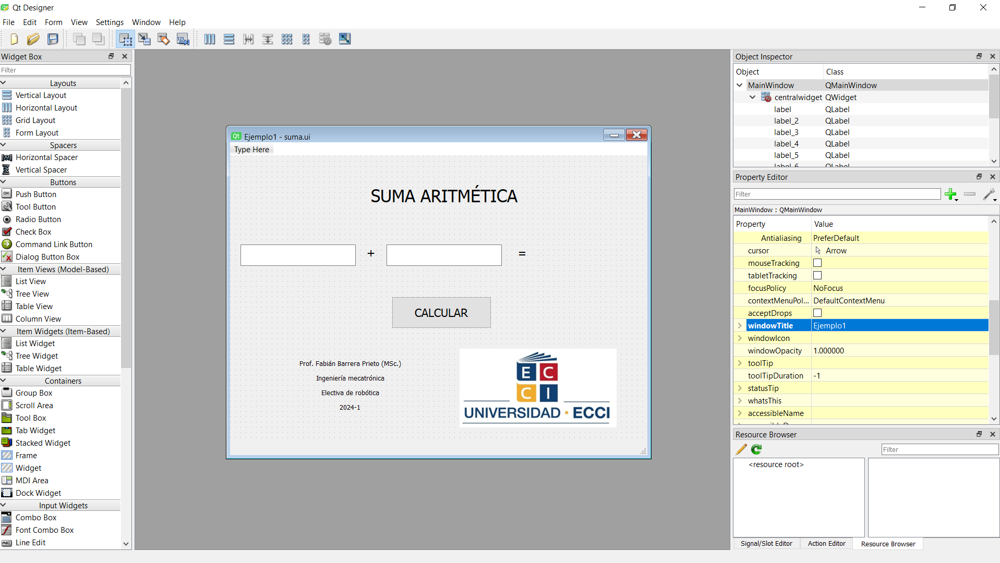
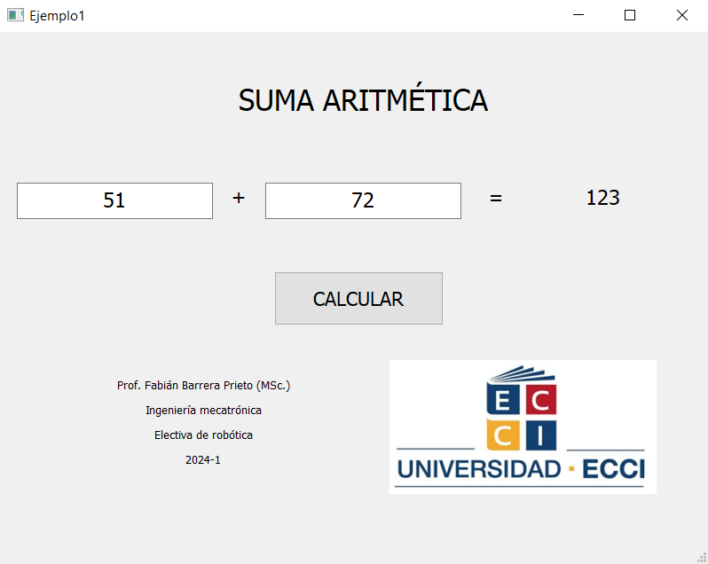

<h1>Aula 3</h1>

En esta clase ...

<h2>Interfaces gráficas (GUI) con Qt designer</h2>

1. Instalar Qt designer<br>
En Windows, descargar el software a través del siguiente link: https://build-system.fman.io/qt-designer-download<br>
En Raspbian, en el terminal ejecutar el siguiente comando: 
```
sudo apt-get install qtcreator
```

2. Realizar el <em>front</em> end de la interfaz gráfica para la suma aritmética de dos números editando algunas propiedades de cada <em>widget</em> utilizado.



3. Convertir un archivo `.ui` a `.py`<br>

I. En el terminal, con los comandos linux (`cd`, `cd ..`, `ls`, `pwd`, etc.) entrar a la carpeta donde se encuentre el archivo `.ui`<br>

II. En Windows, ejecutar en el terminal el siguiente comando:
```
pyuic5 -x [FILENAME].ui -o [FILENAME].py (ej: pyuic5 -x suma.ui -o suma.py)
```
En Raspbian, ejecutar en el terminal el siguiente comando:
```
python -m PyQt5.uic.pyuic -x [FILENAME].ui -o [FILENAME].py (ej: python -m PyQt5.uic.pyuic -x suma.ui -o suma.py)
```

4. Realizar el <em>back end</em> de la interfaz gráfica, es decir, editar el archivo `.py` para que realice la tarea específica de la suma de dos números cuando se presione el botón.

```python
# -*- coding: utf-8 -*-

# Form implementation generated from reading ui file 'suma.ui'
#
# Created by: PyQt5 UI code generator 5.15.9
#
# WARNING: Any manual changes made to this file will be lost when pyuic5 is
# run again.  Do not edit this file unless you know what you are doing.


from PyQt5 import QtCore, QtGui, QtWidgets


class Ui_MainWindow(object):
    def setupUi(self, MainWindow):
        MainWindow.setObjectName("MainWindow")
        MainWindow.resize(800, 600)
        self.centralwidget = QtWidgets.QWidget(MainWindow)
        self.centralwidget.setObjectName("centralwidget")
        self.pushButton = QtWidgets.QPushButton(self.centralwidget)
        self.pushButton.setGeometry(QtCore.QRect(310, 270, 191, 61))
        font = QtGui.QFont()
        font.setPointSize(13)
        self.pushButton.setFont(font)
        self.pushButton.setObjectName("pushButton")
        self.label = QtWidgets.QLabel(self.centralwidget)
        self.label.setGeometry(QtCore.QRect(610, 150, 141, 71))
        font = QtGui.QFont()
        font.setPointSize(14)
        self.label.setFont(font)
        self.label.setText("")
        self.label.setAlignment(QtCore.Qt.AlignCenter)
        self.label.setObjectName("label")
        self.label_2 = QtWidgets.QLabel(self.centralwidget)
        self.label_2.setGeometry(QtCore.QRect(250, 160, 41, 51))
        font = QtGui.QFont()
        font.setPointSize(13)
        self.label_2.setFont(font)
        self.label_2.setTextFormat(QtCore.Qt.AutoText)
        self.label_2.setAlignment(QtCore.Qt.AlignCenter)
        self.label_2.setObjectName("label_2")
        self.textEdit = QtWidgets.QTextEdit(self.centralwidget)
        self.textEdit.setGeometry(QtCore.QRect(20, 170, 221, 41))
        font = QtGui.QFont()
        font.setPointSize(14)
        self.textEdit.setFont(font)
        self.textEdit.setLayoutDirection(QtCore.Qt.LeftToRight)
        self.textEdit.setSizeAdjustPolicy(QtWidgets.QAbstractScrollArea.AdjustIgnored)
        self.textEdit.setObjectName("textEdit")
        self.textEdit_2 = QtWidgets.QTextEdit(self.centralwidget)
        self.textEdit_2.setGeometry(QtCore.QRect(300, 170, 221, 41))
        font = QtGui.QFont()
        font.setPointSize(14)
        self.textEdit_2.setFont(font)
        self.textEdit_2.setObjectName("textEdit_2")
        self.label_3 = QtWidgets.QLabel(self.centralwidget)
        self.label_3.setGeometry(QtCore.QRect(540, 160, 41, 51))
        font = QtGui.QFont()
        font.setPointSize(13)
        self.label_3.setFont(font)
        self.label_3.setTextFormat(QtCore.Qt.AutoText)
        self.label_3.setAlignment(QtCore.Qt.AlignCenter)
        self.label_3.setObjectName("label_3")
        self.label_4 = QtWidgets.QLabel(self.centralwidget)
        self.label_4.setGeometry(QtCore.QRect(200, 40, 421, 71))
        font = QtGui.QFont()
        font.setPointSize(20)
        self.label_4.setFont(font)
        self.label_4.setAlignment(QtCore.Qt.AlignCenter)
        self.label_4.setObjectName("label_4")
        self.label_5 = QtWidgets.QLabel(self.centralwidget)
        self.label_5.setGeometry(QtCore.QRect(130, 370, 201, 141))
        self.label_5.setObjectName("label_5")
        self.label_6 = QtWidgets.QLabel(self.centralwidget)
        self.label_6.setGeometry(QtCore.QRect(440, 370, 301, 151))
        font = QtGui.QFont()
        font.setPointSize(14)
        self.label_6.setFont(font)
        self.label_6.setText("")
        self.label_6.setPixmap(QtGui.QPixmap("Aula2/ecci.jpg"))
        self.label_6.setScaledContents(True)
        self.label_6.setAlignment(QtCore.Qt.AlignCenter)
        self.label_6.setObjectName("label_6")
        MainWindow.setCentralWidget(self.centralwidget)
        self.menubar = QtWidgets.QMenuBar(MainWindow)
        self.menubar.setGeometry(QtCore.QRect(0, 0, 800, 26))
        self.menubar.setObjectName("menubar")
        MainWindow.setMenuBar(self.menubar)
        self.statusbar = QtWidgets.QStatusBar(MainWindow)
        self.statusbar.setObjectName("statusbar")
        MainWindow.setStatusBar(self.statusbar)

        self.retranslateUi(MainWindow)
        QtCore.QMetaObject.connectSlotsByName(MainWindow)

        #Acción al presionar el botón en la GUI
        self.pushButton.clicked.connect(self.Suma)

    def retranslateUi(self, MainWindow):
        _translate = QtCore.QCoreApplication.translate
        MainWindow.setWindowTitle(_translate("MainWindow", "Ejemplo1"))
        self.pushButton.setText(_translate("MainWindow", "CALCULAR"))
        self.label_2.setText(_translate("MainWindow", "+"))
        self.textEdit.setHtml(_translate("MainWindow", "<!DOCTYPE HTML PUBLIC \"-//W3C//DTD HTML 4.0//EN\" \"http://www.w3.org/TR/REC-html40/strict.dtd\">\n"
"<html><head><meta name=\"qrichtext\" content=\"1\" /><style type=\"text/css\">\n"
"p, li { white-space: pre-wrap; }\n"
"</style></head><body style=\" font-family:\'MS Shell Dlg 2\'; font-size:14pt; font-weight:400; font-style:normal;\">\n"
"<p align=\"center\" style=\"-qt-paragraph-type:empty; margin-top:0px; margin-bottom:0px; margin-left:0px; margin-right:0px; -qt-block-indent:0; text-indent:0px;\"><br /></p></body></html>"))
        self.textEdit_2.setHtml(_translate("MainWindow", "<!DOCTYPE HTML PUBLIC \"-//W3C//DTD HTML 4.0//EN\" \"http://www.w3.org/TR/REC-html40/strict.dtd\">\n"
"<html><head><meta name=\"qrichtext\" content=\"1\" /><style type=\"text/css\">\n"
"p, li { white-space: pre-wrap; }\n"
"</style></head><body style=\" font-family:\'MS Shell Dlg 2\'; font-size:14pt; font-weight:400; font-style:normal;\">\n"
"<p align=\"center\" style=\"-qt-paragraph-type:empty; margin-top:0px; margin-bottom:0px; margin-left:0px; margin-right:0px; -qt-block-indent:0; text-indent:0px;\"><br /></p></body></html>"))
        self.label_3.setText(_translate("MainWindow", "="))
        self.label_4.setText(_translate("MainWindow", "SUMA ARITMÉTICA"))
        self.label_5.setText(_translate("MainWindow", "<html><head/><body><p align=\"center\">Prof. Fabián Barrera Prieto (MSc.)</p><p align=\"center\">Ingeniería mecatrónica</p><p align=\"center\">Electiva de robótica</p><p align=\"center\">2024-1</p></body></html>"))

    #Función que se ejecuta con la acción anterior
    def Suma(self):
        a = self.textEdit.toPlainText()
        b = self.textEdit_2.toPlainText()
        c = int(a)+int(b)
        self.label.setText(str(c))


if __name__ == "__main__":
    import sys
    app = QtWidgets.QApplication(sys.argv)
    MainWindow = QtWidgets.QMainWindow()
    ui = Ui_MainWindow()
    ui.setupUi(MainWindow)
    MainWindow.show()
    sys.exit(app.exec_())
```
5. Ejecutar el archivo `.py` para probar la aplicación

