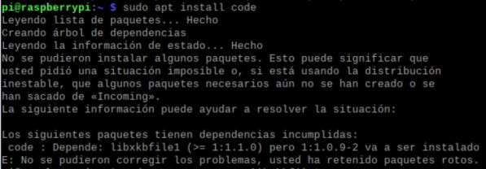

<h1>Introducción a Python :atom:</h1>

`Python` es un lenguaje de programación interpretado, entre sus principales ventajas están: facilidad de sintaxis, no necesita declarar variables, indispensable indentar las líneas de código, fácil manejo de arreglos (vectores y matrices)

<h2>1. Instalar Python</h2><br>
En Windows, descargar el instalador del siguiente link: https://www.python.org y al momento de instalarlo, seleccionar la opción Add path.<br>
En Raspbian, por defecto ya está instalado `Python` versión 3.1X

Para conocer la versión de `Python` sobre la cual se está trabajando, en el terminal ejecutar el siguiente comando: 

```
python --version
```

<h2>2. Instalar Visual Studio Code</h2><br>
En Windows, descargar el instalador del siguiente link: https://code.visualstudio.com<br>
En Raspbian, ejecutar en el terminal la siguiente línea de comando: 

```
sudo apt install code
```

<h2>3. Ejemplos de programación en Python</h2>

Los ejemplos de esta clase están orientados a un repaso básico de programación, teniendo en cuenta la impresión de datos en consola, variables, ingreso de datos por consola, arreglos, condicionales, bucles, funciones y clases.

<h3>Impresión de datos en consola</h3>

Para imprimir informacion se utiliza la funcion `print`, en la cual es posible inicializar un <em>string</em> en comillas simples o dobles.

```python
print("Hola mundo '2024'")
print('Hola mundo "2024"')
```

<h3>Variables</h3>

No hay necesidad de declarar variables, sin embargo, pueden ser inicializadas y específicamente a las variables numéricas se les puede modificar el tipo de variable.

```python
a = 'Hola'
b = "Mundo"
c = 2024.0

print("Texto: %s %s %.2f" %(a,b,c))
print("Texto:",a,b,c)  
print("Texto: "+str(a)+' '+str(b)+' '+str(c))
print(f"Texto: {a} {b} {c:.2f}")
print("Texto: {0} {1} {2:.2f}".format(a,b,c))
```

Este tipo de operaciones se ejecutan de izquierda a derecha teniendo en cuenta la prioridad:

1. Paréntesis `()`
2. Exponente `**`
3. Negación `-x`
4. Multiplicación, División, Cociente, Módulo `*` `/` `//` `%`
5. Suma, Resta `+` `-`

```python
#Variables int y float
a = 7
b = c = 5.2
print(a,b,c)
print(type(a),type(int(b)),type(c)) #up o down casting
text = 'Los valores de a, b y c, respectivamente son:'
print(f'{text} {a}, {b} y {c}')

#Operaciones aritméticas
temp = a
a += b
print(f'a += b es: %f {a}')
a = temp
a -= b
print(f'a -= b es: %f {a}')
a = temp
a *= b
print(f'a *= b es: %f {a}')
a = temp
a /= b
print(f'a /= b es: %f {a}')
a = temp
a **= b #potencia o elevado
print(f'a **= b es: %f {a}')
a = temp
d = a/2 #cociente float
e = a//2 #cociente int
f = a%2 #residuo float
print(f'Los valores de d, e y f, respectivamente son: {d}, {e} y {f}')

```

Ademas, es posible realizar operaciones logicas con las variables numericas

``` python
num1 = 7
num2 = 2
equal = num1 == num2
different = num1 != num2
greater = num1 >= num2
less = num1 <= num2
print(equal, different, greater, less)
```

En el caso de variables tipo <em>string</em>, tambien se pueden hacer comparaciones, teniendo en cuenta los valores de codificacion Unicode (similar a ASCII)

``` python
word1 = "Hola"
word2 = "hola"
equal = word1 == word2
different = word1 != word2
greater = word1 >= word2
less = word1 <= word2
print(equal, different, greater, less)
```

Es posible acceder a un caracter determinado de un <em>string</em> a traves de una posición específica tanto de izquierda a derecha (incrementando) como de derecha a izquierda (decrementando).

```python
n = "Fabián"
i1 = n[4]
i2 = n[-2]
print(i1,i2)

```
Asi mismo, en `Python` se pueden obtener y concatenar diferentes caracteres de un <em>string</em> 

```python
n = "Fabián" #string
s = "Barrera Prieto"
o = 'PROFESOR'
a = '2024'

print(f'Primera letra del nombre: {n[0]}')
print(f"Primer apellido: {s[:7]}")
print(f"Segundo apellido: {s[8:]}")

c = n.upper()+' '+s+" es "+o.lower()+' en el semestre '+a+ " \"2\" "
c = f"{n.upper()} {s} es {o.lower()} en el semestre {a}-\"1\" "
print(c)
print(c[:int(len(c)/2)])
```

Las listas, al igual que las tuplas y los strings se acceden a las posiciones de igual manera, sin embargo, las listas y las tuplas pueden ser heterogeneas. Las tuplas no pueden ser modificadas, ni en datos, ni en tamaño.

```python
a = ('Fabián', "Barrera Prieto", "PROFESOR", 2024) #tupla
print(type(a))

print(f'Primera letra del nombre: {a[0][0]}')
print(f"Primer apellido: {a[1][:7]}")
print(f"Segundo apellido: {a[1][8:]}")

b = f"{a[0].upper()} {a[1]} es {a[2].lower()} en el semestre {a[3]}-\"2\"" 
print(b)
print(type(b))
print(b[:int(len(b)/2)])
```

<h3>Ingreso de datos por consola</h3>

Para ingresar datos por teclado se utiliza la funcion `input`

```python
name = input('Ingrese el nombre \n') 
age = input("Ingrese la edad \n")
print(f'{name} tiene {age} años')
```
<h3>Arreglos</h3>

```python
import numpy

nums1 = numpy.array([3,7,4,9,1])
nums2 = numpy.array([[6.3,7.2,1.1],[9.6,5.7,2.4]])
print(f"Datos y tamaño del vector nums1: {nums1[0:4]} y {nums1.size}")
print(f"Datos y tamaño del vector nums2: {nums2}, {len(nums2)}({nums2.size})")

nums1[2] = 100
nums2[0,:] = 83
print(f"Datos y tamaño del vector nums1: {nums1[1:4]} y {nums1.size}")
print(f"Datos y tamaño del vector nums2: {nums2}, {len(nums2)}({nums2.size})")
```
<h3>Condicionales</h3>

```python
name = input('Ingrese el nombre \n') 
age = int(input("Ingrese la edad \n"))
if age>=0 and age<3:
    print(f'{name} es un bebé')
elif age>=3 and age<12:
    print(f'{name} es un niño')
elif age>=12 and age<20:
    print(f'{name} es un adolescente')
elif age>=20 and age<30:
    print(f'{name} es un joven')
elif age>=30 and age<70:
    print(f'{name} es un adulto')
elif age>=70:
    print(f'{name} es un abuelo')
else:
    print("La edad no es válida")
```
<h3>Bucles o ciclos</h3>

El bucle `for` permite realizar iteraciones teniendo en cuenta una condición de inicio, de final y de incremento

```python
suma = 0
for i in range (1,101,1):
    suma += i
print(f'La suma de los números del 1 al 100 es: {suma}')
```

De igual manera, para ejecutar un código una cantidad determinada de veces, como por ejemplo para recorrer listas y tuplas

```python
ciudades = ["Bogotá", 'Medellín', 'Cali', "Pasto"]
for ciudad in ciudades: #for ciudad in range (0,len(ciudades)):
    print(ciudad) #print(ciudades[ciudad])
```
Otra herramienta muy útil para depurar código es <a href="https://pythontutor.com">PythonTutor</a>; sin embargo, no todas las librerias funcionan en esta página (ej: numpy, roboticstoolbox, entre otras)

```python
notas = [] #lista 
c = int(input('Ingrese la cantidad de notas\n'))
for i in range(0,c):
    n = float(input(f'Ingrese la nota {(i+1)}: '))
    notas.append(n)
print(notas)
print(f'La suma de las notas es: {sum(notas)}')
```



El ciclo `while` se utiliza para ejecutar un código una cantidad indeterminada de veces, teniendo en cuenta una condición

```python
r = "S"
while r != 'n':
    name = input('Ingrese el nombre \n') 
    age = int(input("Ingrese la edad \n"))
    while age<=0:
        print('La edad no es válida')    
        age = int(input("Ingrese nuevamente la edad \n"))
    if age>=18:
        print(f"{name} es mayor de edad \n")
    else:
        print(f"{name} es menor de edad \n")
          
    r = input('Desea ingresar la información de otro estudiante (s/n) \n')
    
print('Fin') 
```

En algunas ocasiones resulta necesario utilizar un ciclo `while` para garantizar ciertas tareas durante un tiempo específico, teniendo en cuenta el temporizador de la librería `time`.

```python
import time

t1 = time.time()
t2 = 0.0
while t2 <= 20.0:
    print(f"El tiempo es {t2}s \n")
    t2 = time.time() - t1
```
<h3>Funciones</h3>

Una suma es posible independizarla en una función, para que esta sea recursiva, flexible

```python
def sum(a,b):
    c = a + b
    return c

num1 = float(input('Ingrese el primer número: \n'))
num2 = float(input('Ingrese el segundo número: \n'))
num3 = sum(num1,num2)
print(f'{num1:.2f} + {num2:.2f} = {num3:.2f}')
```

<h3>Arreglos + funciones</h3>

Este ejemplo es la serie de Fibonacci, la cual consiste en una sucesión que se calcula a partir de la suma de los dos últimos números de dicha sucesión

Es posible leer una variable `global` en cualquier parte del código, sin embargo no es posible escribirla dentro de una función, para editarla, se requiere definir con `global` dicha variable al comienzo de la función

```python
def fibonacci(x):
    global data
    a = 1
    b = 1
    index = 0
    while index < x:
        data.append(a)
        temp = b
        b = a + b
        a = temp
        index += 1

data = []
fibonacci(12)
print(data)
```
Otro ejemplo son el ingreso de cinco calificaciones de un estudiantes y el cálculo del promedio de dichas notas, siendo que cada tarea se realiza en una función diferente

```python
def data(n):
    global grades
    for i in range(0,n,1):
        n = float(input('Ingrese la nota '+str(i+1)+" : "))
        grades.append(n)

def average(notas,n):
    s = 0.0
    for i in range(0,n,1):
        s += notas[i]
    a = s/len(notas)
    return s,a

grades = []
data(5)
r1,r2 = average(grades,5)
print('La suma y el promedio de las notas son: %.2f y %.2f' %(r1,r2))
```

Sin embargo, para realizar operaciones matemáticas con una lista de números, se recomienda utilizar vectores con numpy.arrays. Así mismo, se debe restringir el uso de global debido a la seguridad de las variables.

``` python
import numpy

def data(notas, n):
    #global grades
    for i in range(0,n,1):
        n = float(input(f'Ingrese la nota {i+1}: '))
        notas.append(n)
    calificaciones = numpy.array(notas)
    calificaciones = calificaciones + 0.5
    return calificaciones

def average(notas, n):
    s = 0.0
    for i in range(0,n,1):
        s += notas[i]
    a = s/len(notas)
    return s,a

grades = []
grades = data(grades, 5)
r1,r2 = average(grades, 5)
print(f'La suma y el promedio de las notas son: {r1:.2f} y {r2:.2f}')
```

<h3>Clases</h3>

Para programar a través de clases en `Python`, es importante tener en cuenta que las clases son estructuras de datos creadas a partir de variables (atributos o propiedades) y funciones (métodos). Los objetos (variables) son instancias de dichas clases, es decir, una entidad que puede aprovechar todos los recursos (atributos y métodos) de una clase. Además, se debe tener en cuenta que toda clase tiene un constructor que inicializa algunos atributos del objeto instanciado de dicha clase

```python
class Estudiante():
    #constructor
    def __init__(self, nombre, edad, notas):
        #atributos
        self.nombre = nombre
        self.edad = edad 
        self.notas = notas
        self.ocupacion = "Estudiante"
        self.grades = []
        self.s = 0.0
        self.a = 0
    
    #métodos        
    def data(self):
        for i in range(0,self.notas,1):
            n = float(input(f'Ingrese la nota {i+1}: '))
            self.grades.append(n)

    def average(self):
        for i in range(0,self.notas,1):
            self.s += self.grades[i]
        self.a = self.s/len(self.grades)
        return self.s,self.a
    
    def result(self):
        print(f'La suma y el promedio de las notas son: {self.s} y {self.a}')
    
Fabian = Estudiante('Fabián',20,5) #instancia
Fabian.data()
r1,r2 = Fabian.average()
print(f'La suma y el promedio de las notas son: {r1} y {r2}')
Fabian.result()
```